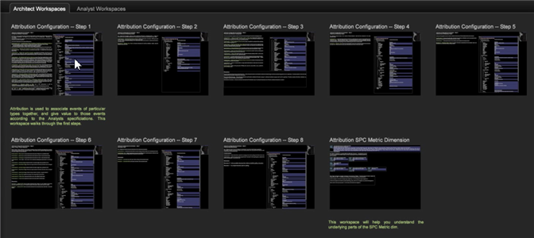

# 歸因設定檔{#attribution-profile}

在「Data Workbench」中使用新的規則型歸因設定檔，您可以快速分析歸因事件，並指派導致您所定義之成功轉換的責任。 歸因設定檔隨附設定和擴充功能所需的資訊，並包含預先建立的工作區，供分析人員直接進入並開始分析。

歸因設定檔可讓您從新的角度了解行銷工作與成功的客戶銷售機會產生或銷售轉換之間的關係。 歸因設定檔可協助您讓互動合格，這些互動應接收已實現收入或下游參與客戶歷程的評分分配。 它可讓您快速分析歸因事件，然後指派對首次接觸或最後接觸或其他事件的責任，進而協助您識別行銷工作和成本的影響，進而達成成功的銷售。

<!--  -->

>[!IMPORTANT]
>
>歸因設定檔已設定為讓已實作使用Analytics(SC/Insight)資料摘要的AdobeSC設定檔的使用者立即使用。 依預設，行銷和轉換事件會作為提供之規則型模型中評估的預設互動類型。

如需詳細資訊，請參閱[部署歸因設定檔](../../../../home/c-get-started/c-attribution-profiles/c-rules-attrib/c-attrib-profile-deploy.md#concept-fbcb5800cd6a40cc901e61f3882988c0)和[歸因模型](../../../../home/c-get-started/c-attribution-profiles/c-rules-attrib/c-attrib-models.md#concept-e209c7e86a5c4008ad6d78fdf4ea032d) 。

## 架構和分析工作區{#section-27c6aff70ba147cca6e11451e127afb4}

在歸因設定檔中，您的架構師和分析師工作區會定義於工作台的個別標籤上。

**架構工作區**

在&#x200B;**歸因**&#x200B;標籤中，按一下&#x200B;**[!UICONTROL Architect Workspace]**&#x200B;標籤以開啟專為設定基本歸因模型的配置檔案而設計的工作區。

「架構」索引標籤包含可逐步執行設定檔資料集資料夾中每個設定檔案的工作區。 例如， **[!UICONTROL Attribution Configuration - Step 1]**&#x200B;可讓您識別[!DNL profile.cfg]檔案的「轉換」區段內的「歸因」值。

**分析** 工作區按一 **[!UICONTROL Analyst]** **[!UICONTROL Workspaces]** 下索引標籤，利用歸因設定檔隨附的維度和量度，開啟預先建立的工作區分析。

這些工作區分為四類：

1. **基本** 報表可在工作區中套用單一模型。
1. **比** 較報告透過在單一檢視中呈現多個模型來擴充分析。
1. **調查** 報表會擴充報表範本，以不同格式呈現歸因模型。本節還介紹並公開基於位置的加權比率。
1. **路徑** 報表提供客戶行銷歷程的可見度，並提供多個路徑視覺化效果，以充分探索及表達流程和互動路徑

「分析師」索引標籤包含已預先設定報表的工作區。 例如， **[!UICONTROL First Attribution]**&#x200B;可讓您從&#x200B;**[!UICONTROL Campaign]**&#x200B;表格中選取，以根據&#x200B;**[!UICONTROL Time]**&#x200B;查看&#x200B;**[!UICONTROL Revenue]**&#x200B;歸因。

