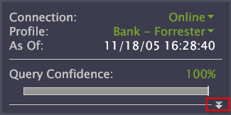

# 配置邊欄{#configure-the-sidebar}

邊欄可讓您存取常用的功能，並在您在工作區間移動時保留視覺化。

管理員可以自訂邊欄，使其適合不同的使用者群組，然後使用描述檔部署側邊欄。

側欄最適合協助您追蹤篩選器和本機覆寫。 如果您不想使用邊欄，可以將其隱藏。

## 新增視覺化至側欄 {#section-666f70a405db4f8d8eaffa567ffcac06}

1. 啟動資料工作台。
1. 在側欄中，按一 **[!UICONTROL Add]** 下> *&lt;**[!UICONTROL item]**>*。 For example, [!DNL Selections Panel], [!DNL Filters Panel], or [!DNL Table].

   標準安裝資料工作台中提供下列側邊欄面板。 您的特定設定檔中可能會有更多項目：

   * **選取範圍面板：** 可讓您瞭解目前工作區中的作用中選擇。 每當 [!DNL Selections Panel] 您進行新選取時，就會更新。 按一下可清除選定項 **[!UICONTROL x]**。 如需如 [何選取資料的詳細資訊](../../home/c-get-started/c-vis/c-sel-vis/c-sel-vis.md#concept-012870ec22c7476e9afbf3b8b2515746) ，請參閱在視覺化中選取。
   * **濾鏡面板：** 可輕鬆載入及套用儲存的篩選。 您可以載入多個篩選器，並按一下其旁的核取方塊，以個別啟用或停用每個篩選器。 請參閱 [篩選編輯器](../../home/c-get-started/c-analysis-vis/c-filter-editors/c-filter-editors.md#concept-2f343ecbed8240f18b0c1f1eccef11e3)。
   * **本機覆寫面板：** 此面板會顯示在個人資料副本中已修改描述檔中的量度、維度和篩選器。 這有助於提醒您，您的用戶端和其他使用者的資料顯示方式可能有差異。 當您將量度、維度或篩選中的變更儲存至伺服器時，覆寫會從中移除 [!DNL Local Overrides panel]。 如果您按一下覆寫，然後按一 **[!UICONTROL Revert to Server]**&#x200B;下，就會移除本機覆寫，項目就會回復為共用版本。
   * **量度圖例：** 新增量度圖例。 [!DNL Metric legends] 可讓您查看與您的設定檔相關的基準量度和與資料集相關的統計資料(或是與目前選取範圍相關的基準量度（如果已建立）。 請參 [閱量度圖例](../../home/c-get-started/c-analysis-vis/c-legends/c-metric-leg.md#concept-e7195bc8f7844ae295bda3a88b028d5b)。
   * **顏色圖例：** 新增顏色圖例。 您可以依據量度（例如轉換和保留）來為視覺化色彩編碼，並且幾乎在每個量度中使用 [!DNL Workspace]。 將業務量度連結至顏色，可輕鬆發現異常、例外和趨勢。 請參 [閱顏色圖例](../../home/c-get-started/c-analysis-vis/c-legends/c-color-leg.md#concept-f84d51dc0d6547f981d0642fc2d01358)。
   * **文字註解：** 新增附註面板。 [!DNL Text annotations] 是可在其中輸入任意文本的窗口，以向中添加描述性資訊或注釋 [!DNL Workspace]。 請參 [閱使用文本批注](../../home/c-get-started/c-analysis-vis/c-annots/c-text-annots.md#concept-55b4aa3e0c58470b8e3c9d452e12a777)。
   * **表格：** 添加表。 表格可以在一或多個資料維度上顯示一或多個度量。 請參 [閱表格](../../home/c-get-started/c-analysis-vis/c-tables/c-tables.md#concept-c632cb8ad9724f90ac5c294d52ae667f)。
   * **開啟：** 開啟儲存的檔案。

## 開啟側欄面板 {#section-cbc8e57491854274a577d47a48c306b8}

您可以從儲存的位置或剪貼簿中開啟邊欄視覺化檔案。

1. 在側欄中，按一下 **[!UICONTROL Add]** > **[!UICONTROL Open]**。
1. 按一 **[!UICONTROL File]** 下以找出您 [!DNL .vw] 要新增之面板的檔案，或按一下 **[!UICONTROL Last Closed Window]**，從剪貼簿中提取視覺化。

   此外，您也可以按一 **[!UICONTROL From Clipboard]** 下以貼上已複製至剪貼簿的視覺化。 請參 [閱複製側欄面板](../../home/c-get-started/c-config-sidebar.md#section-720ae057632a4b8dbb94412e06a370b1)。

## 複製側欄面板 {#section-720ae057632a4b8dbb94412e06a370b1}

1. 以滑鼠右鍵按一下面板的上邊框，然後按一下 **[!UICONTROL Copy]** > **[!UICONTROL Window]**。
1. 若要貼上面板，請按一 **[!UICONTROL Add]** 下> **[!UICONTROL Open]** > **[!UICONTROL From Clipboard]**。

## 保存邊欄面板 {#section-fb19936b12704fb0a4c592abb579db1d}

在側欄面板上，在標題列中按一下滑鼠右鍵，然後按一下 **[!UICONTROL Save]**。

同樣地，您也可以開啟儲存的側欄視覺化。 資料工作台會將視覺化儲存 [!DNL .vw] 為您指定位置的檔案。

## 回復為預設側欄 {#section-4d14b8771ad747bba799876267f24831}

在側欄中，按一下 **[!UICONTROL Options]** > **[!UICONTROL Revert]**。

當您關閉「資料工作台」時，系統會將目前的側欄設定儲存在使用 [!DNL sidebar.vw] 者設定檔的檔案中。 當您開啟「資料工作台」時，系統會從使用 [!DNL sidebar.vw] 者描述檔載入檔案，而非從上層描述檔載入檔案。

您可以回復為預設或先前儲存的側欄，此側欄會從使用者描述檔中刪除側欄，並從上層描述檔重新載入側欄。 管理員可從上傳預設（父）側欄，以本機側欄取代其 [!DNL Profile Manager]。

## 自訂更多狀態面板檔案 {#section-8d502f3b59cc4331966edec05e896ce1}

系統管理員可以在中建立公式 [!DNL More Status Panel.vw]。 這會將內容相關字詞放在度量和維度值周圍，並在側欄中顯 [!DNL More Status panel] 示結果。

若要在側欄 [!DNL More Status panel] 中顯示，請按一下下列範例中顯示的箭頭。

下列程式顯示如何建立自訂狀態的簡單範例，告訴您資料集中有多少天：

1. 在中， [!DNL Profile Manager]單 **擊[!UICONTROL側欄\]**。

1. 在欄 [!DNL Base_5_3*] 中，製作檔案的本機副 [!DNL More Status Panel.vw] 本。

   若要這麼做，請以滑鼠右鍵按一下檔案核取標籤，然後按一下 **[!UICONTROL Make Local]**。

1. 在記事 [!DNL More Status Panel.vw] 本中或在記事 [!DNL .vw] 本中 [!DNL Editor] 開啟檔案。

   

1. 填寫 [!DNL Context] 和 [!DNL Items] 中的欄位 [!DNL Editor]。 如需 [語法的相關指引](../../home/c-get-started/c-qry-lang-syntx/c-qry-lang-syntx.md#concept-15d1d3f5164a47d49468c5acb7299d9f) ，請參閱查詢語言語法。

1. 儲存檔案。

   前面示例中的值會生成如下所示的狀態公式：

   

