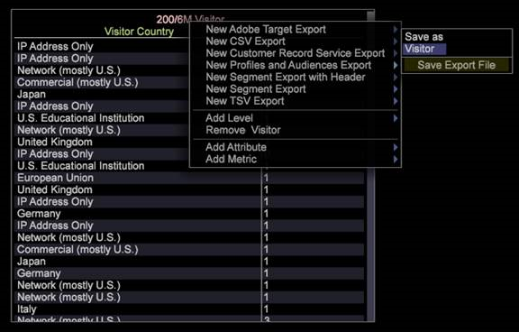

# 主行銷描述檔匯出{#master-marketing-profile-export}

Data Workbench可讓您匯出檔案，以整合整合式Adobe Experience Cloud中的「設定檔和對象」。

<!-- <a id="section_731922BC8628479198A41EF3EA72F2FF"></a> -->

「設定檔與對象」是[Experience Cloud身分識別服務](https://experienceleague.adobe.com/docs/id-service/using/home.html?lang=zh-Hant)的一部分，此服務是[!DNL Adobe Experience Cloud]的核心服務。 「設定檔與對象」匯出可讓您使用唯一的Experience CloudID(ECID)，在整個Experience Cloud中共用對象，此ID會指派給每個訪客，然後由[Audience Manager](https://experienceleague.adobe.com/docs/audience-manager/user-guide/aam-home.html?lang=zh-Hant)使用。 使用[!DNL ExportIntegration.exe]應用程式([!DNL E:\Server\Scripts])來產生MMP和Adobe Target匯出。

**設定FSU伺服器以使用設定檔和對象**

1. 訪問FSU伺服器。
1. 開啟MMPExport.cfg檔案。`Server/Admin/Export/MMPExport.cfg`。
1. 視需要在所有欄位中輸入值。 例如：

   >[!NOTE]
   >
   >MMP/AAM整合需仰賴Amazon的s3貯體來傳輸資料。
   >
   >
   >MMP(s3)轉移所需的s3資訊可從Audience Manager小組獲得。

   ```
   Sample MMPExport.cfg
   MMP Export Configuration = MMPExportConfiguration: 
   s3 Bucket = string: aws_bucket_for_mmp 
   s3 Object Directory = string: test/files/ 
   s3 Region = string: us-east-1 
   s3 Access Key = string: ZZKI62OO5YBA 
   s3 Secret Key = string: ioqwa3OpNE5 
   data Provider Name = string: 895 
   client ID = string: mcprofile2-test 
   client Secret = string: saea1287617212987q 
   username = string: mmptest 
   password = string: pass 
   numRecordsPerChunk = int:  
   numThreads = int:  
   maxRetriesOnSendFailure = unsigned int:
   ```

   >[!NOTE]
   >
   >[!DNL MMPExport.cfg]檔案也可讓您取用所有記錄、將其分割為一組，以及建立大塊的記錄。 然後會將大塊的記錄匯出至Amazon S3。 建立記錄區塊需要三個必要參數：[!DNL numRecordsPerChunk]、[!DNL numThreads]和[!DNL maxRetriesOnSendFailure]。

**參數定義**

<table id="table_DDEFBC45895A4663973F9C2EB9052FEF"> 
 <thead> 
  <tr> 
   <th colname="col1" class="entry"> 參數 </th> 
   <th colname="col2" class="entry"> 定義 </th> 
  </tr> 
 </thead>
 <tbody> 
  <tr> 
   <td colname="col1"> <i>s3貯體</i> </td> 
   <td colname="col2"> 匯出轉移至的AWS S3貯體。 </td> 
  </tr> 
  <tr> 
   <td colname="col1"> <i>s3對象目錄</i> </td> 
   <td colname="col2"> 儲存s3檔案的路徑。 這支援子目錄。 <p> <p>重要： 路徑中不允許使用空格和多位元組字元，且會在匯出中產生錯誤。 （允許連字型大小）。 </p> </p> </td> 
  </tr> 
  <tr> 
   <td colname="col1"> <i>s3地區</i> </td> 
   <td colname="col2"> 將匯出傳送至的AWS s3地區。 例如 us-east-1 </td> 
  </tr> 
  <tr> 
   <td colname="col1"> <i>s3存取金鑰</i> </td> 
   <td colname="col2"> AWS s3訪問密鑰 </td> 
  </tr> 
  <tr> 
   <td colname="col1"> <i>s3密鑰</i> </td> 
   <td colname="col2"> AWS s3密鑰 </td> 
  </tr> 
  <tr> 
   <td colname="col1"> <i>資料提供者名稱</i> </td> 
   <td colname="col2"> 這會是分別用來儲存區段和特徵的資料夾名稱。 每個客戶應有唯一的值。 </td> 
  </tr> 
  <tr> 
   <td colname="col1"> <i>用戶端ID</i> </td> 
   <td colname="col2"> 這是為MMP布建時提供給客戶的唯一用戶端ID。 </td> 
  </tr> 
  <tr> 
   <td colname="col1"> <i>用戶端密碼</i> </td> 
   <td colname="col2"> <p><i></i>這是為客戶布建MMP時，提供給其的唯一用戶端密碼。 </p> </td> 
  </tr> 
  <tr> 
   <td colname="col1"> <i>username</i> </td> 
   <td colname="col2"> MMP用戶名 </td> 
  </tr> 
  <tr> 
   <td colname="col1"> <i>password</i> </td> 
   <td colname="col2"> MMP密碼 </td> 
  </tr> 
  <tr> 
   <td colname="col1"> <i>numRecordsPerChunk</i> </td> 
   <td colname="col2"> <p>根據記錄數確定區塊大小。 </p> <p>實作會將使用者指定的值剪輯為：min = 1000 records&amp;nbsp；（~50 KB區塊）&amp;nbsp；和max = 50000記錄（~2.5 MB區塊）。&amp;nbsp；若使用者未指定此設定屬性，則使用預設值10000。 </p> </td> 
  </tr> 
  <tr> 
   <td colname="col1"> <i>numThreads</i> </td> 
   <td colname="col2"> <p>確定塊發送部分的並行性。 它接受1到24個線程之間的值，其預設值為12個線程。 </p> </td> 
  </tr> 
  <tr> 
   <td colname="col1"> <i>maxRetriesOnSendFailure</i> </td> 
   <td colname="col2"> <p>確定在發生塊發送失敗時要重試的次數。 預設值為0，指定不重試。 </p> <p>重試之間使用2秒的睡眠間隔。 </p> </td> 
  </tr> 
 </tbody> 
</table>

**從用戶端產生MMP匯出**

1. 從客戶端開啟工作區，然後按一下右鍵&#x200B;**[!UICONTROL Tools]**> **[!UICONTROL Detail Table]**。
1. 添加&#x200B;**Level**。
1. 按一下右鍵標題，然後選擇&#x200B;**添加屬性**。
1. 按一下右鍵標題，然後選擇&#x200B;**新建主營銷配置檔案導出**。 
1. 展開&#x200B;**Query**。

   

1. 展開&#x200B;**MMP配置**。
1. （必要）輸入&#x200B;**MMP區段名稱**&#x200B;和&#x200B;**MMP訪客ID欄位**。 這些參數不能留空。
1. **MMP區段名稱**&#x200B;應符合MMP中定義的區段ID。
1. **MMP訪客ID**&#x200B;是步驟4中定義的屬性欄，與&#x200B;**訪客ID**&#x200B;相對應。
1. 輸入這些欄位後，可以按一下右鍵導出的標題，然後選擇&#x200B;**Save**&#x200B;作為&quot;User\.export&quot;來保存導出。
1. 開啟&#x200B;**Admin** > **設定檔管理員**&#x200B;並將匯出儲存至設定檔。

   如果所有資料都正確輸入，則這將在FSU([!DNL Server/Exports])中生成導出檔案，並且還將使用[!DNL MMPExport.cfg]中的資訊將導出轉移到AWS。 此日誌在[!DNL Server/Trace/]中提供。 例如， [!DNL MMP-102014-133651- `<Segment Export Name>` .log]

```
Query = SegmentExportQuery: 
Command = string: ExportIntegration.exe 
Command Arguments = string: \"%file%.cfg\" \"%file%\" 
Filter = string: 
Level = string: Page View 
MMP Configuration = MMPConfiguration: 
MMP Segment Name = string: 12345 
MMP Visitor ID Field = string: Tracking ID 
Oneshot = bool: true 
Output Fields = vector: 3 items 
0 = ColumnDefinition: 
Column Name = string: 
Field Name = string: Tracking ID 
1 = ColumnDefinition: 
Column Name = string: 
Field Name = string: PID 
2 = ColumnDefinition: 
Column Name = string: 
Field Name = string: SID 
Output File = string: MMPTest.txt 
Output Format = string: %1%\t%2%\t%3%\r\n 
Schedule End Time = string: 
Schedule Every = string: 
Schedule Start Time = string: 
Time Limit (sec) = double: 1800 
```

| 配置詳細資訊 | 說明 |
|---|---|
| MMP區段ID | 必填。這是您要先在Audience Manager中定義的識別碼。 |
| MMP訪客ID欄位 | 對應ECID。 |
