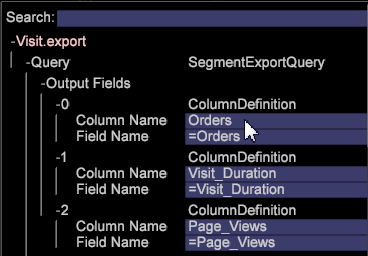

# 使用自訂標題匯出區段{#segment-export-with-custom-headers}

為區段匯出檔案建立自訂欄匯出標題，為匯出的區段新增容易理解的說明。 此匯出功能也可讓您輸出為TSV和CSV檔案。

「區段匯出」已新增新功能，包括以標題或CSV和TSV格式匯出的功能。

您可以建立匯出檔案的欄標題。

## 建立新區段匯出 {#section-cffff55855f8467ea468b71393ab7676}

1. 開啟工作區，然後按一下滑鼠右鍵 **[!UICONTROL Tools]** > **[!UICONTROL Detail Table]**。

1. 按一下右鍵並選擇 **[!UICONTROL Add Level > Extended]** >選擇項目。
1. 按一下右鍵標題，然後從 **[!UICONTROL Add Attribute.]** 菜單中選擇「選擇維」。

1. 以滑鼠右鍵按一下標題，然後從 **[!UICONTROL Add Metric.]** 功能表選取量度。

1. 以滑鼠右鍵按一下標題並選取 **[!UICONTROL New Segment Export]**。

   

   **[!UICONTROL New Segment Export with Header]** 自動填入「欄名稱」中的量度名稱。 **[!UICONTROL New Segment Export]** 需要您設定自訂名稱。 

   >[!NOTE]
   >
   >「欄名」欄位不能留空，或標題不存在。

1. 以滑鼠右鍵按一下並命名區段，然後按一下 **[!UICONTROL Save Export File]**。

   將會開啟一個導出窗口。

1. 以滑鼠右鍵按一下匯出名稱，然後按一 **[!UICONTROL 下另存新檔<export filename>]**。

   

1. 以滑鼠右鍵按 [!DNL Admin] 一下> [!DNL Profile Manager] > [!DNL Expand Export]。 尋找您剛建立的匯出檔案，並將它儲存至現有的描述檔。

   

