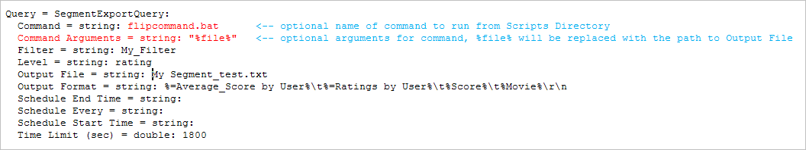

# 區段匯出{#segment-export}

您可以從「資料工作台用戶端」的「明細表」視覺化中輕鬆建立「區段匯出」定義。

此外，自 [!DNL Segment Exports] 動將結果合併至單一伺服器，而不是在每個DPU上產生部分結果，您必須使用外部程式來合併。 您可以建立區段匯出檔案、儲存至 [!DNL Profile Manager]，並將輸出檔案上傳至您選擇的伺服器。

**若要設定區段匯出伺服器**

此功 [!DNL Segment Export] 能會在區段匯出伺服器上建立單一輸出檔案，而非在每個DPU上建立個別的輸出檔案。 區段匯出伺服器通常設定為在FSU上執行。

在的「資料集」目錄 [!DNL Profile Manager]中，開啟 [!DNL Segment Export.cfg] 「工作站」，並指定伺服器位址。 （您的地址可以是IP或完全限定的域名。）:


這是接收區段匯出結果之資料工作台伺服器的IP。 這是一次性設定。 如果不 [!DNL Segment Export.cfg] 存在，則不運行導出。

**要配置導出目錄**

為安全起見，在區段匯出後執行的可執行檔或批次檔案必須位於區段匯出伺服器的可設定Scripts\目錄中。

最終 [!DNL .part] 輸出必須駐留在可配置的導出目錄中。 要運行的命令存在於命令和命令參數中。 命令參數中%file%的實例將替換為輸出檔案的路徑。

>[!NOTE]
>
>「資料工作台5.4」新增的\Exports檔案夾會自動建立。 在5.4版之前設定的先前導出目錄要求在每個段導出的檔案名前加上導出\前置詞。 現在新增此首碼是多餘的。

1. 在 [!DNL Communications.cfg] 的目標伺服器上， [!DNL Segment Exports]將SegmentExportServer添加到伺服器清單中。 （以紅色顯示的範例）。

   

   導出目錄：指定放置和輸 [!DNL .part] 出檔案的位置。 此目錄可以是共用目錄。

   指令碼目錄：指定從中運行所有執行檔或批處理檔案的目錄。

1. [!DNL Access Control.cfg]，在同一伺服器上，將對URI /SegmentExportServer/的讀寫訪問添加到群集伺服器訪問組：

   

1. 變更檔 [!DNL .export] 案：

   

1. 對於每個描述檔， [!DNL Segment Export.cfg] 該描述檔位於Dataset\目錄中，並包含以下內容：

   ```
   Segment Export = SegmentExport:
   Segment Export Server = serverInfo:
   Port = int: 80
   Address = string: 192.168.5.128 (for example) Use SSL = bool: false
   ```

1. 確保導出目錄和指令碼目錄中引用的目錄存在。

   只有Scripts目錄中的執行檔和批處理檔案才能作為段導出的命令運行。

**若要建立區段匯出檔案**

1. 在工作區中，建立顯示資料子集（視覺化>詳細資料表格）的詳細資料表格，並新增屬性。
1. 視需要在工作區中進行選取。 （所有選擇或篩選器都會套用至匯出。）

   

1. 在「明細表」標題中，按一下右鍵並選擇 **[!UICONTROL Create Segment Export File]**。
1. 在 [!DNL Save as]中，鍵入檔案名 [!DNL .export] 稱。
1. 在檔案 [!DNL .export] 上，根據需要配置參數。

   工作區中的任何選擇或篩選器都會合併到導出檔案中。

1. Save the [!DNL .export] file.

   儲存的檔案會顯示在中， [!DNL Profile Manager] 供您儲存至伺服器。 將檔案保存到伺服器時，導出開始。

