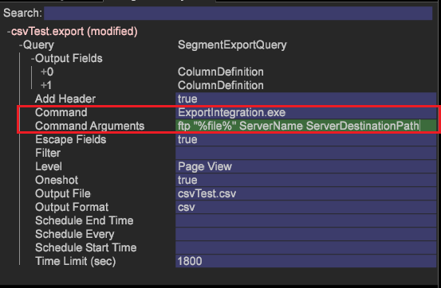

# 使用 S/FTP 傳輸方式匯出區段{#export-a-segment-using-s-ftp-delivery}

{{eol}}

您現在可以使用CSV、TSV、區段匯出和帶標題的區段匯出，透過FTP和SFTP通訊協定，將區段檔案從用戶端（工作站）匯出至伺服器。

**設定S/FTP匯出組態檔**

若要設定匯出設定，已新增兩個新的匯出設定檔來設定FTP或SFTP連線，以便從 *FTPServerInfo.cfg* 檔案和憑證將從 *FTPUserCredentials* 資料夾（與命令參數中提供的伺服器名稱相對應）。

* 設定 **FTPServerInfo.cfg** 檔案。

   輸入FTP伺服器資訊，並設定工作站允許的連線重試次數。 在工作站或伺服器編輯&#x200B; [!DNL Server\Addresses\Export\] **[!DNL FTPServerInfo.cfg]**檔案。

   ```
   FTP Servers = vector: 1 items 
     0 = ftpServerInfo:  
       Address = string:  
       Name = string:  
       Port = int: 21 
   Connect Retries = vector: 1 items 
     0 = connectServerRetries:  
       Retries = int: 0 
       Server Name = string:
   ```

* 設定 **FTPUserCredentials.cfg** 檔案。

   輸入用戶憑據以使用&#x200B; [!DNL Server\Admin\Export\] **[!DNL FTPUserCredentials.cfg]**檔案。 此檔案包含連接到伺服器所需的用戶憑據，只能從伺服器編輯，不能從工作站（客戶端）編輯。

   ```
   FTP User Credentials = vector: 1 items 
     0 = ftpUserCredInfo: 
       User Name = string:  
       User Password = EncryptedString:  
       Server Name = string:  
       Public Key Path = string:  
       Private Key Path = string:  
       Passphrase = EncryptedString:
   ```

   >[!NOTE]
   >
   >請確定您為驗證而產生的SSH金鑰的格式與使用SSH金鑰命令時產生的相同。
   >
   >使用密鑰生成SSH密鑰的示例：
   >
   >
   ```
   >ssh-keygen -t rsa -b 4096 -C "<label>"
   >```

   中有6個參數 **FTPUserCredentials.cfg** 各種FTP或SFTP傳輸所需的檔案。

   1. *使用者名稱*
   1. *用戶密碼*
   1. *伺服器名稱*
   1. *公鑰路徑*
   1. *私密金鑰路徑*
   1. *密碼短語*

   <table id="table_4EB416DC770D4D1AA4FAD9676C0D680C"> 
    <thead> 
      <tr> 
      <th colname="col1" class="entry"> Protocol </th> 
      <th colname="col2" class="entry"> 參數 </th> 
      </tr> 
    </thead>
    <tbody> 
      <tr> 
      <td colname="col1"> <p>FTP </p> </td> 
      <td colname="col2"> <p>設定參數1、2、3。 </p> </td> 
      </tr> 
      <tr> 
      <td colname="col1"> <p>使用密碼驗證的SFTP </p> </td> 
      <td colname="col2"> <p>當傳輸使用密碼驗證時（命令參數中為 — p），請設定參數1、2、3。 </p> </td> 
      </tr> 
      <tr> 
      <td colname="col1"> <p>使用金鑰驗證的SFTP </p> </td> 
      <td colname="col2"> <p>當傳輸使用密鑰身份驗證時（命令參數中為 — k），請設定參數1、2、3、4、5、6。 </p> </td> 
      </tr> 
    </tbody> 
    </table>

**設定FTP和SFTP匯出命令**

1. 開啟匯出表格。

   在工作站中，以滑鼠右鍵按一下 *詳細資料表格* 並選擇其中一種導出類型 — CSV 、 TSV 、 「段導出」或「帶標題的段導出」。 或開啟 [!DNL .export] 檔案(請參閱 [設定要匯出的區段](../../../home/c-get-started/c-exp-data-seg-exp/t-config-sgts-expt.md#task-8857f221fa66463990ec9b60db6db372))。

1. 在 *命令* 欄位，將其設定為指嚮導出執行檔：

   ```
   ExportIntegration.exe
   ```

1. 設定 *命令參數* 下列是通訊協定和必要驗證的欄位：

   **FTP**

   ```
   <Command Arguments> set to  
   <ftp "%file%" ServerName ServerDestinationPath>
   ```

   

   **SFTP** （如果使用密碼進行驗證）

   ```
   <Command Arguments> set to  
   <sftp "%file%" ServerName ServerDestinationPath -p>
   ```

   **SFTP** （若使用金鑰進行驗證）

   ```
   <Command Arguments> set to  
   <sftp "%file%" ServerName ServerDestinationPath -k>
   ```

   

所有命令參數都是必需的，需要按如所示輸入。

## 使用私密/公開金鑰匯出S/FTP {#section-0534424d79a54a47b82594cfa7b3c17f}

若要使用私密金鑰和公開金鑰實作FTP和SFTP匯出，請將設定檔案放置在這些資料夾中：

* 位置 **FTPServerInfo.cfg** 在 [!DNL Server/Addresses/Export/] 檔案夾。
* 位置 **FTPUserCredentials.cfg** 在 [!DNL Server/Admin/Export/] 檔案夾。

中包含6個參數 **FTPServerInfo.cfg** 檔案：

1. *使用者名稱*
1. *用戶密碼*
1. *伺服器名稱*
1. *公鑰路徑*
1. *私鑰路徑 —* 將私密金鑰路徑放入設定檔案中，而不使用副檔名，例如：

[!DNL Private Key Path = string: E:\\Server\\campaign\\campaignprivatekey]

1. *密碼短語*

FTP使用參數1、2和3。

當傳輸使用密碼驗證時，SFTP會使用參數1、2和3。

使用金鑰驗證完成傳輸時，SFTP會使用所有6個參數。 例如，如果您使用金鑰進行驗證：

[!DNL 'Command Arguments' = sftp "%file%" ServerName ServerDestinationPath -k]

配置檔案必須位於正確的位置。

>[!NOTE]
>
>公開密鑰需要指向 **.pem** 檔案，而非資料夾位置。 您可以使用Cygwin等應用程式的SSH金鑰產生功能來建立金鑰。 （Putty會以不支援的.ppk格式產生金鑰。）
