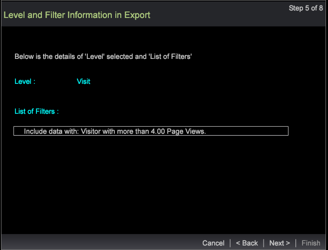

# 區段匯出精靈{#segment-export-wizard}

{{eol}}

使用區段匯出精靈匯出區段

區段匯出精靈提供設定和匯出區段(而非 [從詳細資料表導出段](https://experienceleague.adobe.com/docs/data-workbench/using/client/export-data/c-sgmt-expt.html).

## 使用精靈匯出區段 {#section-b30f2699dbc7490bad18512b91cb0cb3}

若要開啟精靈，請在工作區中按一下滑鼠右鍵並選取 **管理** > **嚮導** > **區段匯出精靈**.

>[!NOTE]
>
>只會擷取開啟精靈前所套用的區段。 此外，從精靈建立的區段匯出無法產生外部命令。

1. 選取要新增至匯出的維度和量度的各個父層級。

   顯示的層級取決於選取的設定檔。 您可以根據設定檔選取多個維度層級。

   

1. 按&#x200B;**「下一步」**。
1. 選取所選層級的Dimension和量度。

   例如，選取「頁面檢視」作為父層級後，您就可以選取可匯出的子維度和量度。

1. 按&#x200B;**「下一步」**。

   

   

1. 選擇導出格式並輸入導出檔案的名稱。

   

   CSV、TSV、區段匯出和具有標題類型的區段匯出不需要額外設定。 不過，設定檔與對象匯出、自訂記錄服務和Adobe Target匯出需在步驟3中設定。 例如，請參閱「設定檔與對象匯出」的設定欄位。 設定這些匯出類型，然後按一下 **下一個**.

   

   

   

1. 配置所選導出類型。

   標題(Header) — 如果標題為True，則為 **輸出檔案** 欄位。

   逸出欄位 — 設定為 **True** 或 **False**.

   欄位順序(Order of Fields) — 選擇一個欄位，然後上移或下移以在導出檔案中設定順序。

   

   按&#x200B;**「下一步」**。

1. 在此對話框中查看級別和已應用的篩選器。 按一下&#x200B;**「下一步」**。

1. 若 **CSV**, **TSV**, **區段匯出** 或 **帶標題的區段匯出** 選取，則有三個選項：

   一般導出 — 輸出檔案將由伺服器在「伺服器/導出」資料夾中生成。

   

   FTP匯出 — 輸出檔案將傳輸至選取的伺服器。 （將從FTPServerInfo.cfg檔案中選擇伺服器的清單。）

   

   SFTP匯出 — 輸出檔案將安全地傳輸至選取的伺服器。

1. 按一下&#x200B;**「下一步」**。

   **注意：** 如果選定的導出類型為 **設定檔與受眾匯出**, **自訂記錄服務**，和 **Adobe Target匯出**，則文字會根據選取的匯出為靜態。

1. 設定排程參數。

   **一槍** 可設為True或False。

   **進階排程** 按一下「進階排程設定」按鈕，即可開啟或關閉。

   

   與從「詳細資料」表格匯出一樣，如果開啟「進階設定」，則會捨棄一次點擊。 按&#x200B;**「下一步」**。

1. 預覽匯出檔案，然後按一下 **運行導出**.

   

   

使用嚮導可以使用以下導出類型：

**區段匯出類型**

* 通用
* FTP
* SFTP

**帶標題的區段匯出**

* 通用
* FTP
* SFTP

**CSV匯出**

* 通用
* FTP
* SFTP

**TSV匯出**

* 通用
* FTP
* SFTP
