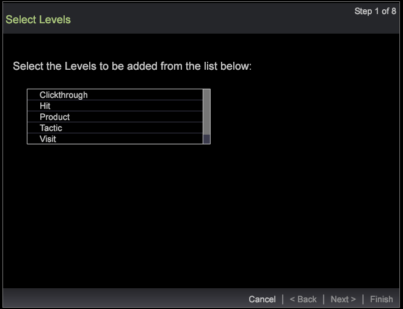

# Segment export wizard{#segment-export-wizard}

使用區段匯出精靈匯出區段

區段匯出精靈提供逐步程式來設定和匯出區段，而非從詳 [細資料表格匯出區段](https://docs.adobe.com/content/help/en/data-workbench/using/client/export-data/c-sgmt-expt.html)。

## 使用精靈匯出區段 {#section-b30f2699dbc7490bad18512b91cb0cb3}

若要開啟精靈，請在工作區中按一下滑鼠右鍵，然後選 **取「管理** >精靈 **>區** 段匯出精靈 ****」。

>[!NOTE]
>
>只有在開啟精靈之前套用的區段才會被擷取。 此外，從嚮導建立的段導出無法生成外部命令。

1. 選擇要新增至匯出的維度和量度的各父級。

   顯示的層級取決於所選的配置檔案。 您可以根據描述檔選取多個維度層級。

   

1. 按&#x200B;**「下一步」**。
1. 選取所選層級的維度和量度。

   例如，在選取「頁面檢視」作為父層級後，您可以選取可匯出的子維度和度量。

1. 按&#x200B;**「下一步」**。

   

   

1. 選擇導出格式並輸入導出檔案的名稱。

   

   CSV、TSV、「區段匯出」和「含標題類型的區段匯出」不需要額外設定。 但是，「設定檔與觀眾匯出」、「自訂記錄服務」和「Adobe Target匯出」必須在步驟3中設定。 例如，請參閱「設定檔與對象匯出」的設定欄位。 配置這些導出類型，然後按一下「 **下一步**」。

   

   

   

1. 設定選取的匯出類型。

   標題(Header)-如果標題為True，則為「輸出文 **件」(Output File** )欄位命名。

   逸出欄位(Escape Field)-設 **置為True** 或 **False**。

   欄位順序(Order of Fields)-選擇一個欄位並向上或向下移動以設定導出檔案中的順序。

   

   按&#x200B;**「下一步」**。

1. 在此對話方塊中檢視「層級」和套用的篩選。 按一下&#x200B;**「下一步」**。

1. 如果 **選擇了** CSV、 **TSV**、 **段導出** 或 **** 段導出並選擇了題頭導出，則有三個選項：

   一般導出——輸出檔案將由伺服器在「伺服器／導出」資料夾中生成。

   

   FTP匯出——輸出檔案將傳輸至選取的伺服器。 （將從FTPServerInfo.cfg檔案中選取伺服器的清單。）

   

   SFTP匯出——輸出檔案將安全地傳輸至選取的伺服器。

1. 按一下&#x200B;**「下一步」**。

   **注意：** 如果選取的匯出類型是「 **設定檔與觀眾匯出**」、「 **自訂記錄服務」和** Adobe Target匯出 ****，則文字會根據選取的匯出而為靜態。

1. 設定排程參數。

   **「一次拍攝** 」可設為「真」或「假」。

   **按一下「進階排程設定** 」按鈕，即可開啟或關閉進階排程。

   

   與從「詳細資訊表」導出一樣，如果「高級設定」開啟，則一次鏡頭將消失。 按&#x200B;**「下一步」**。

1. 預覽匯出檔案，然後按一下「執 **行匯出」**。

   

   

使用嚮導可使用以下導出類型：

**區段匯出類型**

* 通用
* FTP
* SFTP

**含標題的區段匯出**

* 通用
* FTP
* SFTP

**CSV匯出**

* 通用
* FTP
* SFTP

**TSV匯出**

* 通用
* FTP
* SFTP

