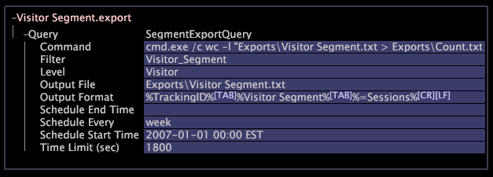

# 設定要匯出的區段{#configure-segments-for-export}

{{eol}}

您可以建立任何可數維度之元素的區段，然後以批次或持續即時將該區段的資料輸出至以Tab分隔的檔案。

每當您匯出區段時，即會輸出該區段中所有維度元素的量度或維度資料。您可以控制輸出資料的格式化方式，以方便其他系統載入資料。

>[!NOTE]
>
>您無法匯出報表維度，因為這些維度使用 [!DNL report time.metric] 檔案供參考。 作為因應措施，如果您將 [!DNL report time.metric] 在設定檔中，區段匯出可將其用作報表維度的參考點。 不過， [!DNL report time.metric] 不會根據設定檔的「截止時間」自動更新，因此，當您想要變更報表維度參考時，必須變更硬式編碼 [!DNL report time.metric] 檔案。

若要設定要匯出的區段，您必須開啟和編輯 [!DNL .export] 檔案。

1. 在 [!DNL Profile Manager]，按一下 **[!UICONTROL Export]** 目錄 [!DNL File] 欄以顯示其內容。

       如果導出目錄不存在，請按如下方式建立：
   
   1. 導覽至您的Data Workbench安裝目錄。
   1. 開啟您正使用的設定檔的目錄。
   1. 在Profile目錄中，建立名為&quot;Export&quot;的新目錄。

1. 在 [!DNL Profile Manager]，請在 [!DNL User] 欄，然後按一下 **[!UICONTROL Create]** > **[!UICONTROL New Segment Export]**.

   名為的檔案 [!DNL New Segment Export.export] 顯示於 [!DNL File] 欄。

1. 在 [!DNL User] 欄，並在「檔案」參數中鍵入新名稱。
1. 在 [!DNL User] 欄，然後按一下 **[!UICONTROL Open]** > **[!UICONTROL from the workbench]**.

   的設定視窗 [!DNL .export] 檔案。

1. 按一下 **[!UICONTROL Query]**，然後修改 [!DNL .export] 檔案，如下表所述：

<table id="table_C2EC8FCD3FA04DE78D2CADFA3F7FD8E3"> 
 <thead> 
  <tr> 
   <th colname="col1" class="entry"> 對於此參數…… </th> 
   <th colname="col2" class="entry"> 提供此資訊…… </th> 
  </tr> 
 </thead>
 <tbody> 
  <tr> 
   <td colname="col1"> 命令 </td> 
   <td colname="col2"> 
選填。要在建立輸出檔案後執行的程式。 此欄位必須參考執行檔(  .exe  檔案)，而非shell命令。 
 
注意：如果命令參數中有空格，則段導出將失敗。 
 </td> 
  </tr> 
  <tr> 
   <td colname="col1"> 篩選器 </td> 
   <td colname="col2"> 
選填。命名的篩選器或篩選器運算式。 您可以使用篩選器編輯器建立命名的篩選器，然後在此處鍵入該篩選器的名稱，或者可以鍵入篩選器表達式本身。 
 
如需篩選器編輯器的詳細資訊，請參閱 <a href="../../../home/c-get-started/c-analysis-vis/c-filter-editors/c-filter-editors.md#concept-2f343ecbed8240f18b0c1f1eccef11e3"> 篩選器編輯器 </a>. 如需篩選運算式語法的詳細資訊，請參閱 <a href="../../../home/c-get-started/c-qry-lang-syntx/c-syntx-fltr-exp.md#concept-72f2563f809747a2a3cff7ec72462a15"> 篩選器運算式的語法 </a>. 
 
與篩選器匹配的級別元素將導出，而其他所有元素則不導出。 
 </td> 
  </tr> 
  <tr> 
   <td colname="col1"> 層級 </td> 
   <td colname="col2"> 
要導出其元素的可數維。 
 
範例：訪客層級會匯出每個訪客的一列資料。 
 </td> 
  </tr> 
  <tr> 
   <td colname="col1"> 輸出檔案 </td> 
   <td colname="col2"> 
匯出資料的路徑和檔案名。 如果配置檔案在Data Workbench伺服器群集上運行，則每個Data Workbench伺服器都會寫入一個包含部分資料的輸出檔案。 
 
Data Workbench伺服器安裝目錄包含「導出」目錄，您可以在其中保存輸出檔案。 例如，您可以輸入  Exports\Visitor Segment.txt ，其中  Visitor Segment.txt  是包含已匯出資料的檔案名稱。 
 </td> 
  </tr> 
  <tr> 
   <td colname="col1"> 輸出格式 </td> 
   <td colname="col2"> 要針對每個「層級」元素匯出的量度或維度資料。 如果輸出是以定位點分隔的檔案，則欄位應以定位點字元分隔，格式應以適當的新行字元結尾。 如需詳細資訊，請參閱 <a href="../../../home/c-get-started/c-exp-data-seg-exp/c-abt-otpt-frmt.md#concept-ac7e24d1374a4b418365db7cc98c361e"> 關於輸出格式 </a>. </td> 
  </tr> 
  <tr> 
   <td colname="col1"> 排程結束時間 </td> 
   <td colname="col2"> 
選填。排程的結束日期和時間，包括時區。 
 
格式：YYYY-MM-DD hh:mm時區 
 
範例：2013-08-01美國東部夏令時12時01分 
 
排程的匯出目前會停止；但是，每當其定義被更改時，輸出檔案仍被重新生成。 若未定義「排程間隔」，此欄位便毫無意義。 如需時區設定的詳細資訊，請參閱 <i>資料集組態指南</i>. 
 </td> 
  </tr> 
  <tr> 
   <td colname="col1"> 排程間隔 </td> 
   <td colname="col2"> 選填。再生輸出檔案的頻率。 支援的值包括小時、日、周和月。 每當其定義被更改時，輸出檔案仍被重新生成。 </td> 
  </tr> 
  <tr> 
   <td colname="col1"> 排程開始時間 </td> 
   <td colname="col2"> 
選填。排程的開始日期和時間，包括時區。 
 
格式：YYYY-MM-DD hh:mm時區 
 
範例：2013-08-01美國東部夏令時12時01分 
 
排程的匯出此時開始，且排程是與此時相對的。 此欄位沒有定義  排程間隔 . 如需時區設定的詳細資訊，請參閱 <i>資料集組態指南</i>. 
 </td> 
  </tr> 
  <tr> 
   <td colname="col1"> 時間限制（秒） </td> 
   <td colname="col2"> 選填。產生區段匯出時允許經過的最長時間。 如果超出指定的間隔，則導出將重新開始。 將此值設為0（零）會移除限制。 預設值為600秒。 </td> 
  </tr> 
 </tbody> 
</table>

1. 按一下右鍵 **[!UICONTROL (New)]** 在視窗頂端，按一下 **[!UICONTROL Save]**.
1. 要使此檔案可供工作配置檔案的所有用戶使用，請按一下右鍵已建立的複選標籤 [!DNL .export] 檔案 [!DNL User] 欄，然後按一下 **[!UICONTROL Save to]** > *&lt;**[!UICONTROL working profile name]**>*.

   >[!NOTE]
   >
   >儲存 [!DNL .export] 檔案到Data Workbench伺服器後，即使將「計劃開始時間」設定為將來的日期和時間，導出仍會立即運行一次。

   以下是範例 [!DNL .export] 檔案。

   

   >[!NOTE]
   >
   >此 [!DNL Visitor Segment.export] 範例中顯示的檔案會參照「訪客區段」篩選器。 修改此篩選器的定義會變更匯出的定義。
