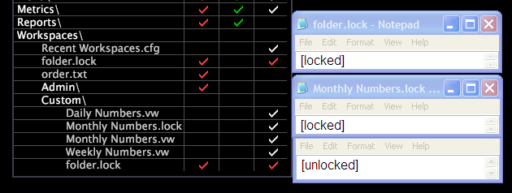

# Folder.lock和workspace.lock檔案{#folder-lock-and-workspace-lock-files}

在資料工作台安裝目錄的「工作區」(Workspaces)資料夾內，folder.lock檔案指定是否鎖定該特定資料夾中的工作區，而工作區name.lock檔案指定是否鎖定特定工作區。

鎖定整個資料夾時，可以在「工作區」(Workspaces)資料夾級別或子資料夾（頁籤）級別鎖定它們。 您也可以鎖定或解除鎖定所有資料夾(在「工作區」(Workspaces)資料夾級別)，然後指定特定子資料夾(使用檔案 [!DNL folder.lock] )或特定工作區(使用工 *作區名稱*.lock檔案)的例外情況。

下列範例會反白顯 [!DNL Profile Manager] 示三個元素：

* 主「工 [!DNL folder.lock] 作區」資料夾的檔案
* 工作 [!DNL Monthly Numbers.lock] 區檔案的 [!DNL Monthly Numbers.vw] 檔案

* Workspaces\ [!DNL folder.lock] Custom子資料夾的檔案

在此範例中，檔 [!DNL Workspaces folder.lock] 案會設為鎖定，這會鎖定此資料工作台例項中的所有工作區。 Workspaces\Custom子資料夾檔案 [!DNL folder.lock] 設定為解鎖，這將解鎖頁籤上的所有工 [!DNL Custom] 作區。 最後，檔 [!DNL Monthly Numbers.lock] 案會設為鎖定，這會鎖定「月度編號」工作區。

## 建立。lock檔案 {#section-c4f78b4b43c347368a376904effb41d2}

可使用或 [!DNL new folder.lock] 中的 [!DNL Create menu] 選項建立 [!DNL Profile Manager] 檔案 [!DNL Workspaces Manager]。 您也可以將現有檔案複製並貼到適當的檔案夾，變更檔案名稱(僅限 [!DNL folder.lock]*workspace name*.lock檔案)，並視需要變更檔案中的設定，以建立或工作區name [!DNL .lock]**.lock檔案。

**建立新folder.lock檔案**

1. 在資料工作台中，以滑 [!DNL Workspaces Manager] 鼠右鍵按一下工作區，然後按一下 **[!UICONTROL Manage]** > **[!UICONTROL Profile]** >開啟 **[!UICONTROL Workspaces Manager]**。
1. 按一下要為其建立檔案的文 [!DNL folder.lock] 件夾。
1. 在該資 [!DNL User] 料夾的欄中，以滑鼠右鍵按一下儲存格，然後按一下 **[!UICONTROL Create]** > **[!UICONTROL folder.lock]**。 出現 [!DNL new folder.lock] 一個檔案。 [!DNL New folder.lock] 檔案預設會設 [為解除] 鎖定。
1. （可選）如果您需要變更檔案中的設定：

   1. 按一下右鍵檔案的複選標籤。
   1. 按一下 **[!UICONTROL Open]** > **[!UICONTROL in Notepad]**. 檔案 [!DNL folder.lock] 隨即開啟。

   1. 將設定變更為 [鎖定]。
   1. 儲存並關閉檔案。

1. 要將此設定設定為所有使用相同工作配置檔案的用戶，請按一下右鍵檔案的複選標籤，然後按一下 **[!UICONTROL Save to]** > *&lt;**[!UICONTROL working profile name]**>*。

現在會根據新檔案中的設定，鎖定或解除鎖定此檔案夾中的工作區。

**從現有檔案建立。lock檔案**

1. 在或 [!DNL Profile Manager] 中 [!DNL Workspaces Manager]，按一下右鍵現有檔案的復 [!DNL .lock] 選標籤並按一下 **[!UICONTROL Copy]**。
1. 在要 [!DNL User] 將檔案貼上到的資料夾的列中，按一下右鍵 [!DNL .lock] 單元格，然後按一下 **[!UICONTROL Paste]**。
1. 如果此檔案用於鎖定單個工作區，請按一下右鍵列中檔案的複選標籤，並更改 [!DNL .lock][!DNL User][!DNL File] 該檔案在欄位中的名稱，以匹配要鎖定的工作區的名稱。

   例如，若要鎖定工 [!DNL Monthly Numbers.vw] 作區，請將檔案命名為「 [!DNL Monthly Numbers.lock]」。如果此檔案用於鎖定單個工作區，請按一下右鍵列中檔案的複選標籤，並更改 [!DNL .lock][!DNL User][!DNL File] 該檔案在欄位中的名稱，以匹配要鎖定的工作區的名稱。 例如，若要鎖定工 [!DNL Monthly Numbers.vw] 作區，請將檔案命名為「 [!DNL Monthly Numbers.lock]」。

1. 要更改檔案中的設定：

   1. 按一下右鍵檔案的複選標籤。
   1. 按一下 **[!UICONTROL Open]** > **[!UICONTROL in Notepad]**. 檔案 [!DNL .lock] 隨即開啟。

   1. 將設定變更為已 [鎖定] 或已 [解鎖]。
   1. 儲存並關閉檔案。

1. 要將此設定設定為所有使用相同工作配置檔案的用戶，請按一下右鍵檔案的複選標籤，然後按一下 **[!UICONTROL Save to]** > *&lt;**[!UICONTROL working profile name]**>*。

選取的工作區現在會根據新檔案中的設定，鎖定或解除鎖定。
