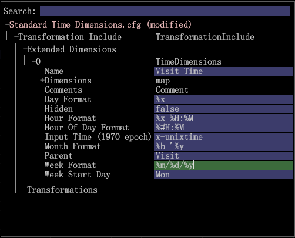

# 將時間維度當地語系化{#localizing-time-dimensions}

{{eol}}

配置時間維以正確顯示區域設定。

您可以根據 **[!DNL Standard Time Dimensions.cfg]** 檔案(預設位於 **[!DNL Server/Profiles/`<my profile>`/Dataset/Transformation/Time/Standard Time Dimension.cfg]**)。

例如，在北美洲，您可以將日期表示為5/3/15，或 **`%m/%d/%y`**. 然而，在世界其他地區，這可以解釋為 `%d/%m/%y`，或2015年3月5日，因為值模糊。 為避免此情況，管理員可能希望更改顯示的格式，以符合區域設定中用戶的期望。

## 1.覆寫標準時間Dimension.cfg中的預設時間Dimension {#section-7d0b24657bef4b15abb3cbea66cb617f}

要啟用此功能，管理員必須通過編輯現有時間維或使用其他參數建立新時間維來覆蓋預設值。

以下是修改時間維度的範例。

此 **格式** 將「周」、「小時」、「日」、「月」和「小時」的值設定為示例中的預設值。

>[!NOTE]
>
>如果省略這些行，Data Workbench的行為將不會變更，且維度將會使用預設值編譯。

```
Transformation Include = TransformationInclude:  
  Extended Dimensions = vector: 1 items 
    0 = TimeDimensions:  
      Comments = Comment: 0 items 
      Dimensions = map:  
        Day = string: Day 
        Day of Week = string: Day of Week 
        Hour = string: Hour 
        Hour of Day = string: Hour of Day 
        Month = string: Month 
        Week = string: Week 
      Hidden = bool: false 
      Input Time (1970 epoch) = string: x-unixtime 
      Week Format = string:  
  %m/%d/%y
      Hour Format = string:  
  %x %H:%M 
      Day Format = string:  
  %x
      Month Format = string:  
  %b '%y
      Hour Of Day Format = string:  
  %#H:%M
      Name = string: Visit Time 
      Parent = string: Visit 
      Week Start Day = string: Mon 
  Transformations = vector: 0 items
```



## 2.設定meta.cfg檔案 {#section-5e077d3298dd48fda7f7bb16af9ea00c}

此外，套件管理員必須將這些參數及其預設值新增至設定檔的 **[!DNL meta.cfg]** 檔案。 這可讓您從工作站進行編輯。

以下是摘自已設定的 **[!DNL meta.cfg]** 檔案。

```
dimensions = vector: 6 items 
  0 = Template: 
    ...
  ...
  5 = Template: 
    name = string: Time Dimensions 
    value = TimeDimensions: 
      Name = string:  
      Comments = Comment: 0 items 
      Hidden = bool: false 
       
  Week Format = string: %d/%m/%y 
       Hour Format = string: %x %H:%M 
       Day Format = string: %x 
       Month Format = string: %b '%y 
       Hour Of Day Format = string: %#H:%M</b> 
      Input Time (1970 epoch) = string:  
      Parent = string:  
      Week Start Day = string: Mon 
      Dimensions = map: 
        Hour of Day = string: Hour of Day 
        Day of Week = string: Day of Week 
        Hour = string: Hour 
        Day = string: Day 
        Week = string: Week 
        Month = string: Month
```

以下是 **[!DNL meta.cfg]** 檔案：


然後，管理員便能 **檔案管理員**，開啟設定時間維度的檔案(例如 **[!DNL Standard Time Dimensions.cfg]**)，並在工作站中使用編輯。
