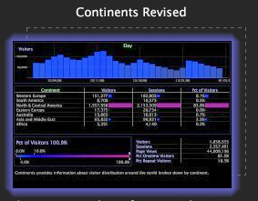

# 檔案版本設定{#file-versioning}

「工作台」可讓您輕鬆判斷每個特定工作區的儲存位置，不論是在Data Workbench伺服器、本機電腦或兩者皆有。

## 識別檔案版本{#section-d555c96b016344f19b356c12213dd2a9}

**伺服器**

伺服器工作區儲存在連接的Data Workbench伺服器上，可供所有有權訪問此配置檔案和頁籤的用戶使用。 伺服器工作區會以單一縮圖顯示。

伺服器工作區預設儲存在所連接的Data Workbench伺服器上「工作區」(Workspaces)資料夾內的相應子資料夾中。

**本地**

本機工作區是伺服器工作區的本機版本。 本機工作區顯示為兩個重疊的縮圖。 最上方的縮圖一開始會被光暈所環繞，這表示伺服器工作區的本機最近變更。 這種光輝會隨著時間消散。

本機工作區預設會儲存在Data Workbench（或分析）安裝目錄的[!DNL User\working profile name\Workspaces\tab]名稱資料夾中。

>[!NOTE]
>
>當您擁有伺服器工作區的本地版本時，必須還原為伺服器版本，才能下載伺服器工作區的更新版本。 要恢復到伺服器版本而不進行本地更改，請按一下右鍵本地工作區的縮略圖，然後按一下&#x200B;**[!UICONTROL Revert to server version]**。

**使用者**

用戶工作區是在上建立的工作區，僅存在於本地電腦上。 使用者工作區會以單一縮圖顯示，並在其後面加上空白工作區的虛線輪廓，表示連線的Data Workbench伺服器上沒有來源工作區。

依預設，使用者工作區會儲存在Insight安裝目錄的User\*working profile name*\Workspaces\*tab name*資料夾中。
