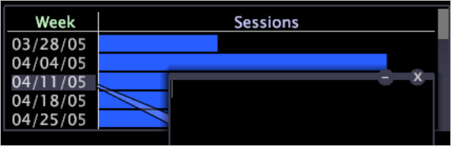

# 為工作區新增圖說文字{#adding-callouts-to-a-workspace}

{{eol}}

圖說文字是您新增至工作區的視窗，可透過虛擬選取該元素來建立新的視覺效果，以吸引特定維度元素的注意。

Data Workbench是以標準標注類型集提供的。 由於您的實作可完全自訂，因此您實作中顯示的可用圖說文字類型可能會與本指南中記錄的有所不同。

依預設，Data Workbench提供下列圖說：

* [註解](../../../home/c-get-started/c-vis/c-call-wkspc.md#section-7b6742160b3f4aed872a09c8c023f90d)
* [空白折線圖](../../../home/c-get-started/c-vis/c-call-wkspc.md#section-5dcc0504bdb64ed4976f880e2f7b277f)
* [空白散布圖](../../../home/c-get-started/c-vis/c-call-wkspc.md#section-5dcc0504bdb64ed4976f880e2f7b277f)
* [空白表格](../../../home/c-get-started/c-vis/c-call-wkspc.md#section-5dcc0504bdb64ed4976f880e2f7b277f)
* [信賴圖例](../../../home/c-get-started/c-vis/c-call-wkspc.md#section-386d1293ddc24a0c9cccb332e20db791)
* [量度圖例](../../../home/c-get-started/c-vis/c-call-wkspc.md#section-daa6d372c22246d9827880a9d6e804d8)

>[!NOTE]
>
>圖說文字無法當作選取項目運作（亦即，它們不會影響工作區內的其他視覺效果），除非您在圖說文字中進行選取。

通過配置儲存在 *設定檔名稱*\Context\Callout資料夾 [!DNL Server] 安裝資料夾。 請參閱 [配置圖說文字](../../../home/c-get-started/c-intf-anlys-ftrs/c-config-callouts.md#concept-f6e91e172f5e4c009245c9c549beb76a).

## 將註解圖說文字新增至視覺效果 {#section-7b6742160b3f4aed872a09c8c023f90d}

1. 按一下右鍵要為其建立註解的元素，然後按一下 **[!UICONTROL Add Callout]** > **[!UICONTROL Annotation]** > **[!UICONTROL Image]** 或 **[!UICONTROL Add Callout]** > **[!UICONTROL Annotation]** > **[!UICONTROL Text]**. 隨即顯示與該元素有可見連線的空白視窗。

   

   若要將圖說文字新增至「圖表」視覺效果，您必須以滑鼠右鍵按一下視覺效果底部（基軸），才能開啟功能表。

   

1. 視您的選擇而定，完成適當的步驟：

   * 對於文本批注，將所需文本鍵入或貼到註解中，然後根據需要設定文本格式。 請參閱 [使用文字註解](../../../home/c-get-started/c-analysis-vis/c-annots/c-text-annots.md#concept-55b4aa3e0c58470b8e3c9d452e12a777).
   * 對於影像注釋，通過複製影像，然後在註解內按一下右鍵，將所需影像貼到註解中。 按一下「**[!UICONTROL Paste image]**」。請參閱 [使用影像註解](../../../home/c-get-started/c-analysis-vis/c-annots/c-image-annots.md#concept-02081ed7d91c4fdcb8fc863f2a51c962).

## 若要將空白表格、折線圖或散布圖註解新增至視覺效果 {#section-5dcc0504bdb64ed4976f880e2f7b277f}

1. 按一下右鍵要為其建立註解的元素，然後按一下 **[!UICONTROL Add Callout]** > *&lt;**[!UICONTROL callout type]**>*.

   以下示例顯示「空白表」(Blank Table)標注。

   

1. 要選擇維，請按一下右鍵 **[!UICONTROL None]** 按一下 **[!UICONTROL Change Dimension]** > *&lt;**[!UICONTROL dimension name]**>*.

   >[!NOTE]
   >
   >如果在具有註解的視覺效果中更改尺寸，註解將從連接到原始維的元素更改為連接到整個視覺效果。

## 若要將信賴圖例圖說文字新增至視覺效果 {#section-386d1293ddc24a0c9cccb332e20db791}

1. 按一下右鍵要為其建立註解的元素，然後按一下 **[!UICONTROL Add Callout]** > **[!UICONTROL Confidence Legend]**.

   

1. 如果需要，請變更 [!DNL Metric or Formula] 欄位。

如需運算式語法規則，請參閱 [查詢語言語法](../../../home/c-get-started/c-qry-lang-syntx/c-qry-lang-syntx.md#concept-15d1d3f5164a47d49468c5acb7299d9f). 請參閱 [信賴度圖例](../../../home/c-get-started/c-analysis-vis/c-legends/c-conf-leg.md#concept-73db81c2c218427786c04068aa778efd).

## 若要將量度圖例圖說文字新增至視覺效果 {#section-daa6d372c22246d9827880a9d6e804d8}

1. 按一下右鍵要為其建立註解的元素，然後按一下 **[!UICONTROL Add Callout]** > **[!UICONTROL Metric Legend]**.

   

1. 如有需要，可新增量度至量度圖例或從中移除量度。

請參閱 [量度圖例](../../../home/c-get-started/c-analysis-vis/c-legends/c-metric-leg.md#concept-e7195bc8f7844ae295bda3a88b028d5b).
