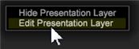

# 為視覺化加上註解{#annotating-visualizations}

「表現層」可讓您標籤並註解工作區視覺化，然後以您的呼籲和留言發佈。 在覆蓋中新增文字說明、圖形物件、圖說箭頭、色彩編碼、影像和其他功能，以新增註解並釐清重要資料點，然後與利益相關者共用。

**將註解新增至視覺化：**

1. 開啟工作區。
1. 前往「檔 **案** >表 **現層」**。
1. 按一 **下「允許表現層**」。

   切換此選單中的命令，以允許或不允許產生表現層。 當允許顯示圖層時，會出現複選標籤。

   

   當您允許呈現圖層時，工具列的右側會出現可點選的圖示。

    此可點選圖示顯示您處於「隱 **藏表現層** 」模式，但無法看見註解。

1. 按一下圖示可切換至「顯 **示表現層」**。

   在表現層中檢視註解。

    此可點選圖示顯示您處於「顯 **示表現層** 」模式，但無法編輯。

   >[!NOTE]
   >
   >您也可以在工作區中按一下滑鼠右鍵，以使用選單指令來變更模式。

   

1. **編輯和添加圖說特徵。**

   再按一下圖示可擷取工作區視覺化的靜態表示，並開啟覆蓋以新增或編輯註解。

    此可點選圖示顯示您處於「編輯表 **現層」模式** ，以新增和編輯註解。

   在編輯模式中，會出現灰色覆蓋。

1. **添加註解功能**。

   以滑鼠右鍵按一下視覺化，以新增文字方塊。 箭頭和其他圖說功能，以反白標示和註解簡報。

   

1. **設定圖形功能**。

   選取圖形物件，然後按一下滑鼠右鍵以設定選項。 您可以為方塊或其他圖形物件設定顏色、調整文字方塊中的文字設定，以及新增箭頭或為線條設定分層。

   

1. **將影像新增至工作區**。

   按一下滑鼠右鍵，將。png和。jpg影像新增至覆蓋並調整大小。

1. **為圖形對象指定顏色**。

   您可以在表現層中選取物件，並使用檢色器來指定顏色。 

1. **匯出和共用表現層**。

   在為工作區視覺化加上註解後，您可以匯出具有視覺化的表現層，並共用為。png圖形檔案。

   按一 **下「匯出** > **匯出PNG**」。
