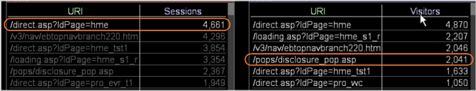

# 瞭解選取項目對其他視覺效果的影響{#understanding-how-a-selection-affects-other-visualizations}

{{eol}}

在工作區中，視覺效果代表一組查詢結果。

進行選取時，「Data Workbench」會篩選查詢結果，查詢結果將用來在工作區中產生視覺效果。 特定篩選依視覺效果而異。

下列範例說明Data Workbench如何將選取項目套用至三種不同的視覺效果類型。 檢閱這些範例有助於了解選取項目對視覺效果的篩選效果。 它們也可協助您了解如何解讀在篩選視覺效果中看到的結果。

* [使用工作階段量度篩選視覺效果](../../../../home/c-get-started/c-vis/c-sel-vis/c-sel-aff-vis.md#section-7cc06493ecb34cd4a696dbf0f0a7aaef)
* [使用訪客量度篩選視覺效果](../../../../home/c-get-started/c-vis/c-sel-vis/c-sel-aff-vis.md#section-97d38c7f03e8457189a9c72d69514ed2)
* [使用依工作階段的訪客量度篩選視覺效果](../../../../home/c-get-started/c-vis/c-sel-vis/c-sel-aff-vis.md#section-f746182311d648dcb98716b0fe846e25)

## 使用工作階段量度篩選視覺效果 {#section-7cc06493ecb34cd4a696dbf0f0a7aaef}

在此範例中， [!DNL /direct.asp/?ldPage=hme] 左側視覺效果中的URI是篩選右側視覺效果中顯示之「工作階段」的量度。


* **選擇對查詢的影響：** Data Workbench篩選所選URI的會話。 在此範例中，為 [!DNL /pops/disclosure_pop.asp] 元素的篩選方式如下：

   ```
   Sessions[ URI="/pops/disclosure_pop.asp" AND URI="/direct.asp
   /?ldPage=hme"] by Page View by Session
   ```

* **解譯視覺效果：** 篩選的視覺效果代表包含列在視覺效果和 [!DNL /direct.asp/?ldPage=hme]. 此範例顯示有1,113個工作階段期間，訪客同時檢視了 [!DNL /pops/disclosure_pop.asp] 頁面和 [!DNL /direct.asp/?ldPage=hme] 在同一個工作階段中。

## 使用訪客量度篩選視覺效果 {#section-97d38c7f03e8457189a9c72d69514ed2}

在此範例中， [!DNL /direct.asp/?ldPage=home] 左側視覺效果中的URI是篩選右側視覺效果中「訪客」的量度。



* **選擇對查詢的影響：** Data Workbench會篩選所選URI的訪客。 在此範例中，為 [!DNL /pops/disclosure_pop.asp] URI的篩選如下：

   ```
   Visitors[ URI="/pops/disclosure_pop.asp" by Page View by Visitor 
     AND URI="/direct.asp/?ldPage=hme" by Page View by Visitor ]
   ```

* **解譯視覺效果：** 篩選的視覺效果可描繪已檢視視覺效果中所列URI的訪客，以及 [!DNL /direct.asp/?ldPage=hme] （雖然不一定在同一工作階段期間）。 上述範例顯示有2,041位訪客同時檢視了兩者 [!DNL /pops/disclosure_pop.asp] 和 [!DNL /direct.asp/?ldPage=hme].

## 使用依工作階段的訪客量度篩選視覺效果 {#section-f746182311d648dcb98716b0fe846e25}

在此範例中， [!DNL /direct.asp/?ldPage=hme] 左側視覺效果中的URI是依工作階段篩選右側視覺效果中的量度。


* **選擇對查詢的影響：** Data Workbench會依工作階段篩選所選URI的訪客。 例如，為 [!DNL /pops/disclosure_pop.asp] URI的篩選如下：

   ```
   Visitors[ ( URI="/pops/disclosure_pop.asp" by Page View 
     AND URI="/direct.asp/?ldPage=hme" by Page View ) by Session ]
   ```

* **解譯視覺效果：** 篩選的視覺效果可描繪已檢視視覺效果中列出的兩個URI的訪客，以及 [!DNL /direct.asp/?ldPage=hme] 在同一工作階段期間。 此範例顯示1,069位訪客同時看到了 [!DNL /pops/disclosure_pop.asp] 和 [!DNL /direct.asp/?ldPage=hme] 在單一工作階段期間。
