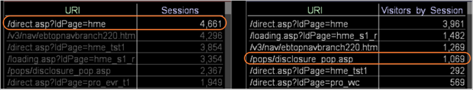

# 瞭解選取範圍對其他視覺效果的影響{#understanding-how-a-selection-affects-other-visualizations}

在工作區中，視覺化代表一組查詢結果。

當您進行選擇時，「資料工作台」會篩選查詢的結果，以便在工作區中產生視覺化。 特定篩選條件會依視覺化而有所不同。

下列範例說明「資料工作台」如何將選取範圍套用至三種不同的視覺化類型。 檢閱這些範例可協助您瞭解選取範圍對視覺化的篩選效果。 它們也可協助您瞭解如何解讀篩選視覺化中的結果。

* [使用工作階段度量篩選視覺化](../../../../home/c-get-started/c-vis/c-sel-vis/c-sel-aff-vis.md#section-7cc06493ecb34cd4a696dbf0f0a7aaef)
* [使用訪客度量篩選視覺化](../../../../home/c-get-started/c-vis/c-sel-vis/c-sel-aff-vis.md#section-97d38c7f03e8457189a9c72d69514ed2)
* [使用逐個作業的訪客度量篩選視覺化](../../../../home/c-get-started/c-vis/c-sel-vis/c-sel-aff-vis.md#section-f746182311d648dcb98716b0fe846e25)

## 使用工作階段度量篩選視覺化 {#section-7cc06493ecb34cd4a696dbf0f0a7aaef}

在此範例中， [!DNL /direct.asp/?ldPage=hme] 左側視覺化中的URI是篩選右側視覺化中顯示之「工作階段」的量度。


* **選擇對查詢的影響：** 「資料工作台」會篩選所選URI的「工作階段」。 在此示例中，生成元素值的查詢 [!DNL /pops/disclosure_pop.asp] 按如下方式篩選：

   ```
   Sessions[ URI="/pops/disclosure_pop.asp" AND URI="/direct.asp
   /?ldPage=hme"] by Page View by Session
   ```

* **解讀視覺化：** 篩選的視覺化表示包含視覺化和中所列URI的作業數 [!DNL /direct.asp/?ldPage=hme]。 此範例顯示有1,113個作業期間訪客檢視了同 [!DNL /pops/disclosure_pop.asp] 一頁 [!DNL /direct.asp/?ldPage=hme] 面和同一作業。

## 使用訪客度量篩選視覺化 {#section-97d38c7f03e8457189a9c72d69514ed2}

在此範例中， [!DNL /direct.asp/?ldPage=home] 左側視覺化中的URI是篩選右側視覺化中訪客的量度。


* **選擇對查詢的影響：** 資料工作台會篩選所選URI的訪客。 在此示例中，生成 [!DNL /pops/disclosure_pop.asp] URI值的查詢按如下方式進行篩選：

   ```
   Visitors[ URI="/pops/disclosure_pop.asp" by Page View by Visitor 
     AND URI="/direct.asp/?ldPage=hme" by Page View by Visitor ]
   ```

* **解讀視覺化：** 篩選的視覺化會顯示已檢視視覺化中所列URI的訪客 [!DNL /direct.asp/?ldPage=hme] （雖然不一定在相同作業期間）。 上述範例顯示2,041位訪客同時檢視 [!DNL /pops/disclosure_pop.asp] 和 [!DNL /direct.asp/?ldPage=hme]。

## 使用逐個作業的訪客度量篩選視覺化 {#section-f746182311d648dcb98716b0fe846e25}

在此範例中， [!DNL /direct.asp/?ldPage=hme] 左側視覺化中的URI是在右側視覺化中依訪客作業篩選度量。



* **選擇對查詢的影響：** 資料工作台會依作業篩選所選URI的訪客。 例如，生成URI值的查詢 [!DNL /pops/disclosure_pop.asp] 按如下方式篩選：

   ```
   Visitors[ ( URI="/pops/disclosure_pop.asp" by Page View 
     AND URI="/direct.asp/?ldPage=hme" by Page View ) by Session ]
   ```

* **解讀視覺化：** 篩選的視覺化會顯示在視覺化中和同一作業期間檢視過兩個URI [!DNL /direct.asp/?ldPage=hme] 的訪客。 此範例顯示有1,069位訪客在單一作業 [!DNL /pops/disclosure_pop.asp] 期間 [!DNL /direct.asp/?ldPage=hme] 和同時檢視。

