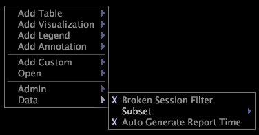

# 瞭解子集{#understanding-subsets}

子集的概念性資訊。

使用子集時，請牢記以下事項：

* 您的所有基準現在都與您的子集相關，而非與整個資料集相關，這在分析特定子集時更有用。 請參閱[瞭解基準](../../../../home/c-get-started/c-vis/c-ustd-benchmks.md#concept-c7b0f4102e92458096f8c4765cbe2914)。
* 使用子集會影響您的所有工作區，因為子集會全域套用至Data Workbench。
* 子集只影響度量和非正規維度，而不影響一般維度。
* 使用[!DNL Report]時，子集不會影響發佈給其他人檢視之報表中的資料。
* 套用後，您的子集將對描述檔中的所有後續工作生效，包括下次開啟此Data Workbench例項時，直到您移除它為止。
* 唯一表示已套用子集的位置是您在工作區中按滑鼠右鍵即可到達的上下文功能表。

   

* 您必須線上上工作才能變更或移除子集。 如果您離線工作並套用子集，則無法檢視整個資料集的結果。 請參閱[離線工作和線上](../../../../home/c-get-started/c-off-on.md#concept-cef8758ede044b18b3558376c5eb9f54)。

   >[!NOTE]
   >
   >子集的大小會限制為駐留在單一Data Workbench伺服器上的篩選器中的資料量。 因此，如果資料集跨越Data Workbench伺服器群集，則子集的資料僅來自群集中的一個Data Workbench伺服器。

大型零售商的使用者想要建立特定工作周資料的子集（本機快取），然後僅對該周資料執行查詢。 為此，使用者會建立興趣日的子集。

下列範例顯示一段時間內的「訪客」長條圖和「流量」量度圖例。 第一個圖不包含選擇：資料集中的所有資料都會呈現。 第二個圖顯示「日」= {...}（依訪客而定）子集的資料，其中「日」是根據「日」維度中4月1日到4月5日的元素選擇。

