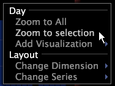

# 放大或縮小視覺效果{#zoom-in-or-out-in-a-visualization}

{{eol}}

您可以放大或縮小圖形、地球圖、程式圖和散布圖中的資料。

## 在進程映射和地球中放大對象 {#section-be293f50337f49ee8f0f1ee3e613e4a1}

**放大區域**

* 指向所需區域，按住兩個滑鼠按鈕，然後將滑鼠向前移動（遠離您）。

**縮小區域**

* 指向所需區域，按住兩個滑鼠按鈕，然後向後（朝向您）移動滑鼠。

## 在圖形和散布圖中放大軸 {#section-1438a5d637e84d68b69e269062dd3d7a}

圖形和散布圖都有可以單獨放大或縮小的軸（即可以放大一個軸，然後縮小另一個軸）。

>[!NOTE]
>
>對於折線圖中的Y軸和散布圖中的X或Y軸，每次基礎資料變更時縮放都會重設。 因為這經常發生線上上工作時，Adobe建議您在需要縮放這些軸時離線工作。 請參閱 [離線和線上工作](../../../home/c-get-started/c-off-on.md#concept-cef8758ede044b18b3558376c5eb9f54).

**若要放大圖表的x或y軸** 垂直縮放時（沿著y軸）,x軸會保持固定，而資料會向上延伸。

1. 將滑鼠指標放置在圖形的x或y軸量度或維度標籤區域。
1. 按兩下滑鼠按鈕，將滑鼠向前移動（遠離您）。 軸上會出現箭頭，指出目前所顯示視覺效果以外還有更多資料可用。

**縮小圖形的x或y軸**

1. 將滑鼠指標放置在圖形的x或y軸量度或維度標籤區域。
1. 按兩下滑鼠按鈕，然後向後（向前）移動滑鼠。

**若要放大圖表x或y軸上的所有資料** 此 [!DNL Zoom to All] 菜單命令返回選定軸上所有資料的顯示。

* 以滑鼠右鍵按一下x或y軸邊框區域（在資料標籤附近），然後按一下 **[!UICONTROL Zoom to All]**.

   

**放大圖形中選取的資料**

1. 按一下滑鼠指標，並拖曳到您要選取的資料範圍。
1. 在維度標籤區域中按一下滑鼠右鍵，然後按一下 **[!UICONTROL Zoom to Selection]**.

軸上會出現箭頭，指出目前所顯示視覺效果以外還有更多資料可用。
