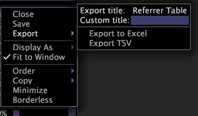

# 匯出視窗資料{#export-window-data}

您可以將特定視窗中的資料匯出至Excel檔案（.xls或。xlsx）或標籤分隔值檔案(.tsv)。

資料不會從圖形、路徑瀏覽器、程式地圖、散布圖和欄匯出。

## 將視窗資料匯出至Microsoft Excel {#section-b660adf7f4f64a2b9be7287c591b67b0}

若要將個別視窗資料匯出至Microsoft Excel，必須符合下列要求：

* Microsoft Excel必須安裝在與Data Workbench相同的機器上。
* 執行Data Workbench程式的使用者帳戶必須擁有存取Microsoft Excel的權限。
* 將資料匯出為Excel檔案時，您會開啟新的Excel例項。
* 雖然Data Workbench支援超過256欄和65,536列的資料，但8.0之前的Microsoft Excel版本則否。

如果符合這些要求，Data Workbench會自動啟動Microsoft Excel，並在您選取&#x200B;**[!UICONTROL Export To Excel]**&#x200B;功能表選項時將資料匯出至新的Excel活頁簿。

**若要將視窗資料匯出至。xls或。xlsx檔案**

按一下右鍵窗口的頂部邊框，然後按一下&#x200B;**[!UICONTROL Export]** > **[!UICONTROL Export to Excel]**。

Excel會開啟包含匯出資料的新活頁簿。 除非您已提供自訂標題（如下節所述），否則此活頁簿會使用[!DNL Export title]（上例中的日表）命名。

## 套用自訂標題{#section-2a6559df812a470685e43923b7b9024e}

如果您為窗口提供自定義標題（使用[!DNL Export]菜單上的[!DNL Custom title]欄位），則Data Workbench將資料導出到的工作表將使用此自定義標題而不是[!DNL Export title]欄位中的標題（上例中的日表）命名。

**若要將自訂標題套用至視覺化**

1. 按一下右鍵窗口的頂部邊框，然後按一下&#x200B;**[!UICONTROL Custom title]**&#x200B;欄位。
1. you

將視覺化匯出至Excel時，包含此視窗資料的工作表會使用您指定的標題來命名，而非在[!DNL Export title]欄位中的標題。

## 將視窗資料匯出至TSV檔案{#section-93c6b24f7338430aaf5a63b99b9489e8}

**要將窗口導出到。tsv檔案**

按一下右鍵窗口的頂部邊框，然後按一下&#x200B;**[!UICONTROL Export]** > **[!UICONTROL Export TSV]**。

1. 出現[!DNL Save Window]對話框。
1. 導覽至您要儲存檔案的目錄。 如有必要，請變更檔案名稱，然後按一下&#x200B;**[!UICONTROL Save]**。
