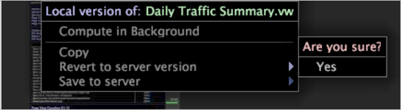

# 刪除工作區{#deleting-a-workspaces}

有關從「工作台」刪除工作區的資訊。

本地工作區是伺服器上存在的工作區的本地版本。 用戶工作區僅存在於本地電腦上。

**若要從[!DNL Worktop]**

按一下右鍵要刪除的工作區，然後按一下&#x200B;**[!UICONTROL Revert to server version]** > **[!UICONTROL Yes]**。 本機版本會刪除，但伺服器版本仍會保留。

>[!NOTE]
>
>當您有伺服器工作區的本機版本時，您必須先回復為伺服器版本，才能下載伺服器工作區的更新版本，以遺失變更。

**若要從[!DNL Worktop]**

按一下右鍵要刪除的工作區，然後按一下&#x200B;**[!UICONTROL Delete]**。

