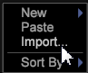

# 匯入工作區{#import-a-workspace}

您可以將工作區匯入操作台。

**匯入工作區的方式**

1. 在「操作台」(Worktop)中按一下右鍵（在工作區縮圖視圖外）以開啟菜單。

   

1. 按一下&#x200B;**Import**&#x200B;以開啟檔案選擇窗口。
1. 選擇&#x200B;**.vw**&#x200B;檔案，然後按&#x200B;**Open**&#x200B;或&#x200B;**Open as read-only**。

>[!NOTE]
>
>無法像工作區一樣匯入視覺效果。 在操作台中按一下滑鼠右鍵並選取&#x200B;**[!UICONTROL Import]**&#x200B;時，您可以匯入現有工作區，但無法匯入駐留在工作區外部的視覺效果。 如果您嘗試匯入視覺效果，會收到「工作區無效」錯誤。
