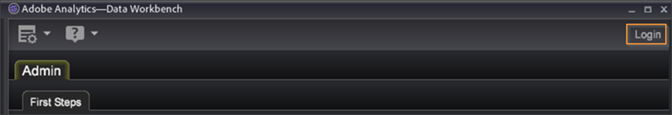

# 開啟 Data Workbench{#opening-data-workbench}

{{eol}}

安裝Data Workbench並連線至伺服器後，您就可以使用它來分析已處理的資料。

1. 導覽至Data Workbench安裝目錄。
1. 按兩下 [!DNL insight.exe] 來啟動應用程式。
1. 按一下 **[!UICONTROL Login]**。

   

1. 輸入您的憑證。

   

   第一次啟動時，系統會顯示 [!DNL Start] 頁面，並開始下載設定檔資料和資料快取。

1. 資料快取開始填滿後，按一下 **[!UICONTROL Start]**.

   系統會顯示 [!DNL Worktop].

   

   下次開始Data Workbench時，系統會略過 [!DNL Start] 頁面和 [!DNL Worktop]，除非已將新設定檔新增至伺服器。

   只有在您線上工作且與Data Workbench伺服器有網路連線時，才會下載設定檔及其資料的更新。 有關聯機工作的詳細資訊，請參閱 [離線和線上工作](../../home/c-get-started/c-off-on.md#concept-cef8758ede044b18b3558376c5eb9f54).

   >[!NOTE]
   >
   >不建議多個使用者共用一台電腦以使用工作站。
