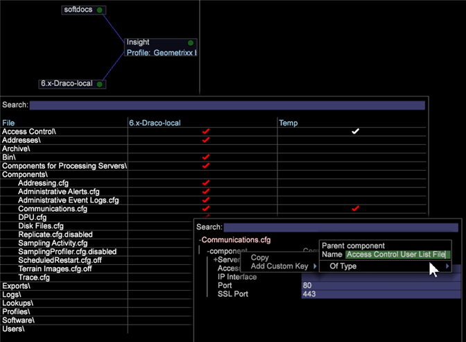

# User Administration of Group Member Access{#user-administration-of-group-member-access}

管理員可以將管理自訂群組存取權控制的部份權限授予工作站使用者。

**群組成員存取權的自我管理** ，可讓非管理員新增和刪除自訂群組中的成員。 管理員會建立「 **使用者清單** 」檔案，並在 [](https://docs.adobe.com/content/help/en/data-workbench/using/server-admin-install/admin-dwb-server/access-control/c-config-acs-ctrl.html) Access Control.cfg檔案中為新群組成員設定群組存取權。

**訪問伺服器管理器**

在「伺服器管 **[!DNL User List]** 理器」工作區中設定文 **[!DNL Communications.cfg]** 件並將其與檔案同 **** 步。

1. 在工作台上，按一下「管 **理」標籤** >「資 **料集和描述檔** 」標籤。

1. 開啟「伺 **服器管理** 」工作區。
1. 按一下右鍵圖中&#x200B;*的*>您的伺服器名稱 **> ，然後選擇「**&#x200B;檔案」。

   伺服器檔案將在表中開啟，其 *中列為**`<server name>`* File *、*&#x200B;和Temp。

1. **在伺服器** 檔案的伺服器欄中按一下滑鼠右鍵，即可建立本端(針對此功能 **[!DNL Access Control]** 和 **[!DNL Components/Communications.cfg)]**)。

   「臨時」( **Temp** )列中將顯示白色複選標籤。 您可以在「臨時」檔案夾中編輯。 然後，按一下右鍵複選標籤並 **保存到伺服器** 。 （與伺服器同步時會變成紅色）。

## 建立User List.cfg檔案 {#section-c25bcaf34f4546e6b8b65f5e7f69ac09}

管理員需要在檔案 **[!DNL User List.cfg]** 夾中建立文 **[!DNL Access Control]** 件。

1. 按一下右鍵「 **Temp** 」列中的「訪問控制」**行，然後選擇「 **開啟** 」>「 **資料夾**」。 

   Temp資料夾中的Access Control資料夾 **將會開啟** ，列出單一 **[!DNL Access Control.cfg]** 檔案。

1. 將另一個文字檔案新增至此檔案夾，並 **[!DNL User List.cfg]** 將其命名(在 **[!DNL Access Control.cfg]**&#x200B;旁)。

1. Add the following parameters to the **[!DNL User List.cfg]** file.

用戶清單檔案應包含 **AccessGroup** 對象的向量，每個 **AccessGroup** 對象都應具有名稱和名為Members的字串向 **量**。

```
Access Control Groups = vector: 1 items 
  0 = AccessGroup:  
    Name = string: Group 1 
    Members = vector: 1 items 
      0 = string: CN:Joe User
```

然後，您可以在**[!DNL User List.cfg]**檔案的「工作站」視圖中編輯和添加用戶。


以下是要新增至檔案的最基本參 **[!DNL User List.cfg]** 數。 然後可以在「工作站」視圖中添加成員。

```
Access Control Groups = vector: 1 items 
  0 = AccessGroup:  
    Name = string:  
    Members = vector: 0 items
```

>[!IMPORTANT]
>
>如同您手 **[!DNL .cfg]** 動編輯的任何檔案，請務必使用空格而非標籤，並密切注意空格和語法。 此檔案中的錯誤會導致 *Adobe Insight Server* 忽略「使用者清單」檔案。

檔案 **中將引用每** 個「訪問組 **」中的「名稱」**[!DNL Access Control.cfg] 欄位。

>[!NOTE]
>
>僅包含目錄服務前置詞的有效成員，如 **CN:** 或 **OU:** 皆可接受，且這些字元不能包含萬用字元(*)。

## 設定Communications.cfg檔案 {#section-9d6f05ba81c14f15be63e361533459e8}

管理員首先會開啟 **[!DNL Components]>檔[!DNL Communications.cfg]**案並新增名稱的新索引鍵，以啟用此功能&#x200B;**[!DNL Access Control User List File]**。 此索引鍵的字串值是新檔案所在的路徑。

1. 在伺服器檔案中，按一下「 **元件** 」(Components)，然後按一下右鍵伺服器列中的複選標籤。 按一 **下「設為本機**」。

   「臨時」( **Temp** )列中將顯示白色複選標籤。

1. 按一下右鍵「 **Temp** 」列中的複選標籤，然後選 **擇「在工作** 站中開啟」 ****。

1. 在 **Communication.cfg檔案中** ，以滑鼠右鍵按一 **下元件** ，然後選 **取「新增自訂金鑰」。** 

1. 鍵入Name **** as *Access Control User List File* (名稱 **為Access Control User List檔案)，並** 將Type *Type*（字串）。

   >[!NOTE]
   不能將新清單檔案建立為路徑。 要糾正此問題，您需要保存檔案，在編輯器（記事本）中將其開啟，並將「字串」更改為「路徑」:

   在可以記錄:

   ```
   component = CommServer:  
     Access Control File = Path: Access Control\\Access Control.cfg 
     Access Control User List File =  
    <string>: Access Control\\User List.cfg
   ```

   之後:

   ```
   component = CommServer:  
     Access Control File = Path: Access Control\\Access Control.cfg 
     Access Control User List File =  
    <Path>: Access Control\\User List.cfg
   ```

1. 儲存檔 **[!DNL Communications.cfg]** 案並（如有必要）儲存至伺服器。 這將重新啟動伺服器中的元件，以確保您沒有犯任何可能阻止解析檔案 **[!DNL Communications.cfg]** 的錯誤。
1. 如果您的系統包含處理伺服器，請修改檔案中的設定 **[!DNL Components for Processing Servers.cfg]** 檔案。
1. 按一下右鍵並 **[!DNL Communications.cfg]** 保存到伺服器。

資料工作台管理員現在可以確認預期使用者擁有使用者清單檔案的存取權，並允許使用者管理群組。 用戶將能夠開啟用戶清單檔案，對其進行編輯，並根據需要添加和刪除CN或OU成員。

## 同步Access Control.cfg檔案 {#section-ca6da453dfb4432bb40b86ef15ede872}

然後，管理員可以編 **[!DNL Access Control.cfg]** 輯「用戶清單」檔案定義的組並插入 *引用* 。

對組的引用應與其他成員一樣插入，但使用以下語法：

```
$(Group Name)
```

其中，「群組名稱」與使用者清單檔案中定義的項目相符，包括空格。 

此時，資料工作台管理員可確認選取的群組使用者擁有使用者清單檔案的存取權。 然後，選擇的用戶可以 **[!DNL User List.cfg]** 開啟檔案、對其進行編輯，並根據需要添加和刪除CN或OU成員。
