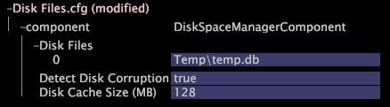

# 監視資料集資料空間{#monitoring-dataset-data-space}

資料集監控和新增資料集資料儲存位置的相關資訊。

**建議頻率：** 每5-10分鐘

預設情況下， [!DNL Insight Server] 將其資料集寫入 [!DNL temp.db] 與資料處理單元上的程式檔案 [!DNL Insight Server] 位於同一驅動器上的檔案。 每部機器的資料集 [!DNL Insight Server] 資料量限制為下列（以先發生者為準）:

* 5億（5億）條資料輸入記錄
* 儲存了500(500)GB的資料集資料
* 每個根層級維度儲存一(1)MB的資料集資料（例如，每個訪客5,000個記錄，每個記錄平均200位元組）

如果要 [!DNL Insight Server] 將資料集維護在不同的驅動器上，或者如果要收集的資料量需要使用多個驅動器，則必須更新磁碟檔案配置檔案( [!DNL Disk Files.cfg])以指定要寫入文 [!DNL Insight Server][!DNL temp.db] 件的位置。 文 [!DNL Disk Files.cfg] 件列出磁碟檔案（字串向量），並指定在重新處理和操作期間使用的資料集 [!DNL Insight Server] 資料的位置。 每個物理驅動器通常有一個檔案。

>[!NOTE]
>
>安裝時可 [!DNL Disk Files.cfg] 能已修改檔案內容 [!DNL Insight Server]。 如需詳細資訊，請 [參閱設定資料集的位置(temp.db)](../../../../home/c-inst-svr/c-install-ins-svr/t-install-proc-inst-svr-dpu/t-cfg-loc-dtst.md#task-f645eefecb154e679acbb480a07c1f0e)。

**為資料集資料儲存添加新位置**

1. 在「 [!DNL Insight]>」標籤 [!DNL Admin] 中， [!DNL Dataset and Profile] 按一下縮圖以開 **[!UICONTROL Servers Manager]** 啟「伺服器管理員」工作區。
1. 按一下右鍵要配置的 [!DNL Insight Server] 表徵圖，然後按一下 **[!UICONTROL Server Files]**。
1. 在中，單 [!DNL Server Files Manager]擊以 **[!UICONTROL Components]** 查看其內容。 文 [!DNL Disk Files.cfg] 件位於此目錄中。
1. 按一下右鍵的伺服器名 *稱列中的複選標籤* ，然 [!DNL Disk Files.cfg] 後按一下 **[!UICONTROL Make Local]**。 複選標籤會出現在的 [!DNL Temp] 列中 [!DNL Disk Files.cfg]。
1. 在欄中以滑鼠右鍵按一下新建立的核取標 [!DNL Temp] 記，然後按一 **[!UICONTROL Open]** 下> **[!UICONTROL in Insight]**。
1. 在視窗 [!DNL Disk Files.cfg] 中，按一 **[!UICONTROL component]** 下以檢視其內容。

   

   >[!NOTE]
   >
   >預設情況下，「檢測磁碟損壞」參數設定為true。 磁碟快取大小(MB)參數控制用於提高磁碟訪 [!DNL Insight Server] 問速度的記憶體量，預設設定為128。 在變更其中一個參數之前，請與Adobe聯絡。

1. 要更改電腦上的磁碟文 [!DNL Insight Server] 件，請按一下右鍵並 **[!UICONTROL Disk Files]** 按一下 **[!UICONTROL Add new]** > **[!UICONTROL Disk File]**。

   要刪除磁碟檔案，請按一下右鍵該磁碟檔案號並按一下 **[!UICONTROL Remove]**。

1. 對於新磁碟檔案，輸入要在重新處理和操作過程中使用的檔案的目 [!DNL Insight Server] 錄和名稱。

   

   >[!NOTE]
   >
   >預設情況下，「檢測磁碟損壞」參數設定為true。 磁碟快取大小(MB)參數控制用於提高磁碟訪 [!DNL Insight Server] 問速度的記憶體量，預設設定為128。 在變更其中一個參數之前，請與Adobe聯絡。

1. 執行下列動作，將變更儲存至伺服器：

   1. 按一下右鍵 **[!UICONTROL (modified)]** 窗口頂部，然後按一下 **[!UICONTROL Save]**。

   1. 在中， [!DNL Server Files Manager]按一下右鍵列中檔案的複選標籤，然 [!DNL Temp] 後選擇 **[!UICONTROL Save to]** > *&lt;**[!UICONTROL server name]**>*。

