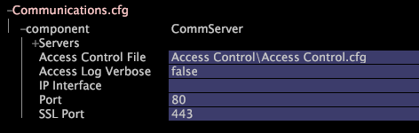

# 設定通訊{#configuring-communications}

{{eol}}

Communications組態檔Communications.cfg包含Insight Server網路設定和Access Control.cfg檔案的路徑。

這些設定可協助您連線至 [!DNL Insight Server].

**建議頻率：** 僅在必要時

**要查看和修改通信設定，請在[!DNL Insight]**

1. 在 [!DNL Insight]，在 [!DNL Admin] > [!DNL Dataset and Profile] ，按一下 **[!UICONTROL Servers Manager]** 縮圖以開啟「伺服器管理器」工作區。
1. 以滑鼠右鍵按一下 [!DNL Insight Server] 要配置，請按一下 **[!UICONTROL Server Files]**.
1. 在 [!DNL Server Files Manager]，按一下 **[!UICONTROL Components]** 來檢視其內容。 此 [!DNL Communications.cfg] 檔案位於此目錄中。
1. 以滑鼠右鍵按一下 *伺服器名稱* 欄 [!DNL Communications.cfg] 按一下 **[!UICONTROL Make Local]**. 勾號會出現在 [!DNL Temp] 欄 [!DNL Communications.cfg].
1. 在 [!DNL Temp] 欄，按一下 **[!UICONTROL Open]** > **[!UICONTROL in Insight]**.
1. 在 [!DNL Communications.cfg] 按一下 **[!UICONTROL component]** 來檢視其內容。
1. 視需要變更設定。 如需此檔案中可用參數的相關資訊，請參閱 [通信配置設定](../../../home/c-inst-svr/c-cfg-stgs-ref/c-comm-cfg-stgs.md#concept-aed00587c7a1432fb487bd154aaea6b1).

   

1. 執行下列操作，將更改保存到伺服器：

   1. 按一下右鍵 **[!UICONTROL (modified)]** 在視窗頂端按一下 **[!UICONTROL Save]**.

   1. 在 [!DNL Server Files Manager]，請在 [!DNL Temp] 欄和選取 **[!UICONTROL Save to]** > *&lt;**[!UICONTROL server name]**>*.
