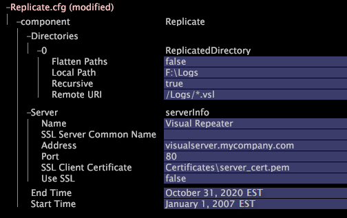

# 設定複寫服務{#configuring-the-replication-service}

您必須設定目標Insight伺服器，以便從儲存原始事件資料的中繼器擷取資料。

要配置從目標中檢索數 [!DNL Repeater] 據的功 [!DNL Insight Server]能，必須編輯目標上資料夾中提供的檔案，如以 [!DNL Replicate.cfg] 下過程 [!DNL Components][!DNL Insight Server(s)] 所述：

**要在目標[!DNL Replication Service]電腦上配置**

1. 在「 [!DNL Insight]>」標籤 [!DNL Admin] 中， [!DNL Dataset and Profile] 按一下縮圖以開 **[!UICONTROL Servers Manager]** 啟「伺服器管理員」工作區。
1. 按一下右鍵要配置的目標 [!DNL Insight Server] 的表徵圖，然後按一下 **[!UICONTROL Server Files]**。
1. 在中，單 [!DNL Server Files Manager]擊以 **[!UICONTROL Components]** 查看其內容。 文 [!DNL Replicate.cfg] 件位於此目錄中。
1. 按一下右鍵的伺服器名 *稱列中的複選標籤* ，然 [!DNL Replicate.cfg] 後按一下 **[!UICONTROL Make Local]**。 複選標籤會出現在的 [!DNL Temp] 列中 [!DNL Replicate.cfg]。
1. 在欄中以滑鼠右鍵按一下新建立的核取標 [!DNL Temp] 記，然後按一 **[!UICONTROL Open]** 下> **[!UICONTROL in Insight]**。 窗口 [!DNL Replicate.cfg] 開啟。
1. 在視窗 [!DNL Replicate.cfg] 中，按一下 **[!UICONTROL Replicate.cfg]**，然 **[!UICONTROL component]** 後檢視其內容。
1. 使用下列範例和表格作為參考線編輯參數：

   

   <table id="table_F32D4BFA2D834BBB81DF8F84417CA969"> 
   <thead> 
   <tr> 
      <th colname="col1" class="entry"> 對於此參數…… </th> 
      <th colname="col2" class="entry"> 指定分類的... </th> 
   </tr> 
   </thead>
   <tbody> 
   <tr> 
      <td colname="col1"> 目錄 </td> 
      <td colname="col2"> 
要複製(復  制 )至目標  Insight Server的Repeater上的目錄。 複製  服務允許從單個重複器中複製多個目 錄 。 
 
要添加新目錄，請按一下右鍵「目錄  」 ，然後按一下「添加新  」&gt;「 目錄 」。 
 </td> 
   </tr> 
   <tr> 
      <td colname="col1"> 平面化路徑 </td> 
      <td colname="col2"> 
是非。 此參數設定所定義的動作取決於此檔案中遞歸參數的設定： 
      <ul id="ul_D4BF3C22FBEF41C290ED938EB57E0F27">
      <li id="li_CB85E5AF9E1B4441AA38C2DB8D4F1800">如果「遞歸」為false，則「平面化路徑」不會產生任何效果。 僅複製遠程URI參數所指定目錄頂級的檔案。 </li>
      <li id="li_8FDB351102344E3995035557445354BB">如果遞歸為true，而平面化路徑為false，則遠端( Repeater)目錄的目錄結構會精確複製到目標  Insight Server的本機路徑中。 </li>
      <li id="li_3114B191C73744658799E112C61AB004">如果「遞歸路徑」和「平面化路徑」都為true，則本地路徑中不會建立子目錄。 而是將遠程目錄樹中的所有檔案放在本地目錄的頂層。 </li>
      </ul>
 
 
注意：如果「平面化路徑」和「遞歸」都為true，並且遠程電腦上各個子目錄中的檔案共用相同的名稱，則  Replication Service （複製服務）可能會停止，或者可能發生其他未定義的行為。 
 
 </td> 
   </tr> 
   <tr> 
      <td colname="col1"> 本機路徑 </td> 
      <td colname="col2">從中繼器中擷取檔案的儲存  位置。 路徑是相對於  Insight Server安裝目錄 。 </td> 
   </tr> 
   <tr> 
      <td colname="col1"> 遞歸 </td> 
      <td colname="col2"> 是非。 如果為false，則僅複製遠程URI參數所指定目錄頂級的檔案。 請參閱此表格中的平面化路徑。 </td> 
   </tr> 
   <tr> 
      <td colname="col1"> 遠程URI </td> 
      <td colname="col2">URI（包括檔案遮色片）可存取  Repeater的檔案儲存 。 Repeater  上的 Communications.cfg檔案應加以設定，以便使用此URI存取事件資料。 See <a href="../../../home/c-inst-svr/c-admin-inst-svr/c-mntr-disk-spc/t-mntr-evt-data-spc.md#task-a54d4bd16b96437f943cd09e5d848440"> Monitoring Event Data Space</a>. </td> 
   </tr> 
   <tr> 
      <td colname="col1"> 伺服器 </td> 
      <td colname="col2">Repeater的參  數 ，目標  Insight Server從中擷取事件資料檔案。 </td> 
   </tr> 
   <tr> 
      <td colname="col1"> 名稱 </td> 
      <td colname="col2">選填。用以識別重複項的  名稱。 </td> 
   </tr> 
   <tr> 
      <td colname="col1"> SSL伺服器通用名稱 </td> 
      <td colname="col2">只有當「使用SSL」設為true時才需要。 儲存事件資  料的 Repeater的公用名稱。 此名稱必須與電腦通信證書中列出的公用名稱匹配。 </td> 
   </tr> 
   <tr> 
      <td colname="col1"> 地址 </td> 
      <td colname="col2">儲存事件資料之中繼器的  主機名 或數值IP位址。 伺服器的公用名稱不是有效的項目。 </td> 
   </tr> 
   <tr> 
      <td colname="col1"> 連接埠 </td> 
      <td colname="col2"> 用於資料傳輸的埠。 預設連接埠為 80。 </td> 
   </tr> 
   <tr> 
      <td colname="col1"> SSL用戶端憑證 </td> 
      <td colname="col2">只有當「使用SSL」設為true時才需要。 用來連線至中繼器的授權憑證  名稱。 </td> 
   </tr> 
   <tr> 
      <td colname="col1"> 使用SSL </td> 
      <td colname="col2"> 
判斷SSL是否用於資料傳輸。 選項為true或false，預設值為false。 
 
 
注意：不建議使用SSL，因為它可能對效能有負面影響。 請注意，除非將中繼器連接至目標電腦的網路  不安全 ，否則不需要SSL。 
 
 </td> 
   </tr> 
   <tr> 
      <td colname="col1"> 結束時間，開始時間 </td> 
      <td colname="col2"> 
（可選）將複製到目標  Insight Server ，但包含「開始時間」和「結束時間」所定義範圍內資料的事件資料檔案集限制為這些檔案。 如果設定了「開始時間」，則不會複製所有日誌條目都早於指定開始時間的事件資料檔案。 如果設定了「結束時間」，則不會複製指定或更新時間的所有日誌條目的事件資料檔案。 如果檔案中的部分資料只在指定範圍內，則整個檔案將被複製到目標電腦。 
 
Adobe建議您目前使用下列其中一種格式： 
      <ul id="ul_AE15A159A4C043398B37AD56FDFD9DCA">
      <li id="li_4DEF0F13D13E43E39CBD1A0F32765F32">2013年1月1日美國東部夏令時間 </li>
      <li id="li_E3275312E93D4C1FAA028543DC21B51A">2013年1月1日HH:MM:SS GMT </li>
      </ul>
 
 
注意：您必須指定時區。 如果未指定，時區不預設為系統時間。 如果您想要實作日光節約時間或類似的時鐘移位政策，則必須在Base\Dataset\Timezone directory on the  Insight Server機器中儲存包含適當規則的 .dst  檔案。 有關支援的時區縮寫和實施日光節約時間的資訊的清單，請參閱時 <a href="../../../home/c-inst-svr/c-time-zn-cds.md#concept-eed5ba32d5d347cf94b76db83b29f211"> 區代碼</a>。 
 
 
 
注意： 若要使用這些設定，事件資料檔案的名稱必須以ISO日期(YYYYMMDD)開頭，且每個檔案必須包含該日期的24小時期間（從12 AM GMT開始）的資料。 
 
 </td> 
   </tr> 
   </tbody> 
   </table>

1. 執行下列動作，將變更儲存至伺服器：

   1. 按一下右鍵 **[!UICONTROL (modified)]** 窗口頂部，然後按一下 **[!UICONTROL Save]**。
   1. 在中， [!DNL Server Files Manager]按一下右鍵列中檔案的複選標籤，然 [!DNL Temp] 後選擇 **[!UICONTROL Save to]** > *&lt;**[!UICONTROL server name]**>*。

<!--  -->

此示例說明如果「平面化路徑」和「遞歸」參數都設定為true，則如何複製檔案。

假設遠程URI為， [!DNL /RemoteRoot/] 本地路徑為 [!DNL E:\LocalRoot\]。 在遠程( [!DNL Repeater])電腦上，檔案的組織如下：

* [!DNL /RemoteRoot/fileA.txt]
* [!DNL /RemoteRoot/Dir1/fileB.txt]
* [!DNL /RemoteRoot/Dir2/Subdir3/fileC.txt]

複製完成時，本地目錄具有以下檔案：

* [!DNL E:\LocalRoot\fileA.txt]
* [!DNL E:\LocalRoot\fileB.txt]
* [!DNL E:\LocalRoot\fileC.txt]

在本地目錄中，不建立子目錄，並且遠程目錄樹中的所有檔案都放在本地目錄的頂層。

>[!NOTE]
>
>如果遠程電腦上各個子目錄中的檔案具有相同名稱，則可能會停止或 [!DNL Replication Service] 發生其他未定義的行為。
