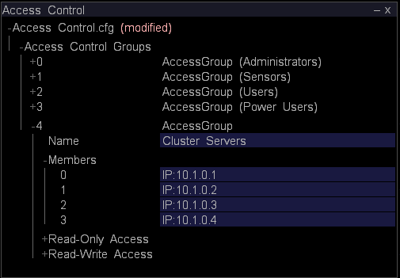

# 為叢集設定主 Insight Server{#configuring-the-master-insight-server-for-clustering}

有關在主Insight Server上設定叢集、更新叢集存取控制檔案等的資訊。

要配置群集，請在主[!DNL Insight Server]上執行以下步驟：

* 將處理[!DNL Insight Servers’]的常見名稱和地址添加到地址檔案中。
* 將所有[!DNL Insight Servers]添加到[!DNL Access Control.cfg]檔案中的群集伺服器組。

* 更新「處理伺服器的元件」目錄中的[!DNL Synchronize.cfg]檔案，以指向主[!DNL Insight Server]。

* 如有必要，請修改「處理伺服器的元件」目錄中的[!DNL Disk Files.cfg]檔案，以指定處理[!DNL Insight Servers]上[!DNL temp.db]檔案的位置。

要完成這些步驟，您需要知道群集中每個[!DNL Insight Server]的通用名稱（如個別的數字證書上所指定）和每個[!DNL Insight Server]的IP地址。 如果您尚未獲得此資訊，請在繼續之前獲取此資訊。

>[!NOTE]
>
>本節所述的過程需要[!DNL Insight]。 如果您尚未安裝[!DNL Insight]，請先按照&#x200B;**[!DNL Insight]使用手冊**&#x200B;中的說明進行操作，然後再繼續。

## 將處理分析伺服器新增至地址檔案{#section-2fe5298180164e8dbaa59ea6b6ff682d}

使用以下過程將處理[!DNL Insight Servers’]公共名稱和IP地址添加到主[!DNL Insight Server]上的地址檔案中。 （雖然地址檔案在主[!DNL Insight Server]上進行維護和管理，但群集中的所有[!DNL Insight Servers]都使用它。）

>[!NOTE]
>
>以下假設已為主[!DNL Insight Server]配置了地址檔案。 如果尚未將主[!DNL Insight Server’s] IP地址添加到地址檔案中，請在開始前完成[定義伺服器的網路位置](../../../../../../home/c-inst-svr/c-install-ins-svr/t-install-proc-inst-svr-dpu/c-svrs-ntwk-loc/c-svrs-ntwk-loc.md#concept-87dd2aa3448c415ca1285bc445a8c649)中所述的過程。

**將處理程式新 [!DNL Insight Servers] 增至位址檔案的方式**

1. 啟動[!DNL Insight]並載入「配置」配置檔案（如果尚未開啟），方法是按一下右鍵標題欄，然後按一下&#x200B;**[!UICONTROL Switch Profile]** > **[!UICONTROL Configuration]**。

1. 在[!DNL Insight]中，在[!DNL Admin] > [!DNL Dataset and Profile]標籤上，按一下&#x200B;**[!UICONTROL Servers Manager]**&#x200B;縮圖以開啟「伺服器管理器」工作區。

1. 按一下右鍵主版&#x200B;**[!UICONTROL Insight Server]**&#x200B;的表徵圖，然後按一下&#x200B;**[!UICONTROL Server Files]**。

1. 在[!DNL Server Files Manager]中，開啟「地址」目錄，然後執行以下操作以開啟[!DNL Insight Server’s]地址檔案：

   1. 按一下右鍵&#x200B;*伺服器名稱*&#x200B;列中的複選標籤，然後按一下&#x200B;**[!UICONTROL Make Local]**。

   1. 按一下右鍵[!DNL Temp]列中的複選標籤，然後按一下&#x200B;**[!UICONTROL Open]** > **[!UICONTROL in Insight]**。

1. 展開[!DNL Locations]結構的內容，然後展開NetworkLocation 0、Addresses和AddressDefinition。
1. 請執行以下操作，為群集中的每個處理[!DNL Insight Server]將AddressDefinition添加到NetworkLocation 0中：

   1. 按一下右鍵&#x200B;**[!UICONTROL AddressDefinition]**，然後按一下&#x200B;**[!UICONTROL Add New]** > **[!UICONTROL Address Definition]**。

   1. 在「名稱」參數中，指定處理的[!DNL Insight Server’s]公用名稱。
   1. 在「地址」參數中，指定處理[!DNL Insight Server’s] IP地址。

      您可以在「地址」欄位中使用星號作為通配符，例如10.10.116。*，簡化群集。 請參閱[了解訪問級別](../../../../../../home/c-inst-svr/c-admin-inst-svr/c-config-acs-ctrl/c-undst-acc-lvls.md#concept-6b292edf79214750a8d0525097b8795a)。

      以下示例定義包含兩個[!DNL Insight Servers]的群集：

      

1. 如果伺服器已連接到多個網路，請重複步驟6將處理[!DNL Insight Servers]添加到這些網路的NetworkLocations中。

   以下示例顯示了連接到兩個網路（&quot;Corporate Intranet&quot;和&quot;Internet&quot;）的四個[!DNL Insight Servers]的群集。

   

1. 執行下列操作，將更改保存到伺服器：

   1. 按一下右鍵窗口頂部的&#x200B;**[!UICONTROL (modified)]** ，然後按一下&#x200B;**[!UICONTROL Save]**。

   1. 在[!DNL Server Files Manager]中，按一下右鍵[!DNL Temp]列中檔案的複選標籤，然後選擇&#x200B;**[!UICONTROL Save to]** > *&lt;**[!UICONTROL server name]**>*。

## 更新群集{#section-fce1367d92a445168c35e9ca506e7d6b}的訪問控制檔案

要在群集中使用[!DNL Insight Servers]，群集中的每個[!DNL Insight Server]（包括主[!DNL Insight Server]）必須屬於群集伺服器訪問控制組。 群集伺服器組標識允許參與群集的伺服器（按IP地址）。 雖然此檔案在主[!DNL Insight Server]上進行維護和管理，但群集中的所有[!DNL Insight Servers]都使用它。

**要編輯訪問控制檔案**

1. 在[!DNL Insight]中，在[!DNL Admin] > [!DNL Dataset and Profile]標籤上，按一下&#x200B;**[!UICONTROL Servers Manager]**&#x200B;縮圖以開啟「伺服器管理器」工作區。

1. 按一下右鍵主版[!DNL Insight Server]的表徵圖，然後按一下&#x200B;**[!UICONTROL Server Files]**。

1. 在[!DNL Server Files Manager]中，開啟Access Control目錄。
1. 執行以下操作以開啟[!DNL Access Control.cfg]檔案：

   1. 按一下右鍵&#x200B;*伺服器名稱*&#x200B;列中的複選標籤，然後按一下&#x200B;**[!UICONTROL Make Local]**。

   1. 按一下右鍵[!DNL Temp]列中的複選標籤，然後按一下&#x200B;**[!UICONTROL Open]** > **[!UICONTROL in Insight]**。

1. 展開「訪問控制組」結構，然後展開「訪問組」（群集伺服器）。
1. 對於群集中的每個[!DNL Insight Server]（包括主[!DNL Insight Server]），請執行以下操作：

   1. 按一下右鍵&#x200B;**[!UICONTROL Members]**，然後按一下&#x200B;**[!UICONTROL Add New]** > **[!UICONTROL New Member]**。

   1. 指定[!DNL Insight Server’s] IP地址（其數值IP地址，而非名稱）。 如果[!DNL Insight Servers]連接到多個網路，則此AccessGroup應僅包含[!DNL Insight Servers]用於群集內伺服器間通信的內部地址。

      下面顯示了四個[!DNL Insight Servers]群集的AccessGroup（群集伺服器）。

      

1. 執行下列操作，將更改保存到伺服器：

   1. 按一下右鍵窗口頂部的&#x200B;**[!UICONTROL (modified)]** ，然後按一下&#x200B;**[!UICONTROL Save]**。

   1. 在[!DNL Server Files Manager]中，按一下右鍵[!DNL Temp]列中檔案的複選標籤，然後按一下&#x200B;**[!UICONTROL Save to]** > *&lt;**[!UICONTROL server name]**>*。

## 配置同步檔案{#section-d23e751771c84da6bab6a34a8db867bc}

您可以使用以下過程來配置[!DNL Synchronize.cfg]檔案的中央副本。 此檔案的中央副本在主[!DNL Insight Server]上維護。 群集中的處理[!DNL Insight Servers]啟動與主[!DNL Insight Server]的通信，以檢索此檔案的更新副本。

[!DNL Synchronize.cfg]檔案指定主[!DNL Insight Server]的位置。 它還標識群集中每個處理[!DNL Insight Servers]從主[!DNL Insight Server]中檢索的一組管理檔案。 處理程式[!DNL Insight Servers]會在開始時從主[!DNL Insight Server]自動下載這些檔案。 當檔案更改時，它們還從主[!DNL Insight Server]動態檢索這些檔案的更新副本。

>[!NOTE]
>
>雖然您在主版[!DNL Insight Server]上配置了[!DNL Synchronize.cfg]檔案，但主版[!DNL Insight Server]本身不使用此檔案。 您可以在主版[!DNL Insight Server]上更新此檔案，以便在處理[!DNL Insight Servers]檢索檔案時正確配置該檔案。

**更新主版上的Synchronize.cfg檔案[!DNL Insight Server]**

1. 在[!DNL Insight]中，在[!DNL Admin] > [!DNL Dataset and Profile]標籤上，按一下&#x200B;**[!UICONTROL Servers Manager]**&#x200B;縮圖以開啟「伺服器管理器」工作區。

1. 按一下右鍵主版[!DNL Insight Server]的表徵圖，然後按一下&#x200B;**[!UICONTROL Server Files]**。

1. 在[!DNL Server Files Manager]中，開啟「處理伺服器」目錄的&#x200B;**[!UICONTROL Components]**。

1. 執行以下操作以開啟[!DNL Synchronize.cfg]:

   1. 按一下右鍵&#x200B;*伺服器名稱*&#x200B;列中的複選標籤，然後按一下&#x200B;**[!UICONTROL Make Local]**。

   1. 按一下右鍵[!DNL Temp]複選標籤，然後按一下&#x200B;**[!UICONTROL Open]** > **[!UICONTROL in Insight]**。

1. 展開元件結構。
1. 在群集主伺服器地址參數中，指定主伺服器（主伺服器）**[!UICONTROL Insight Server]**&#x200B;的IP地址。

   

   要建立記錄主[!DNL Insight Server]和處理[!DNL Insight Servers]之間每次發生同步的日誌，請確保將「啟用同步日誌」參數設定為「true」。

1. 執行下列操作，將更改保存到伺服器：

   1. 按一下右鍵窗口頂部的&#x200B;**[!UICONTROL (modified)]** ，然後按一下&#x200B;**[!UICONTROL Save]**。

   1. 在[!DNL Server Files Manager]中，按一下右鍵[!DNL Temp]列中檔案的複選標籤，然後按一下&#x200B;**[!UICONTROL Save to]** > *&lt;**[!UICONTROL server name]**>*。

## 設定資料集 (temp.db) 的位置{#section-5ec257a4b4c64fb58baec1f12119a822}

如果希望處理[!DNL Insight Servers]將[!DNL temp.db]（資料集）維護在與預設位置不同的目錄或驅動器中，或者希望將[!DNL temp.db]分佈在多個驅動器中，請執行以下過程。

>[!NOTE]
>
>因為處理[!DNL Insight Servers]都共用相同的[!DNL Disk Files.cfg]，所以它們都必須支援您在此檔案中指定的檔案位置。 例如，如果將[!DNL temp.db]指派給E:驅動器，群集中的每個處理[!DNL Insight Server]都必須有E:開車。

**配置temp.db的位置**

1. 在[!DNL Insight]中，在[!DNL Admin] > [!DNL Dataset and Profile]標籤上，按一下&#x200B;**[!UICONTROL Servers Manager]**&#x200B;縮圖以開啟「伺服器管理器」工作區。

1. 按一下右鍵主版[!DNL Insight Server]的表徵圖，然後按一下&#x200B;**[!UICONTROL Server Files]**。

1. 在[!DNL Server Files Manager]中，開啟&#x200B;**[!UICONTROL Components for Processing Servers]**&#x200B;目錄。

1. 執行以下操作以開啟[!DNL Disk Files.cfg]:

   1. 按一下右鍵&#x200B;*伺服器名稱*&#x200B;列中的複選標籤，然後按一下&#x200B;**[!UICONTROL Make Local]**。

   1. 按一下右鍵[!DNL Temp]列中的複選標籤，然後按一下&#x200B;**[!UICONTROL Open]** > **[!UICONTROL in Insight]**。

1. 展開DiskSpaceManagerComponent結構，然後展開「磁碟檔案」清單。
1. 編輯條目0以更改[!DNL temp.db]檔案的位置。
1. 如果要跨多個驅動器分發[!DNL temp.db]，請使用下列步驟為每個附加驅動器建立一個附加條目。

   1. 按一下右鍵&#x200B;**[!UICONTROL Disk Files]**，然後按一下&#x200B;**[!UICONTROL Add New]** > **[!UICONTROL Disk File]**。

   1. 在新條目中，指定要寫入[!DNL temp.db]的位置。
   下面顯示了在四個驅動器上寫入的[!DNL temp.db]。

   

1. 執行下列操作，將更改保存到伺服器：

   1. 按一下右鍵窗口頂部的&#x200B;**[!UICONTROL (modified)]** ，然後按一下&#x200B;**[!UICONTROL Save]**。

   1. 在[!DNL Server Files Manager]中，按一下右鍵[!DNL Temp]列中檔案的複選標籤，然後按一下&#x200B;**[!UICONTROL Save to]** > *&lt;**[!UICONTROL server name]**>*。
