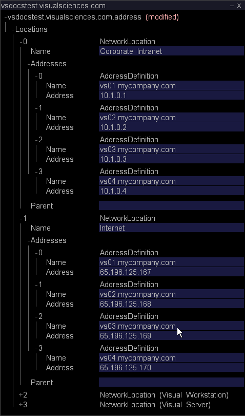

# 為群集配置Master Insight Server{#configuring-the-master-insight-server-for-clustering}

有關在Master Insight Server上配置群集、更新群集訪問控制檔案等的資訊。

要配置群集，請在主系統上執行以下步驟 [!DNL Insight Server]:

* 將處理常 [!DNL Insight Servers’] 用名稱和地址添加到地址檔案。
* 將所有添加 [!DNL Insight Servers] 到檔案中的「群集伺服器」 [!DNL Access Control.cfg] 組。

* 更新「 [!DNL Synchronize.cfg] 處理伺服器的元件」目錄中的檔案，以指向主版 [!DNL Insight Server]。

* 如有必要，請修 [!DNL Disk Files.cfg] 改「處理伺服器元件」目錄中的檔案，以指定檔案 [!DNL temp.db] 在處理中的位置 [!DNL Insight Servers]。

要完成這些步驟，您需要知道群集中每個的公用名稱(如個人的數位憑證中所 [!DNL Insight Server]指定)和IP [!DNL Insight Server] 地址。 如果您尚未取得此資訊，請先取得該資訊再繼續。

>[!NOTE]
>
>本節所述的程式需要 [!DNL Insight]。 如果您尚未安裝， [!DNL Insight]請依照使用指南中的 **[!DNL Insight]指示&#x200B;**，再繼續。

## 將Processing Insight Servers新增至位址檔案 {#section-2fe5298180164e8dbaa59ea6b6ff682d}

請按下列步驟將處理常 [!DNL Insight Servers’] 用名稱和IP地址添加到主檔案的地址檔案中 [!DNL Insight Server]。 (雖然地址檔案是在主機上維護和管理的 [!DNL Insight Server]，但群集中的所有成員 [!DNL Insight Servers] 都使用它。)

>[!NOTE]
>
>以下假設地址檔案已經為主檔案配置 [!DNL Insight Server]。 如果尚未將主 [!DNL Insight Server’s] IP地址添加到地址檔案中，請在開始之前完成定義服  務器網路位置中所述的過程。

**將處理添加[!DNL Insight Servers]到地址檔案**

1. 以滑 [!DNL Insight] 鼠右鍵按一下標題列，然後按一下 **[!UICONTROL Switch Profile]** > **[!UICONTROL Configuration]**，以啟動並載入設定描述檔（如果尚未開啟）。

1. 在「 [!DNL Insight]>」標籤 [!DNL Admin] 中， [!DNL Dataset and Profile] 按一下縮圖以開 **[!UICONTROL Servers Manager]** 啟「伺服器管理員」工作區。

1. 按一下右鍵主表徵圖，然 **[!UICONTROL Insight Server]** 後按一下 **[!UICONTROL Server Files]**。

1. 在中， [!DNL Server Files Manager]開啟「地址」目錄，然後執行以下操作以開啟地址 [!DNL Insight Server’s] 檔案：

   1. 按一下右鍵伺服器名稱列中的 *複選標籤* ，然後按一下 **[!UICONTROL Make Local]**。

   1. 在欄中按一下滑鼠右鍵， [!DNL Temp] 然後按一下 **[!UICONTROL Open]** > **[!UICONTROL in Insight]**。

1. 展開結構的內 [!DNL Locations] 容，然後展開NetworkLocation 0、Address和AddressDefinition。
1. 請執行下列操作，為群集中的每個處理將AddressDefinition添加 [!DNL Insight Server] 到NetworkLocation 0:

   1. 以滑鼠右鍵按 **[!UICONTROL AddressDefinition]** 一下，然後按 **[!UICONTROL Add New]** > **[!UICONTROL Address Definition]**。

   1. 在「名稱」參數中，指定處理公 [!DNL Insight Server’s] 用名稱。
   1. 在「位址」參數中，指定處理 [!DNL Insight Server’s] IP位址。

      您可以在「地址」欄位中使用星號作為萬用字元，例如10.10.116。*，簡化叢集。 請參 [閱瞭解訪問級別](../../../../../../home/c-inst-svr/c-admin-inst-svr/c-config-acs-ctrl/c-undst-acc-lvls.md#concept-6b292edf79214750a8d0525097b8795a)。

      以下示例定義包含兩個群集 [!DNL Insight Servers]:

      

1. 如果伺服器連接到多個網路，請重複步驟6，將這些網路的 [!DNL Insight Servers] 處理添加到網路位置。

   以下示例顯示了一個四個連接到 [!DNL Insight Servers] 兩個網路（「公司內部網」和「Internet」）的群集。

   

1. 執行下列動作，將變更儲存至伺服器：

   1. 按一下右鍵 **[!UICONTROL (modified)]** 窗口頂部，然後按一下 **[!UICONTROL Save]**。

   1. 在中， [!DNL Server Files Manager]按一下右鍵列中檔案的複選標籤，然 [!DNL Temp] 後選擇 **[!UICONTROL Save to]** > *&lt;**[!UICONTROL server name]**>*。

## 更新群集的訪問控制檔案 {#section-fce1367d92a445168c35e9ca506e7d6b}

要在群 [!DNL Insight Servers] 集中使用，群集中的每 [!DNL Insight Server] 個群集(包括主 [!DNL Insight Server]伺服器)必須屬於群集伺服器訪問控制組。 群集伺服器組標識允許參與群集的伺服器（按IP地址）。 雖然此檔案在主機上進行維護和管 [!DNL Insight Server]理，但群集中的所有成員 [!DNL Insight Servers] 都使用該檔案。

**要編輯訪問控制檔案**

1. 在「 [!DNL Insight]>」標籤 [!DNL Admin] 中， [!DNL Dataset and Profile] 按一下縮圖以開 **[!UICONTROL Servers Manager]** 啟「伺服器管理員」工作區。

1. 按一下右鍵主表徵圖，然 [!DNL Insight Server] 後按一下 **[!UICONTROL Server Files]**。

1. 在中， [!DNL Server Files Manager]開啟「訪問控制」目錄。
1. 執行下列動作以開啟檔 [!DNL Access Control.cfg] 案：

   1. 按一下右鍵伺服器名稱列中的 *複選標籤* ，然後按一下 **[!UICONTROL Make Local]**。

   1. 在欄中按一下滑鼠右鍵， [!DNL Temp] 然後按一下 **[!UICONTROL Open]** > **[!UICONTROL in Insight]**。

1. 展開「訪問控制組」結構，然後展開「訪問組」（群集伺服器）。
1. 對於群 [!DNL Insight Server] 集中的每個(包括主 [!DNL Insight Server]節點)，請執行以下操作：

   1. 以滑鼠右鍵按 **[!UICONTROL Members]** 一下，然後按 **[!UICONTROL Add New]** > **[!UICONTROL New Member]**。

   1. 指定 [!DNL Insight Server’s] IP位址（其數值IP位址，而非名稱）。 如果連 [!DNL Insight Servers] 接到多個網路，則此AccessGroup應僅包含用於群集內 [!DNL Insight Servers] 伺服器間通信的內部地址。

      以下顯示了四個群集的AccessGroup（群集伺服器） [!DNL Insight Servers]。

      

1. 執行下列動作，將變更儲存至伺服器：

   1. 按一下右鍵 **[!UICONTROL (modified)]** 窗口頂部，然後按一下 **[!UICONTROL Save]**。

   1. 在中， [!DNL Server Files Manager]按一下右鍵列中檔案的複選標籤， [!DNL Temp] 然後按一下 **[!UICONTROL Save to]** > *&lt;**[!UICONTROL server name]**>*。

## 配置同步檔案 {#section-d23e751771c84da6bab6a34a8db867bc}

您可以使用下列步驟來設定檔案的中央副 [!DNL Synchronize.cfg] 本。 此檔案的中央副本將保存在主檔案上 [!DNL Insight Server]。 群集中 [!DNL Insight Servers] 的處理啟動與主設備的通信， [!DNL Insight Server] 以檢索此檔案的更新副本。

文 [!DNL Synchronize.cfg] 件指定主檔案的位置 [!DNL Insight Server]。 它還標識群集中每個處理從主設備中檢 [!DNL Insight Servers] 索的管理檔案集 [!DNL Insight Server]。 處理程式 [!DNL Insight Servers] 會在開始時自動從主版 [!DNL Insight Server] 下載這些檔案。 當檔案變更時，也會從主版動態擷取這些 [!DNL Insight Server] 檔案的更新副本。

>[!NOTE]
>
>雖然您在主版 [!DNL Synchronize.cfg] 上配置了檔案 [!DNL Insight Server]，但主版本 [!DNL Insight Server] 身不會使用此檔案。 您可在主版上更新此檔 [!DNL Insight Server] 案，以便在處理擷取檔案時正確 [!DNL Insight Servers] 設定此檔案。

**在主版上更新Synchronize.cfg檔案[!DNL Insight Server]**

1. 在「 [!DNL Insight]>」標籤 [!DNL Admin] 中， [!DNL Dataset and Profile] 按一下縮圖以開 **[!UICONTROL Servers Manager]** 啟「伺服器管理員」工作區。

1. 按一下右鍵主表徵圖，然 [!DNL Insight Server] 後按一下 **[!UICONTROL Server Files]**。

1. 在中 [!DNL Server Files Manager]，開啟「處理服 **[!UICONTROL Components]** 務器」目錄。

1. 執行下列動作以開啟 [!DNL Synchronize.cfg]:

   1. 按一下右鍵伺服器名稱列中的 *複選標籤* ，然後按一下 **[!UICONTROL Make Local]**。

   1. 以滑鼠右鍵按一 [!DNL Temp] 下核取標籤，然後按 **[!UICONTROL Open]** > **[!UICONTROL in Insight]**。

1. 展開元件結構。
1. 在群集主伺服器地址參數中，指定主伺服器（主伺服器）的IP地址 **[!UICONTROL Insight Server]**。

   

   要建立記錄主日誌和處理之間每次進 [!DNL Insight Server] 行同步的日 [!DNL Insight Servers]志，請確保「啟用同步日誌」參數設定為「true」。

1. 執行下列動作，將變更儲存至伺服器：

   1. 按一下右鍵 **[!UICONTROL (modified)]** 窗口頂部，然後按一下 **[!UICONTROL Save]**。

   1. 在中， [!DNL Server Files Manager]按一下右鍵列中檔案的複選標籤，然 [!DNL Temp] 後按一下 **[!UICONTROL Save to]** > *&lt;**[!UICONTROL server name]**>*。

## 配置資料集的位置(temp.db) {#section-5ec257a4b4c64fb58baec1f12119a822}

如果希望處理過程在與預設位置不同的 [!DNL Insight Servers] 目 [!DNL temp.db] 錄或驅動器中維護（資料集），或者希望在多個驅動器之間分 [!DNL temp.db] 發，請執行以下過程。

>[!NOTE]
>
>由於處理 [!DNL Insight Servers] 都共用相同的 [!DNL Disk Files.cfg]檔案，因此它們都必須支援您在此檔案中指定的檔案位置。 例如，若您指派 [!DNL temp.db] 給E:驅動器，群集中 [!DNL Insight Server] 的每個處理都必須有E:開車。

**配置temp.db的位置**

1. 在「 [!DNL Insight]>」標籤 [!DNL Admin] 中， [!DNL Dataset and Profile] 按一下縮圖以開 **[!UICONTROL Servers Manager]** 啟「伺服器管理員」工作區。

1. 按一下右鍵主表徵圖，然 [!DNL Insight Server] 後按一下 **[!UICONTROL Server Files]**。

1. 在中 [!DNL Server Files Manager]，開啟目 **[!UICONTROL Components for Processing Servers]** 錄。

1. 執行下列動作以開啟 [!DNL Disk Files.cfg]:

   1. 按一下右鍵伺服器名稱列中的 *複選標籤* ，然後按一下 **[!UICONTROL Make Local]**。

   1. 在欄中按一下滑鼠右鍵， [!DNL Temp]然後按一下 **[!UICONTROL Open]** > **[!UICONTROL in Insight]**。

1. 展開DiskSpaceManagerComponent結構，然後展開「磁碟檔案」清單。
1. 編輯條目0以更改檔案的位 [!DNL temp.db] 置。
1. 如果您想要在多個驅 [!DNL temp.db] 動器間分配，請使用以下步驟為每個附加驅動器建立一個附加條目。

   1. 以滑鼠右鍵按 **[!UICONTROL Disk Files]** 一下，然後按 **[!UICONTROL Add New]** > **[!UICONTROL Disk File]**。

   1. 在新條目中，指定要寫入的位 [!DNL temp.db] 置。
   下面顯示了 [!DNL temp.db] 在四個驅動器上寫入的內容。

   

1. 執行下列動作，將變更儲存至伺服器：

   1. 按一下右鍵 **[!UICONTROL (modified)]** 窗口頂部，然後按一下 **[!UICONTROL Save]**。

   1. 在中， [!DNL Server Files Manager]按一下右鍵列中檔案的複選標籤，然 [!DNL Temp] 後按一下 **[!UICONTROL Save to]** > *&lt;**[!UICONTROL server name]**>*。

