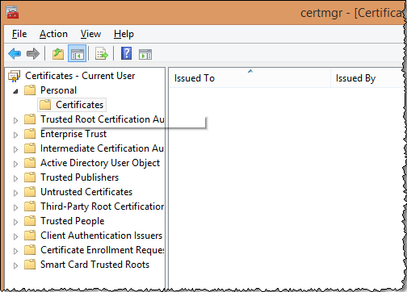

# Windows 憑證存放區{#windows-certificate-store}

Windows 憑證存放區可讓您將用戶端的憑證和私密金鑰存放在 Windows 憑證存放區中，以便與伺服器進行 SSL 通訊。

適用於用戶端的 Windows 憑證存放區是一項新功能，可讓您將 SSL 通訊憑證和私密金鑰存放在 Windows 憑證存放區，而非 `Insight/Certificates/<CertName>.pem` 檔案中。如果您將憑證存放區用於其他應用程式，並且要集中管理憑證，或是因使用者享有額外的 Windows 稽核記錄功能 (由 Windows 憑證存放區提供) 而使用憑證存放區，建議您使用 Windows 憑證存放區。

>[!NOTE]
>
>目前仍可使用現有的 `<Common Name>.pem` 檔案，維持透過授權伺服器進行授權的方式，且從憑證存放區取得的憑證只會用於與您指定的伺服器通訊。

## 必備條件 {#section-69b18600052145ff8e5299b7123e69c5}

1. 您必須能存取 [!DNL certmgr.msc] 檔案，並能夠將憑證和金鑰匯入 **Personal** 存放區。(根據預設，大部分 Windows 使用者都符合條件。)

1. 進行設定的使用者必須有 **OpenSSL** 命令列工具的副本。
1. 伺服器和用戶端必須已設定為使用自訂 SSL 憑證，如[使用自訂憑證](../../../../../home/c-inst-svr/c-install-ins-svr/t-install-proc-inst-svr-dpu/c-dnld-dgtl-cert/using-custom-certificates-dwb.md#concept-ee6a9b5015f84a0ba64a11428b0a72dd)中所述，說明將用戶端憑證存放在 Windows 憑證存放區，而非存放在 **Certificates** 目錄中。

## 設定 Windows 憑證存放區 {#section-3629802122e947d4b4f63e8b732cfe27}

按照下列步驟啟用適用於用戶端的 Windows 憑證存放區：

**步驟 1：將使用者的 SSL 憑證和私密金鑰匯入 Windows 憑證存放區。**

[使用自訂憑證](../../../../../home/c-inst-svr/c-install-ins-svr/t-install-proc-inst-svr-dpu/c-dnld-dgtl-cert/using-custom-certificates-dwb.md#concept-ee6a9b5015f84a0ba64a11428b0a72dd)一文指示您將 SSL 憑證和金鑰放在以下目錄中：

```
< 
<filepath>
  DWB Install folder 
</filepath>>\Certificates\
```

憑證的名稱為 `<Common Name>.pem` (例如 [!DNL Analytics Server 1.pem] [非 [!DNL trust_ca_cert.pem] 檔案]。)

必須將憑證和私密金鑰先從[!DNL pem] 格式轉換為 [!DNL .pfx] 格式 (例如 [!DNL pkcs12.pfx]) 才能匯入。

1. 開啟命令提示字元或終端機，然後導覽至目錄：

   ```
   <CommonName>.pem c: cd \<DWB Install folder \Certificates
   ```

1. 使用下列引數執行 [!DNL openssl] (含實際的 [!DNL .pem] 檔案名稱)：

   ```
   openssl pkcs12 -in "<Common Name>.pem" -export -out "<Common Name>.pfx"
   ```

   如果系統提示，請按 **Enter** 以略過輸入匯出密碼。

1. 在執行提示、開始功能表或命令列執行 [!DNL certmgr.msc]。
1. 開啟目前使用者的 **Personal** 憑證存放區。

   

1. 以右鍵按一下 **Certificates**，然後按一下&#x200B;**「所有工作** > **匯入」**。

   確認選取&#x200B;**「目前使用者」**&#x200B;選項，然後按&#x200B;**「下一步」**。

   

1. 按一下&#x200B;**「瀏覽」**，然後選取先前建立的 `<CommonName>.pfx` 檔案。您必須將副檔名下拉方塊從「X.509 憑證」變更為 **「個人資訊交換」**&#x200B;或&#x200B;**「所有檔案」**，才能看到該檔案。

   選取該檔案，按一下&#x200B;**「開啟」**，然後按&#x200B;**「下一步」**。

1. 請勿輸入密碼，並確認只選取&#x200B;**「將這個金鑰設成可匯出」**&#x200B;和&#x200B;**「包含所有延伸內容」**&#x200B;選項。

   

   按&#x200B;**「下一步」**。

1. 確認已選取&#x200B;**「將所有憑證放入以下的存放區」**，且所列的憑證存放區為 **Personal**。(如果您為進階使用者，此時可選取其他存放區，但稍後必須變更設定。)

1. 按&#x200B;**「下一步」**，然後按一下&#x200B;**「完成」**。您應該會看到一個對話方塊，告訴您匯入成功，並在存放區的 Certificates 檔案夾中看到您的憑證。

   >[!NOTE]
   >
   >請特別注意&#x200B;**「核發對象」**&#x200B;和&#x200B;**「核發人員」**&#x200B;欄位。下一步需要這些資訊。

**步驟 2：編輯 Insight.cfg 檔案。**

必須編輯 [!DNL Insight.cfg] 檔案，才能指示 Data Workbench 使用 Windows 憑證存放區功能。此檔案的每個伺服器項目都必須指定一些其他參數。如果省略這些參數，工作站會預設為使用現有憑證設定。如果已指定參數但值不正確，工作站會進入錯誤狀態，而您必須參考記錄檔以取得錯誤資訊。

1. 開啟 **Insight.cfg** 檔案 (位於 **Insight** 安裝目錄)。

1. 向下捲動至要設定的伺服器項目。如果您想要將 Windows 憑證存放區用於每個伺服器，必須對 [!DNL serverInfo] 物件向量中的每個項目進行下列修改。
1. 將下列參數新增至其 [!DNL Insight.cfg] 檔案。您可以在工作站執行此操作，或手動將下列參數新增至 [!DNL serverInfo] 物件。(請務必使用空格而非定位字元，並確認此檔案中沒有其他拼字或語法錯誤。)

   ```
   SSL Use CryptoAPI = bool: true  
   SSL CryptoAPI Cert Name = string: <Common Name>  
   SSL CryptoAPI Cert Issuer Name = string: Visual Sciences,LLC  
   SSL CryptoAPI Cert Store Name = string: My 
   ```

   布林值會啟用或停用此功能。憑證名稱與憑證管理員中的&#x200B;**「核發對象」**&#x200B;相符。憑證核發者名稱與&#x200B;**「核發人員」**&#x200B;相符，且&#x200B;**「存放區名稱」**&#x200B;必須與憑證存放區名稱相符。

   >[!NOTE]
   >
   >憑證管理員 (certmgr.msc) 中的名稱「個人」實際上是指憑證存放區&#x200B;**「My」。**&#x200B;因此，如果您依建議將 SSL 通訊憑證和金鑰 (.PFX) 匯入 **Personal** 憑證存放區，必須將&#x200B;**「SSL CryptoAPI Cert Store Name」**&#x200B;字串設為「My」。將此參數設為「Personal」會無法執行，這是 Windows 憑證存放區的特性。

   您可在此取得預先定義的系統存放區完整清單：[https://msdn.microsoft.com/zh-tw/library/windows/desktop/aa388136(v=vs.85).aspx](https://msdn.microsoft.com/zh-tw/library/windows/desktop/aa388136%28v=vs.85%29.aspx)。您的系統可能有其他憑證存放區。如果您想使用「個人」(例如&#x200B;**「My」**) 以外的存放區，必須取得憑證存放區的正式名稱，並在 [!DNL Insight.cfg] 檔案中提供該名稱。(Windows 文件將系統存放區名稱「My」不一致地稱為「My」和「MY」。此參數似乎不區分大小寫。)

1. 新增這些參數，並確認值與 Windows 憑證管理員中的清單相符後，請儲存 [!DNL Insight.cfg] 檔案。

您現在可以啟動工作站 (或中斷伺服器連線/重新連線至伺服器)。Data Workbench 應會從憑證存放區載入憑證和金鑰，並正常連線。

## 記錄輸出 {#section-a7ef8c9e90ef4bbabaa3cd51a2aca3ab}

找不到憑證或憑證無效時，系統會將此錯誤訊息擲回 [!DNL HTTP.log] 檔案。

```
ERROR Fatal error: the cert could not be found!
```

>[!NOTE]
>
>可設定 [!DNL L4.cfg] 檔案來啟用 L4 記錄架構 (請洽詢您的帳戶管理員以進行設定)。
