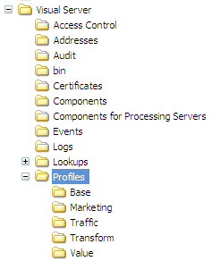

# 設定轉換{#configuring-transform}

轉換功能可在Insight Server FSU機器上執行，以便匯出記錄來源資料供其他應用程式使用。

[!DNL Transform] 可以讀 [!DNL .vsl]  [!DNL .vsl] 取檔案、記錄檔、XML檔案和ODBC資料，並將資料匯出為檔案、文字檔或分隔文字檔，供資料倉庫載入常式、稽核機構或其他目標使用。資料提取和轉換可以連續地執行或其它排程的。 每個提供更改事件資料輸出的[!DNL Insight Server] FSU必須運行[!DNL Transform]。

>[!NOTE]
>
>通常，[!DNL Transform]安裝在[!DNL Insight Server] FSU上。 不過，您的實作可能需要在[!DNL Insight Server] DPU上安裝。 如需詳細資訊，請聯絡Adobe。

有關安裝、配置和操作[!DNL Transform]的系統要求的資訊，請參閱&#x200B;*最小系統要求*&#x200B;文檔。

Adobe在[!DNL Insight Server]發行包的[!DNL .zip]檔案中將[!DNL Transform]功能作為配置檔案分發。 [!DNL Transform]描述檔是內部描述檔，為[!DNL Insight Server]提供其他功能。 與Adobe提供的所有其他內部配置檔案一樣，配置檔案不應更改。 所有自訂都必須發生在您的資料集、角色特定的描述檔或您建立的其他描述檔中。

配置檔案由以下檔案組成：

* [!DNL Log Processing.cfg]
* [!DNL [!DNL Insight] Transform.cfg]
* [!DNL [!DNL Insight]轉換模式。cfg]
* 日誌處理資料集包括檔案

所有這些檔案都位於配置檔案的[!DNL Dataset]資料夾中。

**若要將描述 [!DNL Transform] 檔安裝在[!DNL Insight Server]**

>[!NOTE]
>
>以下安裝說明假定您已安裝[!DNL Insight]並在[!DNL Insight]和[!DNL Insight Server]之間建立了連接，在[!DNL Transform]上安裝了。 如果您尚未這麼做，請參閱* [!DNL Insight]使用指南*。

1. 開啟[!DNL Insight Server]發行套件的[!DNL .zip]檔案，並開啟該[!DNL .zip]檔案中的[!DNL Profiles]檔案夾。
1. 將[!DNL Transform]資料夾複製到[!DNL Insight Server]安裝目錄的[!DNL Profiles]資料夾。 您想在[!DNL Insight Server]上找到[!DNL ...\Profiles\Transform]資料夾，如下列範例所示。

   

   >[!NOTE]
   >
   >如果您遵循安裝[!DNL Insight Server]的所有步驟（請參閱[ Insight Server](../../../home/c-inst-svr/c-msr-server/c-msr-server.md)），則Profiles目錄中可能已有[!DNL Transform]資料夾。

1. 使用以下步驟更新要使用[!DNL Transform]的配置檔案的[!DNL profile.cfg]檔案。 完成這些步驟後，資料集會重新處理。

   1. 開啟 [!DNL Profile Manager].
   1. 按一下右鍵[!DNL profile.cfg]旁邊的複選標籤，然後按一下&#x200B;**[!UICONTROL Make Local]**。 此檔案的複選標籤會出現在[!DNL User]列中。

   1. 按一下右鍵新建的複選標籤，然後按一下&#x200B;**[!UICONTROL Open]** > **[!UICONTROL in Insight]**。 出現[!DNL profile.cfg]窗口。

   1. 在[!DNL profile.cfg]視窗中，以滑鼠右鍵按一下&#x200B;**[!UICONTROL Directories]**，然後按一下&#x200B;**[!UICONTROL Add new]** > **[!UICONTROL Directory]**。

      要將新目錄添加到目錄清單的末尾，請按一下右鍵清單中最後一個目錄的編號或名稱，然後按一下&#x200B;**[!UICONTROL Add new]** > **[!UICONTROL Directory]**。

   1. 鍵入新目錄的名稱：[!DNL Transform]
   1. 按一下右鍵窗口頂部的&#x200B;**[!UICONTROL (modified)]** ，然後按一下&#x200B;**[!UICONTROL Save]**。

   1. 在[!DNL Profile Manager]中，按一下右鍵[!DNL User]列中[!DNL profile.cfg]的複選標籤，然後按一下&#x200B;**[!UICONTROL Save to]** > ***[!UICONTROL profile name]**>*。

      >[!NOTE]
      >
      >請勿將修改過的配置檔案保存到Adobe提供的任何內部配置檔案（包括配置檔案）中，因為在安裝這些配置檔案的更新時，將覆蓋您所做的更改。
