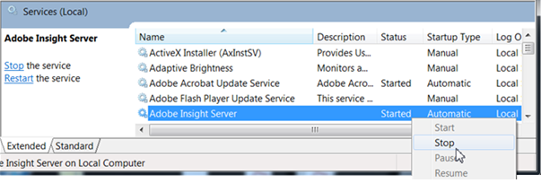

# Data Workbench 5.5 升級至 6.1{#data-workbench-to-upgrade}

請依照下列步驟，從Insight v5.5x安裝更新至資料工作台v6.1。

**步驟1**: [伺服器升級](../../../../home/c-inst-svr/c-upgrd-uninst-sftwr/c-upgrd-sftwr/c-5-x-to-6-1-upgrade.md#section-08bd6fe3da8740fcb19688e8cac6f223)

**步驟2**: [報告伺服器升級](../../../../home/c-inst-svr/c-upgrd-uninst-sftwr/c-upgrd-sftwr/c-5-x-to-6-1-upgrade.md#section-afd9560a446242e9b06490e5f98aaaec)

**步驟3**: [用戶端升級](../../../../home/c-inst-svr/c-upgrd-uninst-sftwr/c-upgrd-sftwr/c-5-x-to-6-1-upgrade.md#section-c896e57ecd2847afb18f4d8ef7cc0e06)

>[!IMPORTANT]
>
>伺服器、報告伺服器和用戶端元件已升級為可在64位元Windows作業系統上執行。

## 伺服器升級{#section-08bd6fe3da8740fcb19688e8cac6f223}

請依照下列步驟更新&#x200B;**[!UICONTROL Server v6.1]**&#x200B;元件：

1. 使用&#x200B;**[!UICONTROL Software and Docs]**&#x200B;配置檔案，開啟&#x200B;**[!UICONTROL Start Here]**&#x200B;工作區並將所有需要的伺服器軟體包下載到本地資料夾。

   * 下載&#x200B;**[!UICONTROL Server Packages]** \ **[!UICONTROL v6.1]** zip資料夾並解壓所有檔案。

      **[!UICONTROL Server]**&#x200B;套件包含&#x200B;**[!UICONTROL Lookup]**&#x200B;和&#x200B;**[!UICONTROL Profile]**&#x200B;資料夾，其中包含&#x200B;**[!UICONTROL Base]**&#x200B;和&#x200B;**[!UICONTROL Transform]**&#x200B;查閱檔案，以新增和取代以更新伺服器。

   * 下載新的&#x200B;**[!UICONTROL Profiles]**&#x200B;資料夾。
   * 下載更新的&#x200B;**[!UICONTROL Lookup]**&#x200B;資料夾。
   * 下載&#x200B;**[!UICONTROL Report Server]** \ **[!UICONTROL v6.1]**&#x200B;軟體包。
   * 視需要下載其他&#x200B;**[!UICONTROL Sensor]**、**[!UICONTROL Documentation]**&#x200B;和&#x200B;**[!UICONTROL Dashboard]**&#x200B;檔案。

1. 停止&#x200B;**[!UICONTROL Adobe Insight Server]**&#x200B;服務。

   

1. 從下載的&#x200B;**[!UICONTROL Server]**&#x200B;套件：

   1. 更換[!DNL Server\Bin]資料夾以更新[!DNL InsightServer64.exe]和支援檔案。

   1. 更換[!DNL Server\Profiles]資料夾。 您可以覆寫所有檔案。
   1. 更新[!DNL Server\Lookups]資料夾。 您會想要將新下載的檔案新增至資料夾中已有的自訂檔案。
   1. 更換[!DNL Server\Software]資料夾以更新[!DNL Insight.exe]和[!DNL ReportServer.exe]

   1. 更新[!DNL Server\Scripts]資料夾以更新[!DNL TnTSend.exe]。

1. 如果您採用&#x200B;**[!UICONTROL DeviceAtlas]**，則需要[更新位於[!DNL Server\Lookups]資料夾中的bundle](https://docs.adobe.com/content/help/en/data-workbench/using/dataset/trans-config-file/c-deviceatlas-update.html)。
1. 在[!DNL Profile.cfg]檔案中設定[!DNL Directories]，以確保向量已更新，以反映每個描述檔的項目數。

   例如，若要啟用&#x200B;**[!UICONTROL Predictive Analytics]**&#x200B;描述檔，您需要更新此設定。

   ```
   Directories = vector: 5 items 
       0 = string: Base\\ 
       1 = string: Geography\\ 
       2 = string: Predictive Analytics\\ 
       3 = string: Adobe SC\\ 
       4 = string: Profile Name\\
   ```

1. 設定並儲存[!DNL PAServer.cfg]檔案，以升級預測性分析功能。

   如果您想要將Predictive Analytics作業提交至伺服器，則需要設定[!DNL Server > Predictive Analytics > Dataset > PAServer.cfg]檔案以管理伺服器端叢集提交。

   自訂描述檔應繼承Predictive Analytics設定描述檔的設定，讓您根據網站的實作來設定並儲存[!DNL PAServer.cfg]。

1. 定義 **[!UICONTROL Log Source ID]**.

   **[!UICONTROL Recording of Rows per Log Source]**&#x200B;已新增至&#x200B;**[!UICONTROL v6.04]**，並透過新增唯一名稱為&#x200B;**[!UICONTROL Log Source ID]**&#x200B;的自訂描述檔的[!DNL Log Processing.cfg]檔案中定義。

   ```
   Log Processing.cfg
   Log Source ID = string: <Name your ID Here>
   ```

   如果您未定義記錄來源ID，則會出現下列錯誤：

   ```
   Missing Log Source ID in log processing.cfg.  
   Log Source ID must be defined for all log sources.
   ```

1. 由於[!DNL EventMessages.dll]已更新，因此必須先在群集中註銷並註冊&#x200B;**[!UICONTROL Adobe Insight Server]**。

   * [!DNL InsightServer64.exe /unregserver]
   * [!DNL InsightServer64.exe /regserver]

1. 啟動群集中的&#x200B;**[!UICONTROL Adobe Insight Server]**&#x200B;服務。

伺服器安裝現已完成。

## 報告伺服器升級{#section-afd9560a446242e9b06490e5f98aaaec}

>[!IMPORTANT]
>
>在升級至&#x200B;**[!UICONTROL Report Server v6.1]**&#x200B;之前，您必須先升級至&#x200B;**[!UICONTROL Server v6.1]**。

1. 使用&#x200B;**[!UICONTROL Software and Docs]**&#x200B;配置檔案，從&#x200B;**[!UICONTROL Report Server]**&#x200B;包下載&#x200B;**[!UICONTROL v6.1]**&#x200B;到本地資料夾。
1. 從下載的包複製&#x200B;**[!UICONTROL Report Server 6.1]**&#x200B;並更換配置檔案包。

   >[!NOTE]
   >
   >[!DNL install]資料夾中的[!DNL Insight.zbin]檔案是用於本地化的備份檔案，必須存在於[!DNL install]目錄中。 根據啟動時傳遞的命令行設定，將使用此檔案或其他[!DNL .zbin]檔案。

1. （可選）修改報表伺服器設定檔案以支援雙位元組字元。

   資料工作台目前支援英文(-en-us)和中文(-zh-cn)。 您必須設定字型以支援單位元組和雙位元組字元：

   ```
   Report Server.cfg - Add Fonts 
      Fonts = vector: 2 items  
      0 = string: SimSun  
      1 = string: Arial 
   ```

   Windows作業系統也必須安裝所列的字型。

1. 設定 [!DNL Report Server v6.1].

   1. 停止&#x200B;**[!UICONTROL Adobe Insight Report Server]**&#x200B;服務。
   1. 以「管理員」身份啟動命令提示符。
   1. 導覽至報表伺服器[!DNL install]資料夾。
   1. 使用下列命令刪除報表伺服器服務：

      ```
      ReportServer.exe /unregserver
      ```

1. 根據語言設定啟動服務：

   ```
   ReportServer.exe -RegServer -Locale -en-us (English) 
   ReportServer.exe -RegServer -Locale -zh-cn (Simplified Chinese)
   ```

1. 要驗證報告伺服器是否使用正確的設定運行，請開啟&#x200B;**[!UICONTROL Windows Service Manager]** ，按一下右鍵&#x200B;**[!UICONTROL Adobe Insight Report Server - Properties]**。 執行檔的路徑將顯示更新的命令行設定。

報表伺服器安裝現已完成。

## 客戶端升級{#section-c896e57ecd2847afb18f4d8ef7cc0e06}

>[!IMPORTANT]
>
>在升級至&#x200B;**[!UICONTROL Client v6.1]**&#x200B;之前，管理員必須先升級至&#x200B;**[!UICONTROL Server v6.1.]**

1. 啟動[!DNL Insight.exe]，但請勿連接任何配置式。
1. 編輯[!DNL Insight.cfg]檔案，不自動更新軟體。

   ```
   Update Software = bool: false
   ```

1. 連接至&#x200B;**[!UICONTROL Software and Docs]**&#x200B;配置檔案(softdocs)。
1. 下載 [!DNL Software\Insight Client\v6.10].
1. （可選）修改[!DNL insight.cfg]以支援雙位元組字元。

   資料工作台目前支援英文和簡體中文。 選擇字型以支援這兩種語言：

   ```
   Fonts = vector: 2 items  
   0 = string: SimSun 
   1 = string: Arial
   ```

1. 退出客戶端。
1. 將下載的&#x200B;**v6.1**&#x200B;客戶機包中的檔案複製到[!DNL Install]資料夾。

   >[!NOTE]
   >
   >安裝資料夾中的[!DNL Insight.zbin]檔案是用於本地化的備份檔案，必須存在於安裝目錄中。 根據啟動時傳遞的命令行設定，將使用此檔案或其他[!DNL .zbin]檔案。
   >
   >例如，要啟動「簡體中文」，請建立命令行設定中傳遞的快捷方式。
   >
   >
   ```
   >Insight.exe -zh-cn
   >```
   >
   >如果您要以英文（預設）啟動，則不需要變更命令列。

1. 啟動[!DNL Insight.exe]以取得英文或您為其他語言建立的捷徑。
1. 連線至您的設定檔，並允許用戶端與伺服器同步。
1. （可選）要使用IME，請對[!DNL Insight.cfg]檔案進行以下更改：

   ```
   Localized IME = bool: true
   ```

   輸入法編輯器(IME)可讓您輸入國際字元。

1. （可選）編輯[!DNL Insight.cfg]檔案以自動更新軟體：

   ```
   Update Software = bool: true
   ```

   請參閱實作IME的指示。
1. 在配置檔案同步後重新啟動，以使用最新的[!DNL .zbin]檔案。

客戶機安裝現已完成。
