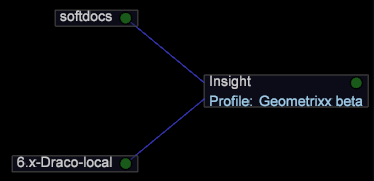

# 設定與 Insight Server 的連線{#configuring-the-connection-to-insight-server}

{{eol}}

安裝Insight軟體和數位憑證後，您必須啟動Insight並設定其與Insight Server的連線。

>[!NOTE]
>
>在某些情況下，Adobe諮詢服務或您的系統管理員可能已預先設定與Insight Server的連線。 如果是，則不需要完成此任務。

當您首次啟動Insight時，Insight會自動連線至Adobe授權伺服器以註冊您的數位憑證。 要成功完成註冊過程，執行以下步驟時，您的電腦必須連接到Internet。

>[!NOTE]
>
>如果您已請求、下載和安裝預先鎖定憑證，如 [下載和安裝數位憑證](../../../home/c-install-insight/install-setup/c-dgtl-crtf.md#topic-fed3b44e472c4e4ca6dd5852af14cdb9), Insight不會嘗試連線至授權伺服器，且您不會收到錯誤。

**設定與Insight Server的連線**

在叢集環境中工作時，應將Insight設定為存取主Insight Server，以避免同步問題。 在Insight中，您可以檢視處理的相關資訊 [!DNL Insight Servers] 在叢集中使用 [!DNL Related Servers] 功能表項目 [伺服器管理員](https://experienceleague.adobe.com/docs/data-workbench/using/client/admin-ui/c-svrs-mgr.html).

1. Launch Insight。
1. 在 [!DNL Worktop]，按一下 **[!UICONTROL Admin]**，然後 **[!UICONTROL First Steps]**.

1. 按一下 **[!UICONTROL Configure Connection to Servers]** 縮圖。

   此 [!DNL Servers Manager], [!DNL Insight.cfg] 檔案，以及配置 [!DNL Insight.cfg]檔案。

1. 在 [!DNL Insight.cfg] 窗口，按一下右鍵 **[!UICONTROL Servers]** 按一下 **[!UICONTROL Add new child]** > **[!UICONTROL Server]**.

   

1. 完成或修改伺服器參數，讓Insight能夠存取您的主Insight Server。 如需Insight.cfg檔案中參數的詳細說明，請參閱 [設定參數](https://experienceleague.adobe.com/docs/data-workbench/using/client/c-insght-config-param.html).

   

1. 對您要設定連線的每個Insight Server重複步驟4和步驟5。
1. 若要儲存設定變更，請按一下滑鼠右鍵 **[!UICONTROL Insight.cfg (modified)]** 在視窗頂端按一下 **[!UICONTROL Save as Insight.cfg]**.

   Insight會嘗試連線至 [!DNL Insight Server(s)] 使用您指定的設定。 如果已建立連線，綠色節點會顯示在 [!DNL Servers Manager] 如下頁所示。

   

   * **綠色：** 指出與Insight Server的連線處於作用中狀態。
   * **淺紅色：** 指出伺服器有潛在問題，例如伺服器處理耗損、記憶體使用率高或磁碟空間不足。
   * **紅色：** 指出與Insight Server的連線未作用中。

   如果Insight無法使用指定的設定進行連線，紅色節點會出現在 [!DNL Servers Manager]. 如果發生此情況，請參閱 [連線疑難排解](../../../home/c-install-insight/install-setup/t-conn-trbsh.md#task-034e588c5ce04c4a8f6d0097364d3b2b).

<!--
c_dir_crt_setup.xml
-->

當您選取要使用的設定檔時，設定檔資訊（包括相關資料以及為設定檔定義的任何特定工作區或視覺效果）會下載至您的電腦。 當您下載每個設定檔時，Insight會使用設定檔名稱在安裝目錄中建立資料夾。

例如，如果您選取名為Sales的設定檔，則名為Sales的資料夾會出現在Insight目錄中。 此資料夾包含「銷售」設定檔中定義的量度、維度、工作區和視覺效果。 設定檔初始載入後，離線工作時即可使用該設定檔。 請參閱 [離線和線上工作](https://experienceleague.adobe.com/docs/data-workbench/using/client/c-off-on.html).

此外，當您首次從Insight連線至Insight Server時，Insight Server會在Insight安裝目錄中建立下列目錄。

* **[!DNL Trace]目錄：** 在 [!DNL Trace] 目錄是Insight記錄檔( [!DNL insight.log])。 當 [!DNL Insight.log] 檔案達100 MB，則檔案會重新命名為 [!DNL insight-1.log]. 如果檔案的名稱 [!DNL insight-1.log] 已存在，則 [!DNL insight-1.log] 已重新命名為 [!DNL insight-2.log]，以此類推，最大值為 [!DNL insight-9.log]. 檔案 [!DNL insight.log] 一律包含最新的記錄資訊，且 [!DNL insight-max.log] 包含最舊的。

* **[!DNL User]目錄：** 在 [!DNL User] 目錄與用於日期的每個配置檔案相對應，而每個配置檔案資料夾中的資料夾名為 [!DNL Work] 和 [!DNL Workspaces]. 目錄 `User\*profile name*\Workspaces` 是Insight Workspace檔案的預設儲存位置。 `User\*profile name*\Work` 是Insight使用者執行之視覺效果和其他自訂工作的預設位置。

下表列出了常用元件的預設位置。

<table id="table_0254A8C25AF5400F89F87A242746D07E"> 
 <thead> 
  <tr> 
   <th colname="col1" class="entry"> 元件 </th> 
   <th colname="col2" class="entry"> 目錄位置 </th> 
  </tr>
 </thead>
 <tbody> 
  <tr> 
   <td colname="col1"> 
儲存的視覺效果 
 </td> 
   <td colname="col2"> 
<i>分析</i>\用戶\<i>設定檔名稱</i>\工作\ 
 </td> 
  </tr> 
  <tr> 
   <td colname="col1"> 
已儲存  工作區 
 </td> 
   <td colname="col2"> 
<i>分析</i>\用戶\<i>設定檔名稱</i>\工作區\<i>標籤名稱</i>\ 
 </td> 
  </tr> 
  <tr> 
   <td colname="col1"> 
已儲存 .png 檔案 
 </td> 
   <td colname="col2"> 
<i>分析</i>\用戶\<i>設定檔名稱</i>\工作\ 
 </td> 
  </tr> 
  <tr> 
   <td colname="col1"> 
資料快取 
 </td> 
   <td colname="col2"> 
<i>分析</i>\User\Cache.db 
 </td> 
  </tr> 
  <tr> 
   <td colname="col1"> 
 Insight.log 檔案 
 </td> 
   <td colname="col2"> 
<i>分析</i>\跟蹤\ 
 </td> 
  </tr> 
 </tbody> 
</table>

<!--
c_config_file_ent.xml
-->

您可以依索引鍵名稱、索引鍵類型或值來搜尋以快速找到項目，以免捲動擴充的大型檔案以取得巢狀資訊。 您可以找到維度名稱、伺服器名稱等。 下列範例顯示片語映射上搜尋的相符項目。

在此欄位中輸入搜尋片語以尋找資料。 欄位的顏色會隨著比對的成功而改變。 「符合」會反白顯示，而「非符合」則會暗顯。 如果沒有相符項目，搜尋欄位的背景會變成紅色。 按下Enter時，設定樹會展開有相符項目的每個位置，然後折疊沒有相符項目的位置。

您也可以在 [!DNL Search] 欄位。 例如，您可以使用： [!DNL *郵遞區號。*] 任何包含&quot;zip&quot;的項目。

要清除搜索，請按 **[!UICONTROL Escape]**.
