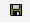

# 下載和安裝數位憑證{#downloading-and-installing-the-digital-certificate}

在安裝Insight程式檔案後，您必須下載並安裝Adobe提供給您的數位憑證。

## 下載和安裝數位憑證 {#topic-fed3b44e472c4e4ca6dd5852af14cdb9}

在安裝Insight程式檔案後，您必須下載並安裝Adobe提供給您的數位憑證。

## 瞭解數位憑證 {#concept-9eed01c8d95440cda6ce29d68e65098c}

Adobe使用X.509數位憑證來識別和驗證構成實作的用戶端和伺服器元件。

<!--
c_undst_dgtl_crtf.xml
-->

當您安裝Insight時，必須安裝數位憑證，以授權指名的個人（例如Jane Smith）使用已安裝的用戶端應用程式。

>[!NOTE]
>
>如果您需要將Insight移轉至其他電腦或其他指名用戶，您必須從Adobe取得新憑證。 若要這麼做，請聯絡Adobe客戶服務。

Insight會提供此數位憑證，以存取伺服器元件。 伺服器元件的管理員可以根據使用者憑證中顯示的通用名稱或組織單位值，限制對伺服器資源的存取。

隨Adobe應用程式安裝的X.509數位憑證也可讓其用戶端和伺服器元件透過安全通訊端層(SSL)交換資訊。 SSL使用公開和私密金鑰加密系統，保護透過HTTP傳輸的安全。 Adobe的SSL實作支援1024位元RSA金鑰，並使用128位元RC4加密演算法。

除了安全性外，您安裝的數位憑證也可當成授權金鑰，讓您執行Insight。 若要正常運作，數位憑證必須是節點鎖定且為目前狀態，否則應用程式將無法啟動。

## 節點鎖定的證書 {#section-984aa8f2f5a1448cadc4afea978aedc9}

節點鎖定證書是已註冊到安裝該證書的電腦的數字證書。 節點鎖定將證書與特定節點標識符（唯一標識特定電腦的值）永久關聯。 若要節點鎖定憑證，您的電腦必須能夠透過網際網路存取Adobe License Server，或是存取授權伺服器的代理伺服器。

如果您要安裝在無法存取網際網路的電腦上，您必須依照在無網際網路存取的電腦上使用數位憑證，取得並安裝特殊的 [預先鎖定憑證](../../../home/c-install-insight/install-setup/c-dgtl-crtf.md#section-d3c060131d7f45cda27f68848b704fa1)。

如果您要安裝在可存取網際網路的電腦上，您的數位憑證會在您第一次啟動Insight時自動被節點鎖定。 在節點鎖定後，該證書無法用於任何其他電腦。 如果您需要將Insight移轉至另一部電腦，您必須從Adobe取得新的解除鎖定憑證。

## 目前憑證 {#section-0816b031df3e415ab3f0205b720c723e}

除了節點鎖定外，您的數位憑證必須是最新的。 若要保持最新狀態，您的憑證必須定期重新驗證（通常每30天重新驗證一次，但視您與Adobe的合約而定）。 如果您的電腦有網際網路連線，重新驗證程式就完全透明。 Insight會自動連線至授權伺服器，並在有需要時重新驗證憑證。 如果您的電腦沒有網際網路存取權，您必須依照下節所述手動安裝更新的憑證。

## 在無網際網路存取的電腦上使用數位憑證 {#section-d3c060131d7f45cda27f68848b704fa1}

如果您要安裝在無法存取網際網路的電腦上，則必須為Insight的安裝申請預先鎖定的憑證。 預先鎖定的憑證是Adobe手動鎖定至電腦節點識別碼的數位憑證。

若要請求預先鎖定的憑證，您必須將節點識別碼和憑證編號傳送給Adobe客戶服務。 若要取得您電腦的節點識別碼，請聯絡Adobe客戶服務以要求Adobe公用程 [!DNL Node Identifier] 式。 您也可以從Insight嘗試連線至授權伺服器且無法連線時發出的警報中取得節點識別碼。 當您收到預先鎖定的憑證時，請依照安裝數位憑證的最後兩個步驟中的說 [明進行安裝](../../../home/c-install-insight/install-setup/c-dgtl-crtf.md#task-1dad1e1d86d04100a7bcf87f26303c38)。

當需要重新驗證憑證時，您必須從授權伺服器下載新的已驗證憑證，並在您的電腦上重新安裝（除非您與Adobe另有協定）。

## 安裝數位憑證 {#task-1dad1e1d86d04100a7bcf87f26303c38}

<!--
t_install_dgtl_crtf.xml
-->

**下載並安裝數位憑證**

1. 開啟您的網頁瀏覽器 [!DNL http:\\license.visualsciences.com]。

   >[!NOTE]
   >
   >您的瀏覽器可能會提示您目前呈現數位憑證。 如果確實如此，請按一 **[!UICONTROL Cancel]** 下以關閉對話方塊。

1. 在登入畫面中，輸入您 [!DNL Account Name] 從Adobe收 [!DNL Password] 到的和，然後按一下 **[!UICONTROL login]**。
1. 找到已為您的Insight例項( *Your Name*.pem)核發的憑證，然後按一下與該憑證  相關聯的圖示。
1. 當提示儲存憑證時，按一下 **[!UICONTROL Save]**。
1. 將檔案下載至 [!DNL Certificates] 您安裝Insight之目錄的檔案夾。

   此資料夾包含名為的證書檔案 [!DNL trust_ca_cert.pem]。 Insight必須始終包含兩個憑證檔案，才能運作。

## Windows憑證商店 {#concept-4acb13b7de9340ea8cde8ad84b93358d}

Windows憑證存放區可讓您將用戶端的憑證和私密金鑰儲存在Windows憑證存放區中，以便與伺服器進行SSL通訊。

<!--
crypto-api.xml
-->

用戶端的Windows憑證存放區是一項新功能，可讓您將SSL通訊憑證和私密金鑰儲存在Windows憑證存放區中，而非儲存在檔 `Insight/Certificates/<CertName>.pem` 案中。 如果您將憑證存放區用於其他應用程式，並希望在單一位置進行憑證管理，或是想要使用Windows憑證存放區提供之額外Windows稽核記錄的使用者，則最好使用Windows憑證存放區。

>[!NOTE]
>
>授權伺服器的授權仍會使用現有檔案來 `<Common Name>.pem` 維護，而且從憑證存放區取得的憑證將僅用於與您指定的伺服器通訊。

## 必備條件 {#section-69b18600052145ff8e5299b7123e69c5}

1. 您必須擁有檔案的存 [!DNL certmgr.msc] 取權，並能夠將憑證和金鑰匯入個人 **商店** 。 （對於大部分的Windows使用者，這個預設值應為true。）

1. 執行配置的用戶必須有 **OpenSSL** 命令行工具的副本。
1. 伺服器和客戶端必須已配置為使用自定義SSL證書，以指示將客戶端證書儲存在Windows證書儲存中，而不是儲存在 **Certificates** 目錄中。

## 配置Windows證書儲存 {#section-3629802122e947d4b4f63e8b732cfe27}

按照以下步驟啟用Windows客戶端證書儲存：

**步驟1:將使用者的SSL憑證和私密金鑰匯入Windows憑證商店。**

在資 [料工作台中使用自訂憑證](../../../home/c-install-insight/install-setup/c-dgtl-crtf.md#concept-ee6a9b5015f84a0ba64a11428b0a72dd) ，系統會將SSL憑證和金鑰放在下列目錄中：

```
< 
<filepath>
  DWB Install folder 
</filepath>>\Certificates\
```

憑證的名稱 `<Common Name>.pem` 如Analytics Server 1.pem（而非trust_ca_cert.pem檔案）。

必須先從轉換憑證和私密金鑰，才能匯入。 [!DNL pem] 格式 [!DNL .pfx] 化，例如 [!DNL pkcs12.pfx] )。

1. 開啟命令提示符或終端，然後導航到目錄：

   ```
   <CommonName>.pem c: cd \<filepath>DWB Install folder</filepath>>\Certificates
   ```

1. 使用 [!DNL openssl] 下列引數(使用實際的檔 [!DNL .pem] 案名稱)執行：

   ```
   openssl pkcs12 -in "<Common Name>.pem" -export -out "<Common Name>.pfx"
   ```

   如果出現提示，請按 **下Enter** 以略過輸入匯出密碼。

1. 從運 [!DNL certmgr.msc] 行提示符、開始菜單或命令行運行。
1. 開啟目 **前使用者** 的個人憑證存放區。

   

1. 按一下右鍵「證 **書** 」 ，然後單 **擊「所有任務** 」 **> 「**&#x200B;導入」。

   請確定已選 **取「目前使用者** 」選項，然後按一下「下 **一步」**。

   

1. 按一 **下「瀏覽** 」，然後選 `<CommonName>.pfx` 取先前建立的檔案。 您必須將副檔名下拉式方塊從X.509憑證變更為 **Personal Information Exchange****或All Files** ，才能檢視它。

   選取檔案，然後按一下「 **開啟**」，然後按「下 **一步」**。

1. 請勿輸入密碼，並確保只選擇「將此鍵標籤為可導出 **」** 和「包含所有擴展屬性 **** 」選項。

   

   按&#x200B;**「下一步」**。

1. 請確定已選 **取「將所有憑證放入下列商店** 」，且所列的憑證商店為「 **個人」**。 （如果您是進階使用者，此時可以選取其他商店，但您稍後必須變更設定。）

1. 按一下「 **Next** (下一步 **)」 ，然後按一下「** Finish（完成）」。 您應該會看到一個對話方塊，告訴您匯入成功，並在商店的「憑證」資料夾中看到您的憑證。

   >[!NOTE]
   >
   >請特別留意「發 **布方** 」 **及「發佈方** 」欄位。 下一步就需要這些。

**步驟2:編輯Insight.cfg檔案。**

必 [!DNL Insight.cfg] 須編輯檔案，才能引導資料工作台使用Windows憑證商店功能。 此檔案中的每個伺服器條目必須指定一些其他參數。 如果省略這些參數，則工作站將預設使用現有證書配置。 如果指定了參數，但值不正確，則工作站將進入錯誤狀態，您必須參考日誌檔案以獲取錯誤資訊。

1. 開啟 **Insight.cfg檔** (位於 **** Insight安裝目錄)。

1. 向下滾動到要配置的伺服器條目。 如果您想要針對每個伺服器使用Windows憑證存放區，則必須對物件向量中的每個項目進行這些修 [!DNL serverInfo] 改。
1. 將這些參數新增至其 [!DNL Insight.cfg] 檔案。 您可以從工作站執行此操作，也可以通過向對象中添加以下參數來手動 [!DNL serverInfo] 執行。 (請務必使用空格來取代Tab字元，而且請勿在此檔案中出現其他印刷樣式或語法錯誤。)

   ```
   SSL Use CryptoAPI = bool: true  
   SSL CryptoAPI Cert Name = string: <Common Name>  
   SSL CryptoAPI Cert Issuer Name = string: Visual Sciences,LLC  
   SSL CryptoAPI Cert Store Name = string: My 
   ```

   布林值會啟用或停用功能。 憑證名稱與憑證管 **理員中的** 「發行者至」相符。 憑證發行者名稱與「 **核發者**」相符，且 **「商店名稱** 」必須與憑證商店名稱相符。

   >[!NOTE]
   >
   >「認證管理員」(certmgr.msc)中的「個人」名稱實際上是指名為 **My的認證商店。** 因此，如果您按建議將SSL通訊憑證和金鑰(.PFX)匯入 **Personal** certificate Store，則必須將 **SSL CryptoAPI Cert Store Name** String設為&quot;My&quot;。 將此參數設為「個人」將無法運作。 這是Windows憑證存放區的特性。

   您可在此處獲得預定義系統儲存的完整清單： [https://msdn.microsoft.com/en-us/library/windows/desktop/aa388136(v=vs.85).aspx](https://msdn.microsoft.com/en-us/library/windows/desktop/aa388136%28v=vs.85%29.aspx)。 您的系統可能有其他憑證存放區。 如果您想使用「個人」以外的商店(例如 **My**)，則必須取得憑證商店的標準名稱，並在檔案中提供 [!DNL Insight.cfg] 該名稱。 (Windows文檔不一致地將系統儲存名稱「My」稱為「My」和「MY」。 參數似乎不區分大小寫。)

1. 添加這些參數並驗證這些值是否與Windows證書管理器中的清單匹配後，請保存文 [!DNL Insight.cfg] 件。

您現在可以啟動工作站（或斷開／重新連接至伺服器）。 資料工作台應從憑證存放區載入憑證和金鑰，並正常連線。

## 日誌輸出 {#section-a7ef8c9e90ef4bbabaa3cd51a2aca3ab}

當找不到憑證或憑證無效時，此錯誤訊息會擲回 [!DNL HTTP.log] 檔案。

```
ERROR Fatal error: the cert could not be found!
```

>[!NOTE]
>
>L4記錄架構可透過設定檔案來啟用(請 [!DNL L4.cfg] 洽詢您的帳戶管理員以設定)。

## 在資料工作台中使用自訂憑證 {#concept-ee6a9b5015f84a0ba64a11428b0a72dd}

使用自訂憑證的指示。

<!--
using-custom-certificates-DWB.xml
-->

資料工作台用戶端或伺服器所使用的憑證必須由受信任的CA（認證授權機構）簽署。 資料工作台客戶會收到由Visual Sciences CA簽署的憑證。 這些憑證受Data Workbench軟體信任，因為 [!DNL trust_ca_cert.pem] (隨附於Insight軟體，並儲存在伺服器和用戶端的 **Certificates** directory)包含 *Visual Sciences CA的* Root CA Certificate。 當用戶端和伺服器使用SSL通訊時，這些憑證會用於軟體授權和驗證。 只有Visual Sciences CA核發的憑證才能用於授權，但其他憑證則可用於通訊和驗證。 CA（非Visual Sciences）核發的證書稱為自 *訂證書。*

**重要注意事項：** 對於伺服器和客戶機，資料工作台軟體使用安裝在客戶機或伺服器的證書目錄中的證書檔案 **** ，或配置中明確標識的證書。 不過，您也可以使用Windows Certificate Store for clients。

以下說明使用自訂憑證在資料工作台用戶端與伺服器間通訊時應遵循的程式。 並非每個細節都是一項艱巨的要求，而且可以採用不同的過程變化。 不過，下列程式已經過測試，可正常運作。

## 設定自訂用戶端憑證 {#section-2083fd41973e451fa404e7a4ae4da591}

1. 將發證CA的證書添加到 [!DNL trust_cert_ca.pem]，該證書安裝在客戶機的 **Certificates** 目錄中，並且安裝在每個群集中要使用此自定義證書訪問的每個伺服器的證書目錄中。

1. 為群集中的每台伺服器獲取自定義證書，條件如下：

   1. 證書的格式為證 [!DNL .pem] 書。
   1. 憑證包含其金鑰且未加密（亦即不含密碼／密碼片語）。

      憑證包含其金鑰，其行如下：

      ```
      BEGIN PRIVATE KEY 
      BEGIN RSA PRIVATE KEY
      ```

      從證書中刪除密碼短語的一種方 [!DNL .pem] 法：

      ```
      openssl rsa  -in password-protected-cert.pem -out no-password-cert.pem 
      openssl x509 -in password-protected-cert.pem >> no-password.pem
      ```

   1. 證書具有CN、O、OU等。 伺服器檔案中此客戶端的必 [!DNL Access Control.cfg] 要。
   1. 憑證的核發目的是*** *客戶端(或同時為客戶端（或同時為客戶端）的***** (或同時為客戶端（或同時為客戶端）或／或同時為客戶端(或同 *時為客戶端（或同時為Client）/Client(或同時為Client（或Client）))))的核發*********&#x200B;核發證的核證。

      要驗證證書是否具有伺服器和／或客戶機的目的代碼，可使用以下命令：

      ```
      openssl verify -CAfile trust_ca_cert.pem -purpose sslserver -x509_strict custom_communications_cert.pem 
      openssl verify -CAfile trust_ca_cert.pem -purpose sslclient -x509_strict custom_communications_cert.pem
      ```

      對於伺服器證書，兩個命令都應產生：

      ```
      custom_communications_cert.pem: OK
      ```

      對於客戶端證書，只需要第二個命令才能返回 [!DNL OK]。

1. 將證書放在客戶機的「證 **書** 」目錄中。
1. 在 [!DNL Insight.cfg] 您要 *使用此憑證的每個叢集的serverInfo下，請確定自訂用戶* 端憑證已命名 ** ，例如：

   ```
   Servers = vector: 1 items 
     0 = serverInfo: 
       SSL Client Certificate = string:  
     <my_custom_client_cert.pem>
   ```

## 設定自訂伺服器憑證 {#setting-up-custom-server-certificates}

本節假定您有一個群集正在啟動並運行，使用Visual Sciences頒發的證書，並且配置遵循常見做法(如主版上的 *Components for Processing Servers* directory將同步到所有DPU的 *Components* 目錄)。

1. 將發證CA的證書添加到群集中 [!DNL trust_cert_ca.pem] 每個伺服器上安裝的證書以及需要與此群集通信的每個客戶端。
1. 為群集中的每台伺服器獲取自定義證書，這些證書具有以下要求：

   1. 自訂憑證的格式為憑 [!DNL .pem] 證。
   1. 憑證包含其金鑰且未加密（亦即不含密碼／密碼片語）。

      如果證書有如下行，則證書包含其密鑰：

      ```
      BEGIN PRIVATE KEY 
      BEGIN RSA PRIVATE KEY
      ```

      從證書中刪除密碼短語的一種方 [!DNL .pem] 法：

      ```
      openssl rsa  -in password-protected-cert.pem -out no-password-cert.pem 
      openssl x509 -in password-protected-cert.pem >> no-password.pem
      ```

   1. 證書的CN與當前安裝在服 [!DNL server_cert.pem] 務器上的CN相同。
   1. 憑證的核發目的是伺 *服器**和用戶端*。

      要驗證證書是否具有伺服器和／或客戶機的目的代碼，可使用以下命令：

      ```
      openssl verify -CAfile trust_ca_cert.pem -purpose sslserver -x509_strict custom_communications_cert.pem 
      openssl verify -CAfile trust_ca_cert.pem -purpose sslclient -x509_strict custom_communications_cert.pem
      ```

      對於伺服器證書，兩個命令都應產生：

      ```
      custom_communications_cert.pem: OK
      ```

      對於客戶端證書，只需要第二個命令才能返回 [!DNL OK]。

1. 將每台伺服器的自定義證書安裝 **到伺服器** 的「證書」目錄中 [!DNL custom_communications_cert.pem]。

1. 使用文字編輯器，將下列行加入「處理伺服器的元件」和「處理伺服器的元件」目錄中的 **Communications** .cfg *檔案，直接在第一行(***[!DNL component = CommServer])下方：

   ```
   Certificate = string: Certificates\\custom_communications_cert.pem
   ```

1. 重新啟動所有伺服器。

**關於證書失敗警告**

當Insight伺服器或用戶端在 **Certificates** 目錄中尋找授權憑證時，會嘗試針對Insight CA憑證的硬式編碼復本來驗證所有憑證(除 ****[!DNL trust_ca_cert.pem])，此復本會失敗於目錄中的任何自訂憑證。 伺服器發出以下警告：

```
Certificate failed to verify. Error 20 at 0 depth. Desc: unable to get local issuer certificate. Cert details:
```

此警告可安全地忽略。

## 字串加密 {#concept-35da0b53650a4d7e82b240ad27f6d45a}

在客戶端和伺服器之間通信時加密口令和其他字串。

<!--
string_encryption.xml
-->

當資料工作台用戶端（工作站）和伺服器之間通訊時，您可以儲存值參數（例如密碼）與加密字串類 *型*。 這會隱藏參數，並將字串儲存至伺服器上 *Windows憑證存放區* ，並傳回對應的金鑰。 這主要儲存匯出時使用的憑證，但可用於加密任何參數。

* 在Server\**EncryptStrings**中新增了新資料夾。

   這是您將配置檔案設定為加密字串的位置。

* 在Server\Component\**EncryptedStrings.cfg**新增了新的設定檔。

   ```
   component = EncryptionComponent: 
     Path = Path: EncryptStrings\\*.cfg
   ```

   此檔案輪詢 *Server*\*EncryptStrings*資料夾以查找加密配置檔案。

**要加密字串**:

1. 為字 **** 串建立EncryptedStrings.cfg組態檔，其欄位設定如下：

   ```
   Names = vector: 1 items 
    0 = NameEncryptValuePair: 
     EncryptValue = EncryptedString: // left empty as input then output will be filled by server 
     Name = string: // Name for identifier  
     Value = string: // Value to be encrypted
   ```

   * *值* -此欄位包含需要加密的純文字檔案字串。

      這僅是伺服器端加密。 Value *設定僅* 在伺服器電腦上加密。

   * *名稱* -此欄位包含標識加密字串的值。
   * *EncryptValue* —— 此欄位在輸入配置檔案中將保留為空。 此欄位將傳回加密的值。
   您可以為不同 **的欄位新增多個NameEncryptValuePair值** ，以進行加密。

   >[!NOTE]
   >
   >所有空值欄位都將被刪除。

1. 將 **EncryptedStrings.cfg檔案儲存至Server** \**EncryptStrings**資料夾。

**輸出檔案**

將生成一個與輸入檔案同名的輸出檔案，其名稱為&lt;*filename*>。*加密擴充* 。 例如，如果輸入檔名為 *sample.cfg* ，則輸出檔名 *sample.cfg.encrypted*。
