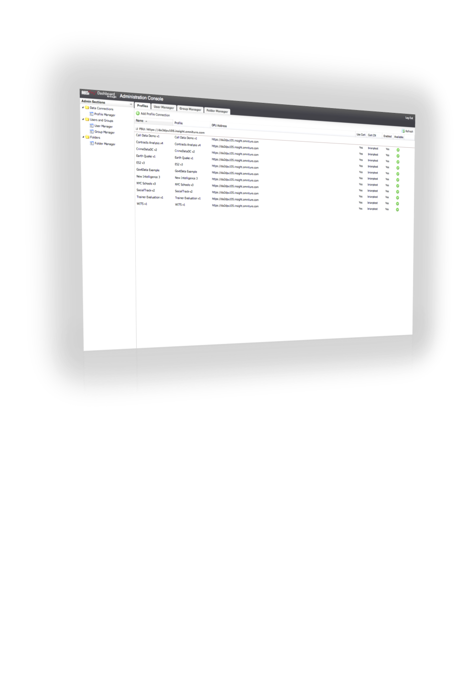

# 從管理控制台進行管理{#managing-from-the-administration-console}

控制面板應用程式的管理功能是使用 **[!UICONTROL Administration Console.]** Using this console來執行的，您可以管理描述檔連線、使用者、使用者群組、資料夾階層，以及控制面板中使用的架構定義。

若要存取管理控制台，您必須先以管理員身分登入控制面板。 登入控制面板介面後，按一下 **[!UICONTROL User]** > **[!UICONTROL Admin]** 以導覽至「管理控制台」。

