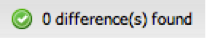

# 初始化和更新設定檔的結構定義{#initializing-and-updating-a-profile-s-schema-definition}

1. 開啟要設定的設定檔的&#x200B;**[!UICONTROL Schema Builder]**。
1. 從Insight設定檔擷取架構時，將會顯示&#x200B;**[!UICONTROL Loading]**&#x200B;訊息。 載入架構的時間長度取決於要載入的設定檔的複雜度。
1. 完成後，您將在左窗格中看到&#x200B;**[!UICONTROL Insight Schema]**&#x200B;與右窗格中&#x200B;**[!UICONTROL Dashboard Schema]**&#x200B;之間差異的摘要。 此摘要會顯示在&#x200B;**[!UICONTROL Schema Builder]**&#x200B;視窗的左下方。

   >[!NOTE]
   >
   >首次設定結構時，每個量度、維度和篩選器的列出與控制面板的結構不同。 這是因為儀表板架構對象目前不存在。

   

1. 按一下&#x200B;**[!UICONTROL Synchronize with Schema]**&#x200B;按鈕，將「分析架構」檢視中的所有量度、維度和篩選器與「控制面板架構」檢視同步。
1. 完成時，您應會看到訊息，指出找不到任何差異：

   

1. 如果控制面板結構發生任何錯誤（例如重複的量度和維度），則您必須先手動修正，才能儲存。

   >[!NOTE]
   >
   >您可以從&#x200B;**[!UICONTROL Dashboard Schema]**&#x200B;中選擇性移除任何您不想顯示給控制面板使用者的量度、維度或篩選器。 您會收到警告，指出控制面板結構中不存在項目，但不會阻止您儲存。

1. 準備就緒後，按一下&#x200B;**[!UICONTROL Save]**&#x200B;以儲存您對控制面板架構的變更。
1. 控制面板系統會使用此結構定義來填入控制面板介面的一般使用者可用的維度、量度和篩選器。
