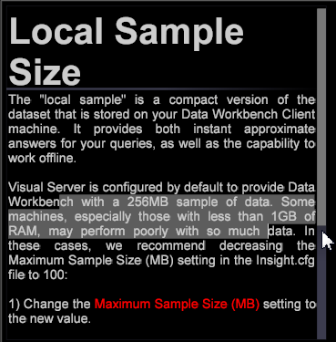

# Data Workbench 6.21 更新{#data-workbench-update}

Data Workbench6.2.1提供新功能和錯誤修正。

## 新功能 {#section-1aacfe9a6a964c91b1d24fc1b181db34}

Data Workbench6.2.1包含下列新功能：

<table id="table_E28A6D31E7D941F7A0C2048F0F0F7838"> 
 <thead> 
  <tr> 
   <th colname="col1" class="entry"> 功能 </th> 
   <th colname="col2" class="entry"> 說明 </th> 
  </tr> 
 </thead>
 <tbody> 
  <tr> 
   <td colname="col1"> 「文字」和「繞圖排文」功能中的「垂直捲軸」。 </td> 
   <td colname="col2"> 文字方塊現在具有垂直捲軸和繞排文字。 
  
 </td> 
  </tr> 
  <tr> 
   <td colname="col1"> 在工作台中排序縮圖 </td> 
   <td colname="col2"> 現在，在操作台上排序的名稱不區分字元大小寫，按字母順序排序AaBCDd而非AbCDd。 
  
 </td> 
  </tr> 
  <tr> 
   <td colname="col1"> 根據父級維度搜尋維度。 </td> 
   <td colname="col2"> 
在 Finder 面板中，您現在可以在「維度」標籤上按右鍵，然後依序點按以選取「維度類型 &gt; 根據父級」。系統會顯示頂層可計算維度清單。選取其中任一父級維度後，搜尋結果會顯示其下層維度清單。 
  </td> 
  </tr> 
  <tr> 
   <td colname="col1"> 對話要求開啟外部應用程式。 </td> 
   <td colname="col2"> 
當您第一次嘗試在Data Workbench中開啟外部應用程式時，現在會顯示一個對話框。 
 
例如，如果您在記事本中開啟文字檔案，將會收到下列訊息。 
  
此也會在客戶端的安裝資料夾中建立名為 InsightSES.dat 的本機檔案。 
 </td> 
  </tr> 
  <tr> 
   <td colname="col1"> 將工具列變更成按鈕 </td> 
   <td colname="col2"> 您可以將 insight.cfg 檔案中的工具列圖示引數變更為 false  ，以選擇退出使用Data Workbench6.2中提供的新工具列圖示。 <code> Toolbar&amp;nbsp;Icons&amp;nbsp;=&amp;nbsp;bool:&amp;nbsp;false&amp;nbsp;&amp;nbsp;&amp;nbsp;&amp;nbsp;&amp;nbsp;&amp;nbsp; </code> 
您需要重新啟動客戶端以讓變更生效。 
 </td> 
  </tr> 
  <tr> 
   <td colname="col1"> 已更新「傾向分數」和「決策樹」中的重設選項 </td> 
   <td colname="col2"> 在「<a href="https://experienceleague.adobe.com/docs/data-workbench/using/client/analysis-visualizations/visitor-propensity/c-visitor-propensity.html" format="http" scope="external">傾向分數</a>」（「工具&gt;預測分析&gt;傾向分數」）和「<a href="https://experienceleague.adobe.com/docs/data-workbench/using/client/analysis-visualizations/decision-trees/c-decision-trees.html" format="http" scope="external">決策樹</a>」（「視覺效果&gt;預測分析&gt;分類&gt;決策樹產生器」）視覺效果中，您現在有兩個重設選項： 
<b>重設模型</b>—清除模型，並維持設定和輸入。將「<b>執行</b>」按鈕切換成可選取。 
 
<b>全部重設</b> — 重設所有設定（如先前的設計）。 
 </td> 
  </tr> 
 </tbody> 
</table>

## 錯誤修正 {#section-8704a9ac358246cd81233dd0982d534f}

* 舊版&#x200B;**[!UICONTROL Traffic]**&#x200B;設定檔中的&#x200B;**[!UICONTROL Browsers]**&#x200B;和&#x200B;**[!UICONTROL Operating Systems]**&#x200B;查閱檔案將不會更新（例如[!DNL Lookups\Traffic\Browsers.txt)]）。 相反，**[!UICONTROL Traffic]**&#x200B;配置檔案將利用DeviceAtlas捆綁包([!DNL Lookups\DeviceAtlas\DeviceAtlas.bundle])提供此配置資訊。
* 資料工作台 6.2.1 是可供下載 32 位元客戶端應用程式的最後一版。未來的客戶端應用程式僅供下載 64 位元版本，且一律要求使用 Windows 7 或以上作業系統。自 6.1 版本開始，我們推出 64 位元應用程式，並說明 32 位元應用程式記憶體限制。

   >[!NOTE]
   >
   >32位版本的Data Workbench客戶端應用程式在使用群集和計分功能運行預測模型時可能遇到與記憶體限制相關的潛在問題。
