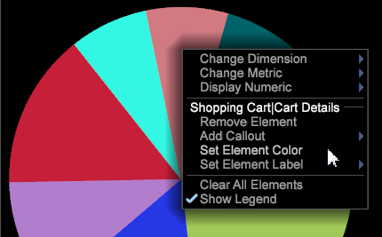

# Pie Chart Update{#pie-chart-update}

圓形圖視覺化的更新可讓您使用圖例中識別的預設顏色，或根據色板來設定顏色。

當您開啟圓形圖時，資料集的色彩預設會以圖例中每個識別的色彩來設定。

通過按一下右鍵圖表並選擇「顯示圖例」，可以開啟和關閉圖 **例**。 結果是圓形圖，每個區段的圖說都不含顏色代碼和元素。

**自訂圓形圖**

按一下右鍵圓形圖以開啟菜單以修改圓形圖。 

此功能表可讓您變更維度元素、量度和數值顯示，以及自訂圖表顏色和標籤。
