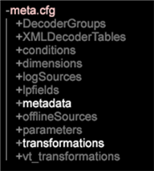

# Data Workbench 6.3 發行說明{#data-workbench-release-notes}

資料工作台6.3版本注意事項包括新功能、升級需求、修正錯誤和已知問題。

## 新特性 {#section-1225066ea8f44cf68e42e019d0bca816}

Data Workbench 6.3包含下列新功能：

<table id="table_E28A6D31E7D941F7A0C2048F0F0F7838"> 
 <thead> 
  <tr> 
   <th colname="col1" class="entry"> 功能 </th> 
   <th colname="col2" class="entry"> 說明 </th> 
  </tr> 
 </thead>
 <tbody> 
  <tr> 
   <td colname="col1"> <a href="../../../home/c-get-started/c-attribution-profiles/c-attrib-algorithmic/c-attrib-algorithmic.md"> 最適化歸因 </a> </td> 
   <td colname="col2"> 「最適歸因」提供機器學習方法，可判斷客戶互動對成功轉換事件的不同影響程度，然後將適當的歸因層級指派給每個事件。 「最適歸因」可讓您評估成功轉換事件發生前一段時間的接觸，然後使用資料工作台演算法根據您的資料建立歸因模型，並提供行銷活動和內部工作流程的特定結果。 </td> 
  </tr> 
  <tr> 
   <td colname="col1"> <a href="../../../home/c-get-started/c-exp-data-seg-exp/c-mmp-integration.md"> 與 Master Marketing Profile 整合 </a> </td> 
   <td colname="col2"> 將在資料工作台中建立的豐富型客戶區段共用至Adobe Experience Cloud。 Integrating with Profiles and Audiences enables the <a href="https://www.adobe.com/solutions/digital-marketing.html?promoid=KLXLZ" format="https" scope="external"> Adobe Experience Cloud </a> and other Adobe Analytic capabilities the opportunity to leverage rich audience segments created in Data Workbench. 這需要您已設定並執行Experience Cloud。 <p>與Master Experience Cloud整合可讓您執行預測性功能，例如叢集或傾向分數，然後將區段推出至較大的Adobe Experience Cloud或其他產品，例如Adobe Target和Adobe Experience Manager。 </p> </td> 
  </tr> 
  <tr> 
   <td colname="col1"> <a href="../../../home/c-get-started/c-exp-data-seg-exp/c-segment-export.md#concept-ac18fdb34edc4b9592130ab98fabd05e"> 區段匯出格式選項 </a> </td> 
   <td colname="col2"> Added industry-standard format options for segments for direct integration with other capabilities, such as <b>R</b>, without additional file manipulation. 如此可提供更有效率的工作流程和更快速的分析。 </td> 
  </tr> 
  <tr> 
   <td colname="col1"> <a href="../../../home/c-get-started/c-analysis-vis/c-visitor-cluster/c-clustering-2.md"> Clustering 2.0 </a> </td> 
   <td colname="col2"> Includes a new <span class="filepath"> KMeans++ </span> algorithm ( <span class="filepath"> KMeans </span> is currently supported) that uses a faster approach to finding centers for an expedited cluster-generation process. </td> 
  </tr> 
  <tr> 
   <td colname="col1"> <a href="../../../home/c-get-started/c-analysis-vis/c-graphs/c-trend-lines.md#concept-2898b2ef97dc4762bda7df292713e9a2"> 趨勢線 </a> </td> 
   <td colname="col2"> 呈現極具視覺效果和易於解讀的資料描述。 </td> 
  </tr> 
  <tr> 
   <td colname="col1"> <a href="../../../home/c-get-started/c-analysis-vis/c-graphs/c-regression-analysis.md#concept-58ec981ab50549488585a88295fa14b7"> 迴歸分析圖 </a> </td> 
   <td colname="col2"> 能夠在分析師工作流程內直接比較一個因素對另一個因素的影響。 </td> 
  </tr> 
  <tr> 
   <td colname="col1"> <a href="../../../home/c-get-started/c-analysis-vis/c-chord-visualization.md#concept-ca600beb11674f3bb2696edf41f1dda9"> 弦圖視覺效果 </a> </td> 
   <td colname="col2"> The Chord Visualization provides another view of the <a href="https://docs.adobe.com/content/help/en/data-workbench/using/client/analysis-visualizations/correlation-analysis/c-correlation-analysis.html" format="http" scope="external"> Correlation Matrix </a>. </td> 
  </tr> 
  <tr> 
   <td colname="col1"> <a href="../../../home/c-get-started/c-admin-intrf/c-query-que/c-query-string-grouping.md"> 查詢字串分組 </a> </td> 
   <td colname="col2"> 如果您有許多欄位具有自訂evar、prop和變數，在記錄處理期間，您可以建立名稱值對來結合報表中的欄位。 </td> 
  </tr> 
  <tr> 
   <td colname="col1"> <a href="../../../home/c-get-started/c-analysis-vis/c-latency.md#concept-a18c23d45af0460ba531f94da0cdfe6a"> 延遲分析 </a> </td> 
   <td colname="col2"> 「延遲」視覺化可讓您分析促銷活動或其他事件類型之後事件發生前或之後的指定天數內的潛在客戶行為。 </td> 
  </tr> 
  <tr> 
   <td colname="col1"> <b>時間</b> 維 </td> 
   <td colname="col2"> In the Finders panel, you can now right-click on the <span class="uicontrol"> Dimensions </span> tab and select <span class="uicontrol"> Dimension Type &gt; Time </span>. 搜尋結果中會顯示時間維度清單。 <p>  </p> </td> 
  </tr> 
  <tr> 
   <td colname="col1"> <b>鎖定功能</b> </td> 
   <td colname="col2"> 新的「 <b>鎖定</b> 」(Lock)功能在工作區被鎖定時，在工具欄中顯示一個表徵圖。 您可以按一下「新增」功能表，然後按一 <b>下「暫時解除</b> 」，以解除 <b>鎖定工作區</b>。 </td> 
  </tr> 
  <tr> 
   <td colname="col1"> 邏輯運算子和篩選面板中的新度 <b>量功能 </b> </td> 
   <td colname="col2"> AND/OR邏輯運算子已新增至「篩 <b>選面板</b>」，讓您在篩選資料時加入或新增量度。 當您變更量度時，「篩選百分比」會隨之調整和顯示。 </td> 
  </tr> 
  <tr> 
   <td colname="col1"> 鍵盤快速鍵 </td> 
   <td colname="col2"> 「資料工作台」中的新鍵盤快速鍵可讓您使用方向鍵，在主要工作台和個別工作區之間導覽。 此外，工作區中的工具列現在會顯示在工作台視窗上。 </td> 
  </tr> 
  <tr> 
   <td colname="col1"> Windows 8.1支援 </td> 
   <td colname="col2"> Microsoft Windows 8.1 64位元版現在支 <a href="https://docs.adobe.com/content/help/zh-Hant/data-workbench/using/install/c-data-workbench-client-install.html" format="https" scope="external"> 援用戶 </a> 端安裝。 </td> 
  </tr> 
 </tbody> 
</table>

## 升級需求與建議 {#section-8704a9ac358246cd81233dd0982d534f}

「資料工作台」的新描述檔位於「軟體」和「文 **件」描述檔** :

```
Profiles - Current\DataWorkBench\ 
  English Translated\DataWorkBench_6.31-en-us\
```


**升級伺服器：**

>[!NOTE]
>
>如果您有自訂設定檔，其優先順序高於套件中提供的預設 [!DNL Base] 檔案，則您需要更新這些自訂檔案：

* **更新Meta.cfg檔案** ( [!DNL E:\..\Profiles\<your custom profile>\Context\meta.cfg)]為檔案系統單元（FSU伺服器）設定更新的密碼加密，並新增名稱值對變更的項目，以利用 [查詢字串分組](../../../home/c-get-started/c-admin-intrf/c-query-que/c-query-string-grouping.md)。

   1. 在FSU [!DNL meta.cfg] 上開啟檔案。
   1. 在「工作站配置」 **[!UICONTROL Proxy Password]** 部分中將 [!DNL string"] 「」的數 [!DNL EncryptedString]據類型從 ** 「」更改。

      ```
      Proxy User Name = string: 
      Proxy Password = EncryptedString:   (from Proxy Password = String) 
      Use Address File = bool: true
      ```

   1. 添加新條目以啟用新的名稱值對轉換： *BuildNameValuePair* 和 *ExtractNameValuePairs*。

      開啟工作區，然後以滑鼠右鍵按一 **下「管理** >描 **述檔管理員**」。

      在「 **Base**」( **Base)欄中，按一下** meta.cfg **檔案，然後按一下「** Make Local Context **」(製作本機上**&#x200B;下文)。 從「用戶」表列中，按一下右鍵並選擇「在工 **作站中** 」 **>「開啟」**。

      

      * 在新視窗中，按一下中繼資 **料** ，並新增可接受的子範本。

      

      * 開啟 **轉換** ，並新增範本。

      


* **更新快速合併改良功能**。 在轉換期間，將參數或變更值新增至下列設定檔案，以運用資料工作台中的速度改進功能。

   * **Communications.cfg** ([!DNL E:\Server\Components\Communications.cfg])

      ```
      18 = SourceListServer:  
          URI = string: /SourceListServer/ 
          Listing Interval = int: 10 (new)
      ```

   * **Disk Files.cfg** (at [!DNL E:\Server\Components] 和 [!DNL E:\Server\Components for Processing Servers])

      ```
      Disk Cache Size (MB) = double: 1024 (from double: 256) 
      Disk Cache Read Limit (MB) = double: 768 (new)
      ```

   * **Log Processing Mode.cfg** ( [!DNL E:\Server\Profiles\<your profile>\Dataset\Log Processing Mode.cfg])

      ```
      <i>(changed)</i> 
      Batch Bytes = int: 268435456 
      Cloud Bytes = int: 268435456 
      Real Time FIFO Bytes = int: 268435456
      ```

      ```
      (new) 
      Cache Bytes = int: 32000000 
      Fast Input Decision Ratio = double: 200 
      Fast Input FIFO Bytes = int: 268435456 
      FIFO Hash Mask = int: 16383 
      Fast Merge Buffer Bytes = int: 536870912 
      Slow Merge Buffer Bytes = int: 268435456 
      Fast Merge Fan In = int: 64 
      Key Cache Size Logarithm = int: 21 
      Max Seeks = int: 512 
      Output Old Buffer Bytes = int: 536870912 
      Overflow FIFO Bytes = int: 67108864 
      Paused = bool: false
      ```

      >[!NOTE]
      >
      >* 若要運用快速合併功能的增強功能，請確定每個DPU至少有8 GB的記憶體。
      >* 如果套用新的「記錄檔處理模式」參數，則可能需要縮短「儲存間隔」（資料集之間的儲存時間）。 由於轉換的完成速度會更快，與舊版相比，資料集狀態檔案在「保存間隔」之間將包含更多資料。

      >
      >  **建議將「儲存間隔」設定減少為1800秒（30分鐘）**—預設的「儲存間隔」為3600秒（1小時）。 (如果需要將此行添加到中 [!DNL Log Processing Mode.cfg]，請注意有兩個前導空格)。
      >
      >  
      ```
      >      Save Interval (sec) = int: 1800
      >  ```
      >
      >  * 建議不要將新的「記錄處理模式」參數套用至使用「全部」操作設定 **CrossRows** 的 **資料集** 。 使用這些設定，此操作的記憶體使用量可能會對環境造成太大影響。


* **Adobe Target與DWB整合更新**。 新的匯出檔案 [!DNL ExportIntegration.exe]會取代Insight Server( [!DNL TnTSend.exe] )上的現有檔案 [!DNL E:\Server\Scripts\TnTSend.exe]。 此新的匯出檔案支援Adobe Target整合，並支援與新的主行銷設定檔(MMP)和Adobe Audience Manager協調。

   您需要更新下列Adobe Target匯出指令。

   `Command = string: TnTSend.exe`

   變更為

   ```
   <filepath>
   Command = string: ExportIntegration.exe 
   </filepath>
   ```

   >[!NOTE]
   >
   >這只會影響6.3版之前建立的匯出。
   >
   >
   >您也可以嘗試使用下列項目來運用舊的匯出程式：
   >    
   >* 在工作站中建立新的測試和目標匯出。
   >* 修改Server/Profiles/`<your profile>`/Export中的舊「測試和目標」導出。


* **更新Adobe SC設定檔。** 對檔案的 [!DNL Exclude Hit.cfg] 更改要求在關聯檔案中聲明一個 [!DNL Decoding Instructions.cfg] 欄位。

   >[!NOTE]
   >
   >如果您的Adobe SC設定檔包含自訂 [!DNL Decoding Instructions.cfg] 檔案，您將需要在自訂檔 [!DNL DelimitedDecoder] 案中加入參數。

   ```
   0 = DelimitedDecoder: 
      Delimiter = string: \t 
      Fields = vector: x items 
      …  
         5 = string: 
   Changed to: 
   
   5 = string: x-hit_source
   ```

   新增欄 [!DNL DelimitedDecoder] 位可讓您運用功能更新，並避免因這些更新而產生的記錄處理問題。

**升級客戶端：**

* **從伺服器更新您的用戶端**。

   在您的伺服器更新後，如果檔案已正確設定，您的用戶端就可 [!DNL Insight.cfg] 以自動更新：

   1. Edit the [!DNL Insight.cfg] file.

      ```
      Update Software = bool: true
      ```

      接著 **[!UICONTROL Save]**.

   1. 退出並啟動用戶端。
   1. 連線至描述檔。

      客戶會自動升級至Data Workbench 6.3。

   1. 退出客戶端。
   1. 編輯 [!DNL Insight.cfg]

      * 變更 [!DNL Proxy Password = string:]

         變更為 [!DNL Proxy Password = EncryptedString:]

         移除先前「代理位址」和「代理密碼」的值。

      * **[!UICONTROL Save]**。
   1. 啟動客戶端。
   1. 編輯 [!DNL Insight.cfg].

      * 輸入所有伺服器的代理密碼並保存。
      * 輸入所有伺服器的代理地址並保存。

         >[!IMPORTANT]
         >
         >必須在客戶端中輸入並保存代理地址和代理密碼。
   1. 連線至描述檔。
   >[!NOTE]
   >
   >
   >    
   >    
   >    * 請依照正確的升級順序，以避免帳戶鎖定。 如果帳戶已鎖定，請依所列順序執行所有必要變更，儲存您的作品，然後退出用戶端。 等待鎖定釋放（約45分鐘），然後再次啟動客戶端。
   >    * 只有在Windows Credential Vault中保存密碼的情況下，才應在客戶端中執行密碼修改。


* **建議**:**全新Windows Aero主題。 **使用Windows Aero Themes升級用戶端應用程式的外觀。

* **建議：中文和日文版字型**:

   中文：

   * Arial
   * SimSun

   日文:

   * MS Gothic
   * 梅里約
   * Mincho女士
   * Arial
   * SimSun

   >[!NOTE]
   >
   >*SimSun* 可用於中文和日文。 如果嘗試用日文寫入半位元組字元，您還需要包含 *MS Mincho*。 若要在中啟用這些 [!DNL Insight.cfg]字型，您可以新增這些參數。

   ```
   0 = string: Arial 
   1 = string: SimSun 
   2 = string: MS Mincho
   ```

   這些字型應列在工作站配置檔案中： [!DNL Insight.cfg.]

**升級至Adobe Analytics Premium**

若要在 **資料工作台中執行Best Fit Attribution** ，您必須從Adobe ClientCare接收您的用戶端、伺服器和報表伺服器（.pem檔案）的新憑證，以支援Adobe Analytics Premium。 每個新證書都具有此參數：

```
Product = Premium
```

「Premium Package」（高階套件）可在「Profiles and Lookup files」（描述檔與查閱檔案）工 **[!UICONTROL Software and Docs]** 作區 **[!UICONTROL Getting Started]** 的標籤下 **** 方下載。 Navigate to `Profiles - Current\DataWorkBench\<language>\Data WorkBench_6.30-en-us\Premium_6.30_en-us.zip`.  在您的 **伺服器上載入** Premium描述檔後，您就需要將 *Premium* 參數新增至自訂 [!DNL Profile.cfg] 檔案。 這可讓您的自訂設定檔包含功能表、視覺化和工作區，做為Adobe Analytics Premium的一部分。

## 修正的錯誤 {#section-e1e3df3da3594987a325344cd5e8b855}

* 修正「密度圖」 **視覺化中** ，缺少最大元素的問題。
* 修正「密 **度圖** 」中，元素區域未描繪量度值比例的問題。
* 修正將量度從面板拖曳至量 **[!UICONTROL Finders]** 度欄外的量度圖例會從工作區刪除圖例的問題。
* 修正使用和 **[!UICONTROL Print Workspace]** 選項 **[!UICONTROL Sidebar]** 時， **[!UICONTROL Both]** 列印頁面中不會包含著作權資訊的問題。

## 已知問題 {#section-751e8698e9f14b75a85f63253782be41}

* 使用 **AMD Radeon™顯卡的用戶** ，應更新為最新的顯卡驅動程式。 一些驅動程式的早期版本聲稱支援openGL 3.2，但是不一致。
* 由區段匯 **出設定產生的輸出，若沒有標題宣告** ，可能會在檔案的開頭出現與第一組列衝突的假標題。
* **「新增維度** 」只會顯示「延 *伸維度」*。 因應措施是使用「尋找 **工具** 」工具將維度拖曳至表格。

* 當「3D散布圖視覺化」包含圖說時，縮放可能會在視覺化邊框外顯示圖畫。 若要解決此問題，請先縮放3D散布圖，然後將圖說加入視覺化。
* 更名工作區時，在遠程案頭會話中使用工作站將崩潰。
* 清單項目
* **即使匯出檔案在「輸出格式」欄位中不包含引號** ，舊版區段仍會匯出以雙引號輸出的檔案。

   *解決方法*:將這三行新增至。export檔案。 設定這些值不會觸發MMP整合（因為需要其他設定欄位），但會略過不要的自動轉義。

   ```
     MMP Configuration = MMPConfiguration: 
       MMP Segment Name = string: UNESCAPE DUMMY 
       MMP Visitor ID Field = string: [Specify a Dimension from the output of 
                                       the current export]
   ```

   (第一行有兩(2)個前導空格，而下一行有四(4)。 當前導出輸出中的「尺寸」(Dimension)需要在中參 [!DNL MMP Visitor ID Field]考。)
