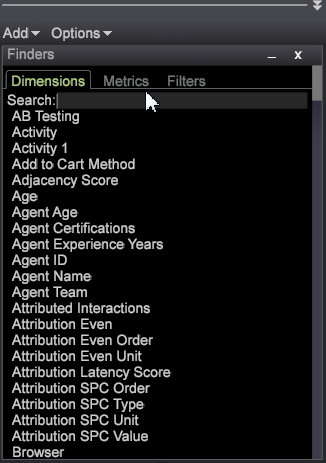
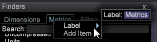

# 搜尋器{#finders}

在Data Workbench中使用搜尋器面板來選取量度、維度和篩選器。 這些面板提供搜尋支援、排序選項及拖放功能。

可在左側邊欄或工作區中開啟「尋找器」面板。

<table id="table_3E43DBA0646842898F14F31374F9E39C"> 
 <thead> 
  <tr> 
   <th colname="col1" class="entry"> Dimension尋找器 </th> 
   <th colname="col2" class="entry"> 量度搜尋器 </th> 
   <th colname="col3" class="entry"> 篩選器尋找器 </th> 
  </tr>
 </thead>
 <tbody> 
  <tr> 
   <td colname="col1"> 
查詢模型中所有維的清單。 
 </td> 
   <td colname="col2"> 
查詢模型中所有量度的清單。 
 </td> 
   <td colname="col3"> 
為貴組織建立的所有篩選器清單。 
 </td> 
  </tr> 
 </tbody> 
</table>

**要開啟Finder:**

* 在工作區中按一下右鍵，然後選擇「**[!UICONTROL Tools]** > **[!UICONTROL Finder]**」。

   將在工作區中開啟「尋找器」窗格，其中包含「量度」、「Dimension」和「篩選器」索引標籤。

* 在左側邊欄中按一下右鍵，然後選擇「**[!UICONTROL Add]** > **[!UICONTROL Finder]**」。

   「尋找器」窗格將在左側面板中開啟。

**Finder**&#x200B;包含下列功能：

<table id="table_072047E919204577AE85789BAE0F4EE8"> 
 <thead> 
  <tr> 
   <th colname="col1" class="entry"> 尋找器功能 </th> 
   <th colname="col2" class="entry"> 詳細資料 </th> 
  </tr>
 </thead>
 <tbody> 
  <tr> 
   <td colname="col1"><b>拖放</b> </td> 
   <td colname="col2"> 
 您可以從面板將維度或量度拖放至工作區中的視覺效果，以變更維度或新增量度。 
 
    <ol id="ol_612DC76EC04C4FCE938B20B388C43CE8"> 
     <li id="li_7F73B781141E4B8CAE9800F580F62E44">按住 &lt;Ctrl&gt;和 &lt;Alt&gt;鍵，然後從Finder面板中選取維度或量度。 </li> 
     <li id="li_631D57976F71415AA61F33EBBFDD128A">從窗格拖曳新維度至視覺效果，以變更或新增維度。 </li> 
     <li id="li_5329FB82225F46EBBE3A996A641058DE">若要新增量度，請從窗格拖曳新量度，放置到所選視覺效果的量度標題上。 </li> 
    </ol> 
這適用於所有相關的視覺效果，包括表格、訪客叢集、關聯矩陣、散布圖和2-D長條圖（視軸而定）。 
 </td> 
  </tr> 
  <tr> 
   <td colname="col1"><b>搜尋</b> </td> 
   <td colname="col2">搜尋器面板中的搜尋方塊可讓您篩選Dimension、量度和篩選器的名稱。 
    <ul id="ul_0F6F377E9906472E99008EBE7483F689"> 
     <li id="li_75857895EDB045C8B2960393854B257D"> 
模式比對（簡單全域搜尋）。 開始在「搜尋」欄位中輸入所需維度、量度或篩選實體的名稱，而名稱中任何位置所包含的相符字串才會經過篩選並顯示在「尋找器」窗格中。 
 
例如，輸入： 
 <code><b>Search:</b>click</code> 
您可以在「Dimension尋找器」中取得下列結果： 
 
 
 
標準模式比對可讓您使用萬用字元，例如。 （圓點），「？」 ，和"*"（星號）。 
 </li> 
     <li id="li_044F9EC1399B44CD81E1852F85137704"> 
規則運算式. 新增的搜尋功能也支援更複雜的規則運算式。 在搜尋詞（無空格）前面加上前置詞"re:"，以解譯為規則運算式。 
 
例如，輸入： 
 <code><b>Search:</b>re.*ip</code> 
您可以在「Dimension尋找器」中取得下列結果： 
 
 
 </li> 
    </ul> 
如需深入搜尋資訊，請參閱<a href="https://docs.adobe.com/content/help/en/data-workbench/using/dataset/c-reg-exp.html" format="http" scope="external">規則運算式</a>。 
 </td> 
  </tr> 
  <tr> 
   <td colname="col1"><b>Dimension類型</b> </td> 
   <td colname="col2">在「Dimension」標籤中，您可以按一下滑鼠右鍵標籤標題，依維度類型排序。 
 
     <ul id="ul_D36B8474730F4859BC7AA015CC1B8EF0"> 
      <li id="li_4AE1D5699D0E45AF880A134F886B8B19">屬性 — 根據訪客、產品、地理、時間、視訊和其他屬性的特性建立的Dimension。 </li> 
      <li id="li_0B2A08F8CBE94356AC506F95DC268C47">叢集 — 在叢集產生器內建置的Dimension。 </li> 
      <li id="li_4BC3396A680B49A4B6BDAAD066826864">分數 — 在傾向分數內建置的Dimension。 </li> 
     </ul> 
 </td> 
  </tr> 
  <tr> 
   <td colname="col1"><b>標籤</b> </td> 
   <td colname="col2">在每個頁簽中，可以按一下右鍵並選擇標籤以更名Finder窗格。 
 
 
預設Dimension、量度和篩選器標籤可變更為符合組織慣例的索引標籤名稱。 
 </td> 
  </tr> 
  <tr> 
   <td colname="col1"><b>新增項目</b> </td> 
   <td colname="col2">在每個索引標籤中，您可以按一下滑鼠右鍵並選取新增項目以開啟表格並手動新增Dimension、量度和篩選器。 </td> 
  </tr> 
  <tr> 
   <td colname="col1"><b>查找器條</b> </td> 
   <td colname="col2">在左側邊欄的搜尋器列中按一下滑鼠右鍵，以開啟其他功能的功能表。 
 
 </td> 
  </tr> 
  <tr> 
   <td colname="col1"><b>Close</b> </td> 
   <td colname="col2">按一下右鍵 Finders欄，然後選擇 Close以關閉Finders窗格。 </td> 
  </tr> 
  <tr> 
   <td colname="col1"><b>儲存</b> </td> 
   <td colname="col2">按一下右鍵標題欄並選擇 Save選項，將清單保存到本地。 </td> 
  </tr> 
  <tr> 
   <td colname="col1"><b>轉存</b> </td> 
   <td colname="col2">您可以從搜尋器面板中，以滑鼠右鍵按一下搜尋器列並從功能表選取匯出，以匯出選取的維度、量度或篩選器清單。 
 新增名稱並匯出至Microsoft Excel。 
 </td> 
  </tr> 
  <tr> 
   <td colname="col1"><b>Copy</b> </td> 
   <td colname="col2"> 複製Dimension、量度或篩選器清單。 您可以在「深色背景」、「淺色背景」或「單色」中以檔案或圖形形式複製。 </td> 
  </tr> 
  <tr> 
   <td colname="col1"><b>最小化</b> </td> 
   <td colname="col2"> 最小化查找器窗格。 只會出現Finders列。 </td> 
  </tr> 
  <tr> 
   <td colname="col1"><b>無邊距</b> </td> 
   <td colname="col2"> 顯示工作區中(但左側邊欄中不顯示查找器的無邊框行的窗格。 </td> 
  </tr> 
 </tbody> 
</table>

