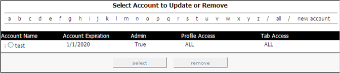

# 檢視帳戶{#viewing-accounts}

有關檢視帳戶的資訊。

在[!DNL Report Portal]中，按一下&#x200B;**[!UICONTROL Admin]**&#x200B;頁籤。 此時將顯示[!DNL Admin]頁面，其中列出了所有單個用戶和組帳戶。

每個帳戶會顯示下列資訊：

| 此欄位。.. | 表示。.. |
|---|---|
| 帳戶名稱 | 個別使用者或群組帳戶的名稱。 顯示在使用者或群組名稱左側的字母會指出這是個人(i)或群組(g)帳戶。 個別帳戶可讓使用者重設密碼，而群組則不會。 管理員是唯一能夠重設群組帳戶密碼的人員。 |
| 帳戶過期 | 此日期的格式為MM/DD/YYYY，直到允許此用戶或組使用[!DNL Report Portal]。 |
| 管理 | 是否允許此使用者建立、更新和刪除使用者帳戶，以及編輯與每個報表關聯的附註。 設定[!DNL True]表示這是管理帳戶。 |
| 設定檔存取 | 此使用者可存取的設定檔（例如ProductSales）。 如果允許用戶訪問與[!DNL Report Portal]關聯的所有配置檔案，則顯示「ALL」。 |
| 標籤存取 | 允許此用戶訪問的頁籤（例如[!DNL Admin]）。 如果允許用戶訪問[!DNL Report Portal]中的所有頁籤，則顯示「ALL」。 |
