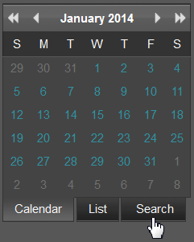

# 報表入口網站中的進階搜尋{#advanced-search-in-the-report-portal}

「報表入口網站」提供搜尋功能，以根據資料夾的樹狀檢視、報表日期的樹狀檢視以及臨機搜尋來尋找報表。

1. 按一下 **[!UICONTROL Search]** 報表入口網站左窗格中的標籤。

   

   將會開啟新網頁，顯示 **[!UICONTROL Search]** 以選項為預 **[!UICONTROL Folder Tree]** 設檢視的頁面。

   

1. 從顯示在頁面頂部的按鈕中選擇其他視圖選項。

<table id="table_02610040A3284C07B62A6E70C0421573"> 
 <thead> 
  <tr> 
   <th colname="col1" class="entry"> 搜尋按鈕 </th> 
   <th colname="col2" class="entry"> 說明 </th> 
  </tr> 
 </thead>
 <tbody> 
  <tr> 
   <td colname="col1"> 
資料夾樹 
 </td> 
   <td colname="col2"> 
根據報表資料夾的自訂階層來選取報表。 這些資料夾已定義並組織為報 <a href="../../home/c-rpt-oview/c-work-rpt-sets/c-work-rpt-sets.md#concept-a5f078668e1245e684cb2a778c8803d5"> 表集</a>。 
 </td> 
  </tr> 
  <tr> 
   <td colname="col1"> 
日期樹 
 </td> 
   <td colname="col2"> 
根據報表伺服器定義的日期階層來選取資料夾。 報表會根據執行日期（年／月/日）來組織。 
 </td> 
  </tr> 
  <tr> 
   <td colname="col1"> 
搜尋 
 </td> 
   <td colname="col2"> 
在所有報表上執行臨機搜尋。 如果您知道報表的完整名稱，可直接在搜尋方塊中輸入。 
 
除此之外: 
 
    <ul id="ul_EAE30AAA865942078D0C6C0AE527C07C"> 
     <li id="li_F5213977442F4B89A62CA6BC315F95BE">鍵入&lt;space&gt;鍵可查看所有現有報表的開始字元或名稱的下拉式清單。 </li> 
     <li id="li_C28799438777471290B424CAFFCAF810">輸入報表的名稱，然後輸入&lt;space&gt;索引鍵以檢視下拉式清單，讓您自動填寫現有報表的名稱。 </li> 
    </ul> </td> 
  </tr> 
  <tr> 
   <td colname="col1"> 
取消選取全部 
 </td> 
   <td colname="col2"> 按一下以清除所有選取的報表。 </td> 
  </tr> 
  <tr> 
   <td colname="col1"> 
顯示選定項 
 </td> 
   <td colname="col2">按一下以顯示在資料夾樹或日期樹視圖中選擇的任何報告。 報表入口網站將會在新視窗中開啟，並將每個報表顯示為。png檔案。 如果選取了多個報表，則可從頁面頂端的標籤中選取每個個別報表。 
按一下此  頁面上的 「列印」按鈕，以列印選取的報表，或按一下「下載  」以本機儲存。 
 </td> 
  </tr> 
 </tbody> 
</table>

