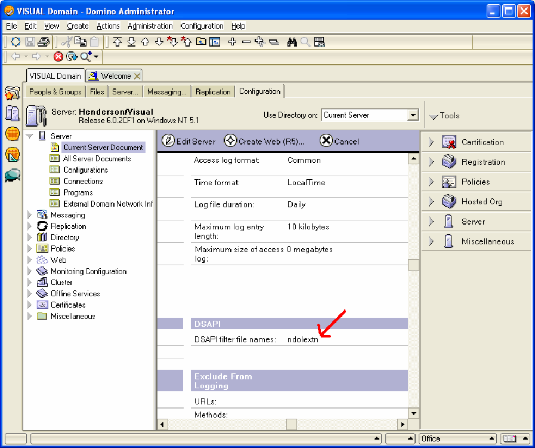
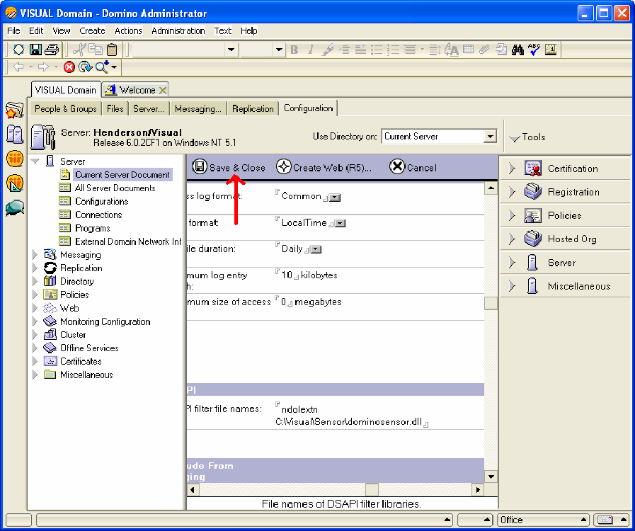

# Windows Server 2000 或更新版本上的 Lotus Domino Server{#lotus-domino-server-on-windows-server-or-later}

{{eol}}

有關如何安裝和配置在Microsoft Windows Server 2000或更新版本下運行的Windows 3.1或更新版本的Lotus Domino Server 6感測器的說明。

Sensor的程式檔案將打包在安裝檔案中，您可從Adobe下載站點獲取該檔案。 如果您尚未擁有特定Web伺服器的感測器安裝檔案，請先下載該檔案(或從Adobe代表處獲取)，然後再開始執行以下步驟。

要安裝和配置Sensor，必須執行以下步驟：

## 安裝程式檔案 {#section-2f3e85083b4f4aa989a85997330e86ae}

1. 在Lotus Domino電腦上，建立一個目錄以安裝Sensor程式檔案。 請記住，磁碟隊列也駐留在此目錄中，因此，請確保您選擇的設備有足夠的空間容納所需大小的隊列。

   ```
   C:\VisualSensor
   ```

1. 將安裝檔案的內容解壓到Lotus Domino目錄中。 在此步驟中，Sensor會安裝下列檔案：

<table id="table_ABFF5F92271B4F3CB0AC68DAB6A5709F"> 
 <thead> 
  <tr> 
   <th colname="col1" class="entry"> 檔案 </th> 
   <th colname="col2" class="entry"> 說明 </th> 
  </tr> 
 </thead>
 <tbody> 
  <tr> 
   <td colname="col1"> EventMessages.dll </td> 
   <td colname="col2"> 事件檢視器訊息 </td> 
  </tr> 
  <tr> 
   <td colname="col1"> stchatlog.dll </td> 
   <td colname="col2"> 收集器模組 </td> 
  </tr> 
  <tr> 
   <td colname="col1"> <p>TestExperiment.xls </p> </td> 
   <td colname="col2"> <p>架構師可用來設定受控實驗的Excel試算表檔案 </p> <p>Sensor不使用此檔案。 </p> </td> 
  </tr> 
  <tr> 
   <td colname="col1"> trust_ca_cert.pem </td> 
   <td colname="col2"> 用於驗證Insight Server在連線程式期間所提供數位憑證的憑證 </td> 
  </tr> 
  <tr> 
   <td colname="col1"> TXLog.exe </td> 
   <td colname="col2"> 發射機程式 </td> 
  </tr> 
  <tr> 
   <td colname="col1"> <p>txlogd.conf </p> </td> 
   <td colname="col2"> 感測器配置檔案 </td> 
  </tr> 
 </tbody> 
</table>

>[!NOTE]
>
>安裝套件包含名為TestExperience.xls的試算表檔案。 這個試算表是一種工具，建築師們用來配置受控實驗。 Sensor本身不使用此檔案，因此不需要在運行Sensor的電腦上安裝該檔案（儘管您可以選擇安裝）。 您可能會想要將檔案複製到架構師可存取的位置，或視需要從安裝套件中擷取檔案。 如需受控實驗的詳細資訊，請參閱Insight受控實驗指南。

## 配置Lotus Domino Server {#section-2e2f1875a5304cdfa2cbcd0680683cfd}

配置Lotus Domino Server的步驟。

1. 登錄到Lotus Domino Administrator ，然後按一下 **[!UICONTROL Domain]**.

   

1. 在「Lotus Domino Administrator」中，按一下 **[!UICONTROL Configuration]**.

   

1. 展開「伺服器」節點，然後按一下 **[!UICONTROL Current Server Document]**.

   

1. 按一下「**[!UICONTROL Current Server Document]**」，然後按一下「**[!UICONTROL Internet Protocols]**」。

   

1. 在HTTP頁簽的DSAPI部分下，按兩下單詞後面的 [!DNL ndolextn].

   

1. Press **[!UICONTROL Enter]** 並輸入 [!DNL dominosensor.dll] 檔案。

   

1. 按一下 **[!UICONTROL Save & Close]**。

   

## 編輯感測器配置檔案 {#section-de0eb4a646394b61abb6cd5a2b706de0}

txlogd.conf檔案包含Sensor的配置參數。

您必須編輯此檔案，以指定磁碟佇列檔案的大小和位置、Insight Server的位址，以及將附加至此感測器產生之事件資料的ID。

設定檔案包含必要參數和選用參數。

* **必要參數** 是安裝Sensor時必須指定的設定。 沒有這些設定，Sensor將無法成功運行。
* **選用參數** 是預設為預先定義值（您可以修改）或啟用可選功能的設定。

**編輯Sensor配置檔案**

* 開啟 `<Sensor directory>/txlogd.conf` 檔案，並設定所需的參數以及任何所需的選用參數。
* 儲存並關閉檔案。

## 啟動發射器並建立磁碟隊列 {#section-55630de65f264274aefd771da2002852}

設定txlogd.conf檔案後，您可以啟動傳送器程式、將其註冊為Windows服務，然後建立磁碟佇列。

1. 從Windows的「開始」菜單中，選擇 **附件** > **命令提示**.

1. 在命令提示符窗口中，導航到安裝Sensor的目錄，然後執行以下命令：

   ```
   txlog /regserver
   ```

   此命令將啟動發射器、建立磁碟隊列，並將Sensor註冊為Windows服務。

1. 若要確認傳送器是否正常運作，請按一下 **開始>控制面板>管理工具>服務**.

   >[!NOTE]
   >
   >此命令序列可能因您使用的Windows版本而異。

   1. 在服務清單中，找到Sensor的條目，並確認其狀態為「啟動」，其啟動類型為「自動」。
   1. 關閉「服務」控制面板。

1. 若要檢查傳送器在啟動期間是否發生任何錯誤，請按一下「開始」 > 「控制面板」 > 「管理工具」 > 「事件檢視器」 ，以開啟「事件檢視器」。

   >[!NOTE]
   >
   >此命令序列可能因您使用的Windows版本而異。

   1. 在「事件查看器」窗口的左窗格中，選擇「應用程式」日誌。
   1. 在右窗格中，查找「源」列中帶有「Adobe」的事件。
   1. 如果從「Adobe」中發現錯誤，請按兩下錯誤以顯示「事件屬性」窗口。 此窗口提供有關錯誤的詳細資訊。

1. 檢查完應用程式日誌後，關閉事件查看器。
1. 驗證發送器已建立磁碟隊列( [!DNL Diskq2000.log])，且大小與 [!DNL QueueSize] 參數 [!DNL txlogd.conf] 檔案。

   如果未正確建立隊列：

   1. 檢查txtlogd.conf檔案，並確認QueueSize參數已正確設定。
   1. 檢查Sensor安裝設備上是否有足夠的空間可容納QueueSize參數中指定大小的檔案。
   1. 在Windows中使用「服務」控制面板，停止發射器。
   1. 刪除隊列檔案。
   1. 將Sensor重新註冊為Windows服務：從Windows的「開始」菜單中，選擇「附件」>「命令提示符」。 在命令提示符窗口中，導航到安裝Sensor的目錄，然後執行以下命令：

      ```
      txlog /regserver
      ```

      發射器設計為連續運行。 如果重新啟動電腦，發射器會自動重新啟動。 如果您需要手動啟動和停止傳輸器，則可以使用Windows中的「服務」控制面板執行此操作。
