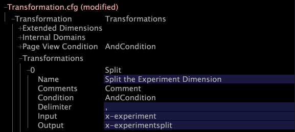

# 修改Transformation.cfg{#modifying-transformation-cfg}

既然x實驗欄位已可用，您必須建立擴充維度以在資料集中包含x實驗欄位，以便在Insight中檢視結果。

若要這麼做，您必須在檔案中新增維 [!DNL Transformation.cfg] 度。

如果您打算運行多個實驗，還必須向檔案添加新的分割變 [!DNL Transformation.cfg] 形。 此分割轉換可分隔不同的實驗和群組名稱，讓資訊更容易解讀。 為避免在日後需要新增其他實驗時重新處理資料，Adobe建議您新增分割變形，即使您目前不打算執行多個實驗亦然。

以下過程包括建立新的分割變形和擴展尺寸。 如果不想添加拆分轉換，只需跳過步驟5-7。

**要修改Transformation.cfg**

1. 在中， [!DNL Insight]在工作區中 [!DNL Profile Manager] 按一下滑鼠右鍵並按一下 **[!UICONTROL Admin]** > **[!UICONTROL Profile Manager]**，或在標籤上開啟「描述檔管理」工作區，以開啟 [!DNL Admin] 該工作區。
1. 在中，單 [!DNL Profile Manager]擊以 **[!UICONTROL Dataset]** 顯示其內容。
1. 按一下右鍵旁邊的複選標 [!DNL Transformation.cfg] 記並按一下 **[!UICONTROL Make Local]**。 此檔案的複選標籤將出現在列 [!DNL User] 中。
1. 以滑鼠右鍵按一下新建立的核取標籤，然後按一 **[!UICONTROL Open]** 下> **[!UICONTROL in Insight]**。 出現 [!DNL Transformation.cfg] 窗口。
1. 按一 **[!UICONTROL Transformation]** 下以顯示其內容。
1. 以滑鼠右鍵按 **[!UICONTROL Transformations]** 一下，然後按 **[!UICONTROL Add new]** > **[!UICONTROL Split]**。
1. 按逗號轉換完成新分割，如以下範例所示：

   

   >[!NOTE]
   >
   >您可以在「名稱」欄位中輸入任何值。

1. 以滑鼠右鍵按 **[!UICONTROL Extended Dimensions]** 一下，然後按 **[!UICONTROL Add new]** > **[!UICONTROL ManyToMany]**。
1. 完成新維，如下例所示：

   

   >[!NOTE]
   >
   >* 您可以在「名稱」欄位中輸入任何值。
   >* 如果未包含分割變形，則必須在欄位中輸入&quot;x-experity&quot; [!DNL Input] 。

1. 按一下右鍵 **[!UICONTROL (modified)]** 窗口頂部，然後按一下 **[!UICONTROL Save]**。
1. 在中， [!DNL Profile Manager]按一下右鍵列中的複選標 [!DNL Transformation.cfg] 記，然 [!DNL User] 後按一下 **[!UICONTROL Save to]** > **[!UICONTROL profile name]** ，保存對工作配置檔案的本地更改。

   >[!NOTE]
   >
   >資料集會立即開始重新轉換。

   如需有關維度和擴 [!DNL Transformation.cfg] 充維度的詳細資訊，請參 *閱資料集設定指南*。
