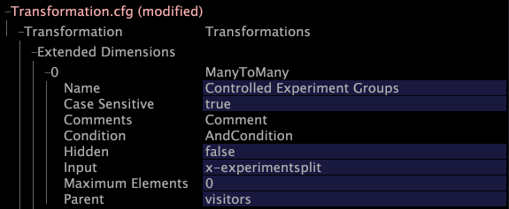

# 修改 Transformation.cfg{#modifying-transformation-cfg}

{{eol}}

現在x實驗欄位已可供使用，您必須建立延伸維度以在資料集中加入x實驗欄位，以便在Insight中檢視結果。

若要這麼做，您必須將新維度新增至 [!DNL Transformation.cfg] 檔案。

如果您計畫執行多個實驗，也必須將新的分割轉換新增至 [!DNL Transformation.cfg] 檔案。 此分割轉換會分隔不同的實驗和群組名稱，以便更容易解讀資訊。 為避免在之後需要新增其他實驗時再次重新處理資料，Adobe建議您新增分割轉換，即使您目前不打算執行多個實驗亦然。

以下過程包括建立新的分割轉換和擴展尺寸。 如果不想添加拆分轉換，只需跳過步驟5-7。

**要修改Transformation.cfg**

1. 在 [!DNL Insight]，開啟 [!DNL Profile Manager] 在工作區中按一下滑鼠右鍵，然後按一下 **[!UICONTROL Admin]** > **[!UICONTROL Profile Manager]**，或在 [!DNL Admin] 標籤。
1. 在 [!DNL Profile Manager]，按一下 **[!UICONTROL Dataset]** 來顯示其內容。
1. 以滑鼠右鍵按一下旁的核取記號 [!DNL Transformation.cfg] 按一下 **[!UICONTROL Make Local]**. 此檔案的複選標籤會顯示在 [!DNL User] 欄。
1. 按一下右鍵新建立的複選標籤，然後按一下 **[!UICONTROL Open]** > **[!UICONTROL in Insight]**. 此 [!DNL Transformation.cfg] 的上界。
1. 按一下 **[!UICONTROL Transformation]** 來顯示其內容。
1. 按一下右鍵 **[!UICONTROL Transformations]** 按一下 **[!UICONTROL Add new]** > **[!UICONTROL Split]**.
1. 依照下列範例，完成逗號轉換的新分割：

   

   >[!NOTE]
   >
   >您可以在「名稱」欄位中輸入任何值。

1. 按一下右鍵 **[!UICONTROL Extended Dimensions]** 按一下 **[!UICONTROL Add new]** > **[!UICONTROL ManyToMany]**.
1. 填入新維度，如下列範例所示：

   

   >[!NOTE]
   >
   >* 您可以在「名稱」欄位中輸入任何值。
   >* 如果您未包含分割轉換，則必須在 [!DNL Input] 欄位。

1. 按一下右鍵 **[!UICONTROL (modified)]** 在視窗頂端按一下 **[!UICONTROL Save]**.
1. 在 [!DNL Profile Manager]，按一下右鍵的複選標籤 [!DNL Transformation.cfg] 在 [!DNL User] 欄，然後按一下 **[!UICONTROL Save to]** > **[!UICONTROL profile name]** 以儲存本機對工作設定檔進行的變更。

   >[!NOTE]
   >
   >資料集會立即開始重新轉換。

   如需 [!DNL Transformation.cfg] 和延伸維度，請參閱 *資料集組態指南*.
