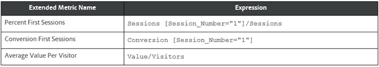

# 量度設定{#metrics-setup}

{{eol}}

本節說明如何在Data Workbench中建立量度。

## 了解量度 {#section-f0412e851fcb4ac9886dca4003d42cec}

量度是有關客戶活動的量化資訊，例如檢視、訂購、呼叫次數和收入。 量度是報告的基礎，有助於您檢視和理解資料關係。

量度Dimension可讓您依特定層級將量度計數分組。 它也可讓您依特定層級將量度計數分組。

## 建立新量度 {#section-60a413899d1b4707965e06fb5ef7fc4e}

請依照下列步驟建立新量度：

1. 按一下 **工具** > **量度編輯器**.

1. 在量度編輯器中，輸入新的量度名稱和公式。 

1. 儲存至量度資料夾。 

## 建立和編輯衍生量度 {#section-ebdcd3ec652f485e90e001d694eab6d0}

使用量度編輯器，依名稱、公式和格式定義新量度，並儲存至 [!DNL User\profile_name\Metrics] 資料夾以供稍後使用。

1. 使用 **管理員>設定檔** ，或在您要建立量度的資料夾中以滑鼠右鍵按一下「使用者」欄，然後按一下 **建立>新量度**. 量度編輯器隨即顯示。

1. 在 *名稱* 參數，輸入新度量的名稱。

   >[!NOTE]
   >
   >請注意，底線(_)不允許使用空格()。 此外，您不能使用下列符號：+ - &#42; /

   

1. 在 *公式* 參數，輸入新量度的運算式。

   >[!NOTE]
   >
   >篩選器必須在方括弧內定義 [ ] 在運算式中。 如需其他量度運算式語法規則，請參閱 [量度運算式的語法。](https://experienceleague.adobe.com/docs/data-workbench/using/client/qry-lang-syntx/c-syntx-mtrc-exp.html)

   下表提供擴充量度的運算式範例。 

   >[!NOTE]
   >
   >輸入適當的運算式時，預覽行會顯示新量度的值。 如果運算式中有錯誤，預覽行會顯示錯誤訊息。

1. 按一下滑鼠右鍵並選取 **儲存**. 儲存量度時，代表新量度的檔案會在您的電腦上的DWB中建立 *安裝目錄\用戶\配置檔案名稱\度量* 檔案夾。

## 編輯現有的衍生量度 {#section-4b5b7baf885b45cc8b358d1bd774e925}

1. 在設定檔管理員或量度管理員的設定檔名稱欄中，以滑鼠右鍵按一下您要編輯之量度檔案的勾號，然後按一下 **使本地**.
1. 以滑鼠右鍵按一下「使用者」欄中量度檔案的勾號，然後按一下 **開啟** 從工作台。

   >[!NOTE]
   >
   >您也可以以滑鼠右鍵按一下視覺效果中任何與量度相關的區域，以開啟量度編輯器，以顯示量度功能表。

1. 在 **量度編輯器**，請視需要使用步驟2至4，編輯並儲存量度定義。 *建立新的衍生量度*.

   如果您希望設定檔的所有使用者使用您編輯的量度，則必須使用「設定檔管理員」將其發佈至正常設定檔。

如需更多協助，請參閱本檔案：

[量度運算式的語法](https://experienceleague.adobe.com/docs/data-workbench/using/client/qry-lang-syntx/c-syntx-mtrc-exp.html)

[建立和編輯衍生量度](https://experienceleague.adobe.com/docs/data-workbench/using/client/admin-ui/profile-mgr/c-drvd-mtrcs.html)
