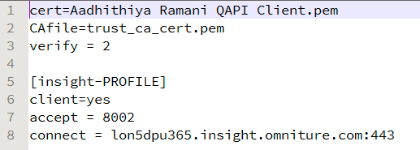
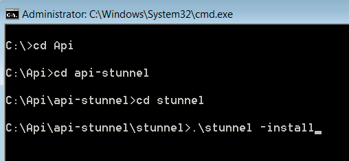

# 查詢 API 設定{#query-api-setup}

{{eol}}

設定查詢API的快速指南。

請依照下列步驟來設定查詢API:

1. 查詢API憑證贏取

   傳送電子郵件給技術作業團隊Adobe電子郵件 —  `Dataworkbench@adobe.com`.

   請提供您要用於查詢API的CN名稱(提供類似 `<Client>` 查詢API)。

   >[!NOTE]
   >
   >技術作業會產生憑證並在URL中上傳。 收到技術作業團隊關於成功產生票證的通知後，請讓Adobe顧問知道，以便票證會由他們傳回給您。

1. 下載和擷取API範圍。 從您的顧問處接收api特定檔案。

   確保電腦上安裝了Perl。

   在擷取的資料夾（複製檔案的資料夾路徑）中，將查詢API憑證複製到 *特技* 檔案夾。

1. 設定Stunnel.conf

   應該有一個檔案，名為 *stunnel.conf* 內 *斯圖內爾* 資料夾（您複製憑證的位置）。

   在記事本中編輯檔案。

   

   變更參數如下： 

   此檔案中需要變更兩個參數。

   * *Cert* =憑證上的名稱。 在此範例中，此為Aadhithiya Ramani QAPI Client.pem。
   * *Connect* =您主要DPU的伺服器名稱。

1. 複製 *Query.pm*.

   此 *Query.pm* 檔案將可在Insight API資料夾中使用。

   複製 *Query.pm* 檔案並貼到Perl Library資料夾中(通常為*C:\Perl64\lib *，但檢查Perl在電腦中的安裝位置)。

1. 修改 *api-http.pl* 檔案

   api-http.pl檔案將可在api-stunnel資料夾中使用。

   僅要修改一個參數

   *我的$配置檔案* =您要設定查詢API的設定檔名稱。

1. 安裝查詢API。

   在系統中以「管理員」的身份開啟命令提示符，並導航到解壓的目錄 *特技* 如所示： 

   執行以下命令 *.\stun-install*. 

   執行命令後，會出現視窗，指出 *特技* 已安裝。

   >[!NOTE]
   >
   >執行命令後，會出現視窗，指出 *特技* 已安裝。

1. 測試查詢API失敗設定

   此程式的最後一步將是測試查詢API設定。 在用於安裝api-stunnel目錄的命令提示符中。 

   使用以下命令* perl api-http.pl*運行該資料夾中可用的Perl指令碼。 

   執行指令碼後，結果應如下方螢幕擷圖（步驟6）所示（結果中的日期時間和值會根據您設定查詢API的設定檔中的截止時間和其他參數而有所不同）。 
