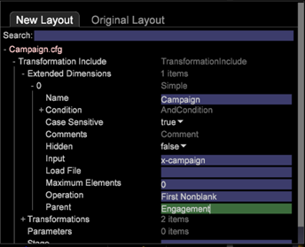

# 新結構的組態變更{#configuration-changes-for-new-schema}

{{eol}}

本檔案說明如何在新架構建立後變更所有預設Data Workbench設定。

## 了解資料集結構 {#section-2ffac5170c894781bc943565af7ad479}

資料集結構的基礎包含一組構成Data Workbench網頁分析結構骨幹的關鍵關係。 在下列範例中，一般的Web分析架構提供訪客、造訪和頁面檢視之間關係的概念。 

* 任何特定訪客都可能有一或多次造訪。
* 任何指定的造訪都只會由一位訪客產生。
* 任何指定的造訪皆可包含一或多個頁面檢視。
* 任何指定的頁面檢視都只屬於一次造訪。 `<discoiqbr>`

隨著網路和商業世界的不斷演化，網路和資料分析的需求也發生了改變。 網站一開始是查看內容的地方。 現在，您可以查看內容；通過聊天、視頻或提交以交互方式對應；購買產品；還有更多。 此外，企業現在希望將其Web資料與業務中的其他資料渠道整合，以便更好地了解其整個業務。 例如，企業可能希望將其網路、客服中心、電子郵件、社交以及儲存和客戶資料整合在一起。 透過離線和線上頻道的整合，資料集結構在過去數年間已有所演變，但兩個資料集結構並不相同。

`<discoiqbr>`當您整合線上和離線資料時，「訪客」一詞不一定適合。 因此，有時會使用「customer」一詞來取代訪客。  

如果您有來自多個資料來源的資料，「參與」層級可用來啟用單一時間檢視。 例如，假設您只有單一資料來源：訪客活動在您網站上收集的電子商務資料。 在這種情況下，「瀏覽」層級會指出訪客對您網站的瀏覽。 請注意，時間維度 — 「日」、「周」、「月」等。  — 通常會在「造訪」層級擷取。

同樣地，「事件」層級會將參與期間發生的所有事件（頁面檢視、呼叫呼叫中心等）帶入。 它結合了客戶參與期間的所有線上和離線事件。

## DWB中新的可數結構 {#section-b77638ec04e4441cb51c56fd3d4abeb6}

新的結構會取代「依客戶訪客」、「依參與造訪」和「依事件點擊」。 

## 依新資料集結構變更的設定 {#section-27135515be5c471ba2ee879d1ef4771f}

若要將資料集結構從訪客變更為客戶，您必須變更下列組態檔：

1. 定義可數和延伸維度的「資料集」資料夾下的所有設定檔案。 

1. 設定檔案位於Dimension資料夾下，其中「訪客」、「造訪」或「事件」會作為「層級」。

   範例：Campaign.cfg檔案。 在AdobeSC設定檔中，促銷活動是在造訪層級定義。 

   下列範例提供從「造訪」到「參與」的父結構變更概念： 

1. 由於有些量度是衍生自或建立自可數，因此需要修改或建立「量度」資料夾下的設定檔案。

   例如：建立新量度 [!DNL Customers.metric with formula = sum(one,customer)] 或作為頁面檢視.metric *定義* 在點擊層級。 修改量度，然後將層級變更為「事件」而非「點擊」。

   Adobe在點擊層級定義的SC頁面檢視量度： 

   `<discoiqbr>` `<discoiqbr>`以下是根據新結構的頁面檢視量度： 

1. 變更 *order.txt* 量度資料夾中，以便反映與客戶、參與和事件相關的新或修改量度。

   Adobe *SC order.txt* 檔案。 

   *Order.txt* 具有新架構更改的檔案： 

1. 「視覺效果」資料夾下的所有設定檔(.vw)都應變更為參照新層級：客戶、參與和活動。 例如：2D程式圖、3D程式圖等

   AdobeSC在「點擊」層級和「造訪群組」中定義2D程式圖的預設URI.vw，如下所示： 

   在URI.vw中為新架構進行的更改： 
