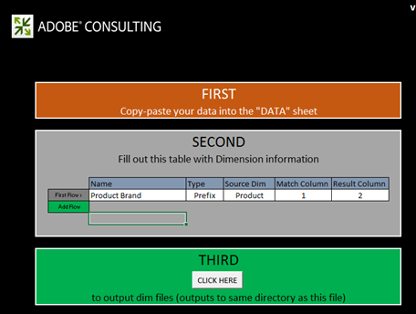

# 派生維設定{#derived-dimensions-setup}

衍生（用戶端）維度的不同類型，以及如何在資料工作台中設定這些維度。

## 派生維的類型 {#section-33e6dcc9ab9745de9b830cecb2427ca3}

**量度維度**

「量度維度」可讓您依特定的「層級」來分組量度計數。 它也可讓您依特定層級將量度計數分組。 一旦建立「量度維度」後，您就可以根據量度值來分段資料。

範例1:您是旅遊公司，想要瞭解您經常乘坐的傳單和訂機票次數不足5次的客戶在網站上的行為活動有何不同，您會怎麼做？

您只有「預訂」計數作為量度，如何根據量度（這裡，預訂）劃分客戶，以瞭解其在網站上的行為？

範例2:您是一家金融銀行，您想要根據客戶所投資的光碟數量對客戶進行分組。 您想要將客戶細分為3個層。 第1層——客戶有10張以上CD，第2層——客戶有5張和&lt;10張CD，第3層——客戶有>0張和&lt;5張CD

您所擁有的資訊是可提供CD投資計數的量度——如何建立疲勞客戶區段以供您分析？

*建立度量維——通過工作站*

將其中一個OOB量度維度標示為本機，然後以自訂名稱重新命名該維度／製作RenameDim.example的本機副本，並以。dim副檔名將它重新命名為適當的維度名稱

在工作站中開啟新建立的維以進行更改。 根據需求變更量度維度的下列參數： 

量度——要分組的量度

層級——量度將分組的層級

時段開始——量度維度的起始元素。 在偏移中輸入相同的值。

時段大小——量度的分組大小。 在比例中輸入相同的值

時段計數——維中要顯示的最大元素數

如果您想與其他人共用新建立的維度，請將它儲存在伺服器上。

**首碼維度**

「前置詞」維的主要用途是對原始維的元素進行分組，並為分組的元素提供用戶友好的名稱。

例如，您擁有零售網站，而您的網站有各種網站區域，例如「女裝」、「男裝」、「玩具與遊戲」、「家庭裝飾」等，而且這些網站區域都有數個與之相關的頁面。 您想要進行路徑分析，並獲得有關從一個網站區域到另一個網站區域等流量的深入資訊。 如果您使用URI維度，則需要提取路徑瀏覽器或流程圖中每個網站區段的每個頁面並進行分析。

如果「首碼」維度將網站區段的頁面分組為單一元素，則可輕鬆進行相同的分析。

建立前置詞維：

從「視覺化」功能表開啟2D流程圖。

根據需求變更前置詞維度的下列參數。

更改映射維——要用於2D進程映射的維(例如：簡訊類型學)

更改映射級別維——上述維的級別

變更對應剪輯維度——您要檢視資料的可計數層級。

變更對應量度——您要檢視的量度。

設定2D進程映射後，開啟在「更改映射維」參數中提及的維。

選擇要分組的元素。 使用CTRL+ALT並拖放元素至處理對映。

在出現的點上按一下滑鼠右鍵，然後重新命名群組名稱。 如果您已選取3個要群組的元素，預設名稱將是3個「選取」。

在視覺化的外框上按一下滑鼠右鍵，並從出現的功能表儲存維度。

**更名維**

更名維是基於預先存在的維建立的。 更名維的主要目的是為維的元素提供用戶友好的名稱。 「更名」維是在URI維中建立的「頁」維。 對於不知道頁面技術名稱的人員，URI維度可能會讓人困惑，這就是為什麼「頁面」維度允許您更名URI維的元素。

建立自定義更名維：

「更名」維的元素與原始基本維的元素保持「一對一」映射。 您可以在「工作站／注釋」面板中開啟更名維的。dim檔案來驗證這一點。 您會注意到，原始維度的每個元素在檔案中只有一個值（重新命名字串）。

如果您的重新命名元素較少；您可以在工作站中建立。dim檔案，並按照以下說明的步驟更名每個單獨的元素。

為更名維建立。dim檔案的步驟——使用工作站

如果要重新命名的元素數較少，請使用此選項。

1. 開啟空白工作區並開啟「維度管理員」。 按一下右鍵>管理>配置檔案>配置檔案管理器。
1. 展開「檔案」列中的「維」資料夾。
1. 展開「檔案」列中的「頁面資料夾」，在「從第二到最後一列」列中按一下右鍵Page.dim檔案（此列通常代表配置檔案名稱），然後按一下「建立本地」選項。
1. 按一下右鍵「用戶」列中的Page.dim ，然後按一下「複製」選項，然後將複製的。dim檔案貼上到維目錄下的所需資料夾。
1. 按一下錯誤消息上的「確定」。
1. 現在，您會注意到「維度」檔案夾下有兩個Page.dim檔案。 一個是「維度\頁面」目錄下的原始檔案，第二個是您剛在步驟4中複製貼上的檔案。
1. 在最近貼上的Page.dim檔案上，按一下「使用者」欄下方的滑鼠右鍵，然後按一下顯示Page.dim的藍色／灰色輸入方塊。 當游標閃爍時，輸入框將變為綠色，表示可以修改它。 鍵入要建立的更名維的名稱。
1. 您會注意到，「檔案欄」中的Page.dim檔案已變更為您在步驟7中提供的新檔案名稱。 按一下右鍵「用戶」列（「最後一列」）中的new.dim檔案，然後選擇「開啟」>「在工作站中」。
1. 在工作站中開啟。dim檔案後；按一下實體旁的加號(+)，然後展開它。 觀察「父項」欄位所顯示的值，它會反映「URI」維度。 它顯示&quot;wdata/model/dim/URI&quot;按一下藍色／灰色輸入框，將URI更改為要更名其元素的維的名稱。
1. 請確定您要重新命名的維度在資料集中確實存在。 尺寸名稱區分大小寫，因此保留原始尺寸的大小寫。
1. 觀察尺寸名稱旁出現的「已修改」。 這表示原始尺寸已修改。 為了維持步驟9中所做的變化；按一下右鍵new.dim（已修改），然後按一下「另存為」選項。
1. 在依步驟10儲存維度後，您現在可以使用新建立的「促銷活動」重新命名維度，以進行重新命名。 這僅適用於本機。
1. 為了讓其他人看到您建立的維，必須將其保存到配置檔案中。 在「用戶」列（最後一列）中按一下右鍵新維的。dim檔案，然後按一下要保存維的「保存到」>「配置檔案名稱」。
1. 將檔案儲存至描述檔後，所有可存取此描述檔的工作站使用者都可以看到促銷活動的重新命名維度。

前置詞和更名尺寸建立器工具

Adobe有Excel工具可產生「首碼」和「重新命名維度」。

以下是使用工具生成前置詞／更名維的步驟：

1. 將Excel工具 *Adobe_DWB_Dimension_Generator.xlsm儲存在檔案夾中* 。 請連絡Adobe客戶服務以下載此工具。
1. 開啟工具並啟用宏： 

1. 將要使用的值填入資料表。

   例如，我們會根據「產品維度」建立「產品品牌首碼」維度。 在資料表中，會擷取下列資訊： 

   每個產品都會指派給資料表中的品牌。

1. 在「配置」(Configuration)頁籤中，填充與要建立的尺寸相關的資訊。 針對上述範例資料輸入下列資訊： 

   名稱：前置詞／更名維的名稱

   類型：前置詞／更名

   原始碼：原始尺寸

   匹配列：要匹配的列

   結果列：用於新維的值。

1. 按一下標題為「按 *這裡」的按鈕*。 

1. 尺寸檔案將生成在保存工具的同一資料夾中。 

   使用「配置檔案管理器」(Profile Manager)，將尺寸檔案保存在「尺寸」(Dimension)資料夾中。

**位移尺寸**

Shift維度可讓您查看任何維度在任何特定可計數維度內的N個元素。

它們也可讓您回顧任何特定可計數維度內任何維度的第N個元素

範例 1:

* 工作階段中的第N頁——下一頁維度
* 所有作業中訪客的N頁——訪客的下一頁
* 使用者的N次呼叫

知道可計數維度的N個元素為何重要？

* 您想知道作業中已檢視的第5頁。
* 您要對促銷活動進行路徑，以瞭解在檢視「免費檢查帳戶」促銷活動後檢視的2ndcampaign是哪一個？
* 您想瞭解訪客在點按「與代理聊天」連結前點按的連結嗎？ 

「下一個URI」是OOB Shift維度之一，可用作範本。 上述範例是在參與事件（剪輯=參與事件）中提供促銷活動的第2個（偏移= 1）元素（Dim =促銷活動）

此處偏移1表示在事件中前向右側

某些其他OOB Shift尺寸

*下一頁:*

在頁面維度中目前選取頁面後，作業中檢視的下一頁

這裡的偏移為1，層級為頁面檢視，維度為頁面，剪輯為工作階段

*上一頁:*

在作業階段中檢視的上一頁，目前在頁面維度中選取的頁面之前

此處偏移為-1，層級為頁面檢視，維度為頁面，剪輯為工作階段

訪客在目前選取促銷活動之前，先前檢視的促銷活動是什麼？

這裡的偏移是-1，層級是促銷活動回應，維度是促銷活動回應屬性值，剪輯是訪客

*通過工作站建立Shift維*

* 將其中一個OOB移位維標籤為本地
* 以自訂名稱重新命名該維度
* 在工作站中開啟新建立的維以進行更改
* 根據需求變更量度維度的下列參數。

   * 可計數層級維度
   * 偏移——您想要向後看
   * 要分析其元素的尺寸
   * 要檢視的可計數剪輯段。

* 如果您想與其他人共用新建立的維度，請將它儲存在伺服器上。

**最後N個維**

最後N個維僅在系統的「時間」維和「截止時間」上操作。 OOB時間維度為日、周、小時和月。 您可以為這些基本時間維度（例如「最近10天」、「最近72小時」、「最近8週」、「最近6個月」等）建立「最近N」維度。 最後N個維度會根據目前的「報表時間量度」或系統截止時間計算最後N個維度。 

Count —維中要顯示的元素總數

範圍偏移——偏移值，表示計算最後N天／周的起始點（日／周）。

**None.dim**

None.dim是「別名」維。 它用於從擴展維建立別名。

範例：

在None.dim中，實體定義為&quot;wdata/model/dim/Parent/+name&quot;（可以更改），這意味著根據維檔案的名稱建立維。 因此，如果我們在「維」檔案夾下建立None.dim檔案的副本（例如，複製並重新命名「訪客資料」檔案夾下的None.dim檔案），並將其重新命名為「記錄來源ID.dim」，則具有「記錄來源ID」的新衍生維度會出現在「訪客資料」下的「選單」中，如下所示：

變更前： 

After None.dim changes: 

實體可以更改為擴展維名稱，在這種情況下，另一個名稱指向相同維的維，如下所示：

在此範例中，&quot;Source Name.dim&quot;包含下列內容： 

因此，將出現指向日誌源ID的另一個維源名稱。 

**隱藏衍生維**

要隱藏派生維，請將 *Show* 屬性設定為&quot;false&quot;。 

