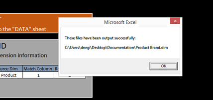

# 衍生維度設定{#derived-dimensions-setup}

{{eol}}

不同類型的衍生（用戶端）Dimension，以及如何在Data Workbench中設定。

## 衍生Dimension的類型 {#section-33e6dcc9ab9745de9b830cecb2427ca3}

**量度Dimension**

量度Dimension可讓您依特定層級將量度計數分組。 它也可讓您依特定層級將量度計數分組。 建立「量度」Dimension後，您就可以根據量度值劃分資料。

範例1:您是一家旅遊公司，想要了解您經常乘坐的傳單與訂機票次數少於5次的客戶之間網站上的行為活動差異，您該如何做到？

您只有「預訂」計數作為量度，如何根據量度（此處為預訂）劃分客戶，以了解其在網站上的行為？

範例2:您是一家金融銀行，您希望根據客戶投資的CD數量對客戶進行分組。 您想要將客戶細分為3個層級。 第1層 — 使用10多張CD的客戶，第2層 — 使用5張和&lt;10張CD的客戶，以及第3層 — 使用>0張和&lt;5張CD的客戶

您擁有的資訊是可提供CD投資計數的量度 — 如何建立「累贅客戶區段」供您分析？

*建立量度Dimension — 透過工作站*

將其中一個OOB量度維度標示為本機，然後以自訂名稱重新命名該維度/製作RenameDim.example的本機副本，並將其重新命名為副檔名為.dim的適當維度名稱

在工作站中開啟新建立的維度以進行變更。 根據需求變更量度維度的下列參數： 

量度 — 要分組的量度

層級 — 量度分組的層級

貯體開始 — 量度Dimension的開始元素。 在偏移中輸入相同的值。

貯體大小 — 量度的分組大小。 在比例中輸入相同的值

貯體計數 — 維度中要顯示的元素數上限

如果要與其他人共用新建立的維度，請將其儲存在伺服器上。

**前置詞Dimension**

「首碼」維度的主要用途是將原始維度的元素分組，並為分組的元素提供好記的名稱。

例如，您擁有一個零售網站，而您的網站有各種網站區段，例如「女裝」、「男裝」、「玩具與遊戲」、「家庭裝飾」等，且每個網站區段都有數個相關頁面。 您想要執行路徑分析，並深入分析從一個網站區域流向其他網站區域的流量，以此類推。 如果使用URI維，則需要提取路徑瀏覽器或進程圖中每個站點部分的每個頁面並進行分析。

如果有Prefix維度將網站區段的頁面歸類為單一元素，便可輕鬆進行相同的分析。

建立前置詞Dimension:

從「視覺效果」功能表開啟2D程式圖。

根據需求變更前置詞維度的下列參數。

Change MapDimension — 要用於2D流程圖的Dimension(例如：SMS類型)

變更對應層級Dimension — 上述維度的層級

「更改映射剪輯Dimension」 — 要查看資料的可數級別。

變更對應量度 — 您要查看的量度。

設定2D程式圖後，開啟您在「變更圖」Dimension參數中提及的維度。

選取要分組的元素。 使用CTRL+ALT，並拖放元素以處理地圖。

以滑鼠右鍵按一下顯示的點，然後重新命名群組名稱。 如果您已選取3個要分組的元素，則預設名稱將為3 Selected。

以滑鼠右鍵按一下視覺效果的大綱，並從顯示的功能表中儲存維度。

**重新命名Dimension**

重新命名Dimension是從預先存在的維度建立。 重新命名維度的主要用途是為維度的元素提供好記的名稱。 立即可用的「更名」維是從URI維建立的「頁面」維。 對於不知道頁面技術名稱的人員，URI維可能會令人困惑，這也是為什麼「頁面」維允許您更名URI維的元素。

建立自訂重新命名DIMENSION:

「已更名」維的元素與原始基本維的元素保持一對一映射。 您可以在工作站/備注面板中開啟「重新命名」Dimension的.dim檔案，以驗證這一點。 您會發現原始維度的每個元素在檔案中只有一個值（重新命名字串）。

如果您的重新命名用途元素較少；您可以在工作站中建立.dim檔案，並依照下列步驟重新命名每個個別元素。

為更名Dimension建立.dim檔案的步驟 — 使用工作站

如果要重新命名的元素數量較少，請使用此選項。

1. 開啟空白工作區並開啟「Dimension管理器」。 按一下右鍵>「管理員」>「設定檔」>「設定檔管理員」。
1. 展開「檔案」欄中的「Dimension」資料夾。
1. 展開「檔案」列中的「頁面資料夾」，然後按一下右鍵「從第二到最後一列」中的Page.dim檔案（此列通常表示配置檔案名），然後按一下「建立本地」選項。
1. 以滑鼠右鍵按一下「使用者」欄中的Page.dim ，然後按一下「複製」選項，然後將複製的.dim檔案貼到Dimension目錄下的所需資料夾。
1. 按一下錯誤訊息的「確定」 。
1. 現在，您會發現「Dimension」資料夾下有兩個Page.dim檔案。 一個是Dimension\頁面目錄下的原始檔案，第二個是您剛在步驟4中複製貼上的檔案。
1. 按一下右鍵「用戶」(User)列下最近貼上的Page.dim檔案，然後按一下顯示Page.dim的藍色/灰色輸入框。 當游標閃爍時，輸入框將變為綠色，表示可以修改它。 鍵入要建立的「更名」維的名稱。
1. 您會發現「檔案」欄中的Page.dim檔案已變更為您在步驟7中提供的新檔案名稱。 在「用戶」列（「最後一列」）中按一下右鍵new.dim檔案，然後選擇「開啟」>「在工作站中」。
1. 在工作站中開啟.dim檔案後；按一下實體旁的加號(+)，然後展開它。 觀察「父項」欄位顯示的值，它反映的是「URI」維度。 它顯示「wdata/model/dim/URI」按一下藍色/灰色輸入框，將URI更改為要更名其元素的維的名稱。
1. 確認資料集中確實存在您要重新命名的維度。 Dimension名稱區分大小寫，因此保留原始維的大小寫。
1. 觀察維度名稱旁出現的「已修改」。 這表示原始維已修改。 維持第9步中的變化；按一下右鍵new.dim（已修改），然後按一下「另存新檔」選項。
1. 在每步驟10儲存維度後，您現在就可以使用為「促銷活動」新建立的重新命名維度來重新命名。 這僅適用於本機。
1. 為了讓其他人看到您建立的維度，必須將其儲存至設定檔。 在「用戶」列（最後一列）中按一下右鍵新維的.dim檔案，然後按一下要保存該維的「保存到」>「配置檔案名」。
1. 將檔案儲存至設定檔後，所有可存取此設定檔的工作站使用者都能看到促銷活動的重新命名維度。

前置詞和更名尺寸建立器工具

Adobe有Excel工具可產生首碼和重新命名Dimension。

以下是使用工具產生「首碼/重新命名」維度的步驟：

1. 儲存Excel工具 *Adobe_DWB_Dimension_產生器.xlsm* 中。 請連絡Adobe客戶服務以下載工具。
1. 開啟工具並啟用巨集： 

1. 將要使用的值填入資料表。

   例如，我們會根據產品Dimension建立產品品牌首碼維度。 在資料表中，將捕獲以下資訊： 

   每個產品都會指派給資料表中的品牌。

1. 在「配置」頁簽中，填寫與要建立的維相關的資訊。 針對上述範例資料，會輸入下列資訊： 

   名稱：前置詞/更名維的名稱

   類型：前置詞/重新命名

   源維：原始Dimension

   匹配列：要匹配的列

   結果列：用於新維的值。

1. 按一下標題為的按鈕 *按一下這裡*. 

1. 尺寸檔案將在保存工具的同一資料夾中生成。 

   使用「配置檔案管理器」(Profile Manager)，將尺寸檔案保存在Dimension資料夾中。

**班次Dimension**

Shift維度可讓您在任何特定可數Dimension中查看任何維度的N元素。

它們也可讓您回顧任何特定可數Dimension內任何維度的 — Nth元素

範例 1:

* 工作階段中的第n個頁面 — 下一頁Dimension
* 所有工作階段中訪客的第N個頁面 — 訪客的下一頁
* 使用者的N次呼叫

為何知道可數維度的第N個元素很重要？

* 您想知道工作階段中檢視的第5個頁面。
* 您想要對促銷活動進行路徑分析，以了解在檢視「免費檢查帳戶」促銷活動後檢視了哪個促銷活動？
* 您想了解訪客在點按「與代理聊天」連結前所點按的連結嗎？ 

「下一個URI」是可用作模板的OOB Shift維之一。 上述範例是在參與事件（剪輯=參與事件）中為您提供促銷活動（維度=促銷活動）的第2個（偏移= 1）元素

此處，offset 1表示在「事件」中前後查看

其他一些OOB ShiftDimension

*下一頁:*

在「頁面」Dimension中目前選取的「頁面」之後，工作階段中檢視的下一個頁面

此處偏移為1，層為頁面視圖，尺寸為頁面，剪輯為工作階段

*上一頁:*

在工作階段中檢視的上一頁，目前在「頁面」Dimension中選取的「頁面」之前

此處偏移為–1，層為頁面視圖，尺寸為頁面，剪輯為會話

訪客在目前選取的促銷活動之前將檢視哪些先前的促銷活動？

此處的位移為–1，層級為促銷活動回應，維度為促銷活動回應屬性值，而剪輯為訪客

*建立班次Dimension — 通過工作站*

* 將其中一個OOB班次維標籤為本地
* 以自訂名稱重新命名該維度
* 在工作站中開啟新建立的維度以進行變更
* 根據需求變更量度維度的下列參數。

   * 層級可數維度
   * 偏移 — 您想向後看
   * 維Dimension，要分析其元素
   * 要查看的可數剪輯。

* 如果要與其他人共用新建立的維度，請將其儲存在伺服器上。

**最後N個Dimension**

Last NDimension僅在系統的「時間」Dimension和「截止時間」上運行。 OOB時間維度為日、周、小時和月。 您可以為這些基本時間維度中的每個維度建立「最近10天」、「最近72小時」、「最近8週」、「最近6個月」等維度。 Last NDimension會根據目前的「報表時間量度」或系統的「截止時間」來計算Last N。 

計數 — 要在維度中顯示的元素總數

範圍偏移 — 偏移值，表示計算最後N天/周的起始點(Day/Week)。

**無.dim**

None.dim是「別名」維。 用於從擴展維建立別名。

範例:

在None.dim中，實體定義為「wdata/model/dim/Parent/+name」（可以更改），這意味著按照維檔案的名稱建立維。 因此，如果我們在「Dimension」資料夾下建立None.dim檔案的復本（例如，在「訪客資料」資料夾下複製並重新命名None.dim檔案），並將其重新命名為「Log Source ID.dim」，則「訪客資料」下的「功能表」中會顯示新的「記錄來源ID」衍生維度，如下所示：

變更前： 

None.dim變更後： 

實體可變更為延伸維度名稱，在此情況下，另一個具有其他名稱的維度會指向相同的維度，如下所示：

在此範例中，「Source Name.dim」包含下列內容： 

因此，將顯示指向日誌源ID的另一個Dimension源名稱。 

**隱藏衍生Dimension**

要隱藏派生Dimension，請設定 *顯示* 屬性設為&quot;false&quot;。 
