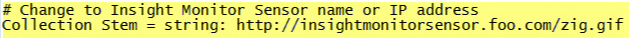
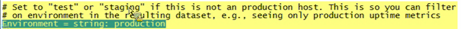

# 安裝監控設定檔{#installing-the-monitoring-profile}

安裝資料工作台監控描述檔的指示。

## 安裝步驟 {#section-d4355dbea8a447f48ab168db6ccff612}

1. 配置新的感測器實例，使其用於標籤的Web頁資料收集。 請確定zig.gif檔案位於感測器Web伺服器文檔根目錄中。 感測器可以在與監視器配置檔案相同的主機上運行。 （如果為此目的使用文字檔案，則不會發生此問題。）

   >[!NOTE]
   >
   >此感測器實例必須專用於僅接收來自監視代理的通信。 此外，如果要為此收集重新使用Web伺服器，則可將感測器配置為在不同埠上運行。

1. 在檔 [!DNL txlogd.conf] 案中有預設行：

   ```
   <b>ContentFilterExclude</b> image/,text/css,application/x-javascript,text/javascript
   ```

   對於資料工作台的「監控描述檔」應用程式（或任何「標籤」頁面實施），必須移除影像類型，才能透過GIF檔案收集。 更新的行是：

   ```
   <b>ContentFilterExclude </b>text/css,application/x-javascript,text/javascript
   ```

1. 將複製 [!DNL insight_monitor.zip/insight_monitor_agent] 到臨時位置。
1. 更新 [!DNL insight_monitor_agent.cfg] 您環境的檔案。 請遵循設定檔案中的注釋：

   **監視配置檔案：**

   

   定義您收集所有資訊的位置，並提供URL位址。 這必須是專用的感測器，除此應用程式外，不會收到任何通信。

   

   有些路徑假設存在e:磁碟。 您可能希望為您的環境更改此路徑。

   

   執行「轉換」描述檔時，資料工作台可能會停止回應。 此值可讓您在連續三次處理沒有回應時傳送警報。 這是一種減少虛假正面警報的方法。

   

   這是您設定環境和群組維度的位置。 這可能與主機不同。

   在這裡，您 可以通過查看此路徑中的錯誤日誌來確切瞭解監視代理正在執行什麼操作。

   

   這是在內部使用temp db。 當達到容量時，系統可能會對它發出警報。 這與物理磁碟的使用不同。

1. 將 ** insight_monitor_agent資料夾複製至執行資料工作台伺服器的每個DPU和FSU主機。 配置檔案中指示的預設位置是， [!DNL e:\insight_monitor_agent] 但您可以更改此位置。

1. 每10分鐘添加一個Windows計畫任務以調用代理（在處理率計算中假定此時段）。 計畫是 [!DNL e:insight_monitor/insight_monitor_agent.exe]。 引數為config-file e:\insight_monitor\insight_monitor.cfg。 從e:\insight_monitor開始。 執行任務的用戶必須具有讀取／寫入和讀取 [!DNL e:\insight_monitor] Win32 OLE對象 [!DNL root\CIMV2] （確定資料工作台伺服器服務啟動模式並檢查本地磁碟上的空間百分比所需）的權限

1. 確認VSL檔案會隨著螢幕記錄的累積而開始成長。 這需要一些時間，因為小型安裝中的流量會非常低（每10分鐘，代理程式就只會針對主機特定資料傳送一次點擊，加上每個處理設定檔一次點擊）。
1. 解壓縮insight_monitor.zip\profiles\Insight Historic to a temporary location。
1. 在、和 [!DNL profile.cfg]中更 [!DNL dataset\cluster.cfg]新主機名 [!DNL dataset\segment export.cfg]。

1. 將檔案更新至資料工作台描述檔目錄。
1. 將日誌伺服器和路 [!DNL dataset\log processing.cfg] 徑更新到感測器VSL的累積位置。
1. [(可選] )對配置檔案和執行 [!DNL Insight Profile Status] 相同操作 [!DNL Insight Server Status]。 此外，狀態描述檔應在每晚以尾隨兩天視窗重新處理。 添加Windows計畫任務：計畫是 [!DNL e:\insight_monitor\insight_reprocess.exe]。 理由是 [!DNL --profile-path="PATH TO PROFILES\insight profile status" --start-days-ago=2]。 留 [!DNL start in] 空。 新增「分析伺服器狀 *態」的另一個排程任務*。 *insight_reprocess.exe* 需要有記錄處理。cfg *的讀／寫存取權* ，才能更新開始時間。

1. 此外，狀態描述檔應在每晚以尾隨兩天視窗重新處理。 添加Windows計畫任務：此計畫為 *e:\insight_monitor\insight_reprocess.exe*。 理由是- [!DNL -profile-path="PATH TO PROFILES\insight profile status" --start-days-ago=2]。 將開 *始保留* 空白。 為添加另一個計畫任務 [!DNL "insight server status"]。 [!DNL insight_reprocess.exe] 需要讀／寫訪問權 [!DNL log processing.cfg] 限才能更新開始時間。 確認每個配置式在累計時讀取顯示器VSL。 同樣地，由於音量太低，這需要一些時間——可能需要幾個小時。

## 安裝說明 {#section-17722441ab0046fcbcb46b957d56230a}

* **在授權測試環境中設定監控設定檔**。 測試環境套件隨附於您的資料工作台實作中，可讓您安裝和設定應用程式。 如果安裝在生產FSU或DPU伺服器上，則您需要將伺服器設定為在個別的埠上執行。
* **為監視配置檔案專門部署新感測器**。 您需要將新的感測器實例安裝到運行監視配置檔案的伺服器。 這是Sensor生產實例的補充。 （在生產或非生產伺服器上安裝感測器是專門為監控配置檔案而收取的額外費用。）
* **在資料工作台維護期間禁用監視器代理**。 為避免污染正常運作時間和效能指標，您可將服務InsightServer(Omniture Insight Server)的服務啟動模式設為手動。 方便使用的PowerShell命令 *是set-service -name insightserver -startuptype手冊*。 在維護後將其設回自動： *set-service -name insightserver -startuptype automatic*。 另一個選項是暫時禁用監視程式代理計畫任務。
* **「狀態」配置檔案需要一個尾隨窗口** ，以刪除舊主機和配置檔案以及舊主機配置檔案映射。 不過，如果事件資料量太小，資料工作台無法將它緩衝，則您可能需要將視窗大小延伸相當一部分，才能加以處理。
* **代理從資料工作台收集整體和最舊的截止時間詳細狀態**，此狀態會在本機主機時間中報告，假設事件資料記錄時間戳記為UTC（如VSL檔案）。 如果事件資料時間戳記位於非UTC時區，則「分析描述檔狀態」描述檔中的截止時間會偏移。 如果 **您** 所有的事件資料時間戳記都位於相同的時區，您可以將該偏移新增至 *Insight Profile Status\metrics\as of delay minutes.metric*。

* **引入了兩個新維度，可幫助客戶在伺服器處於不同狀態時對其伺服器進行分組**，如生產、測試、測試伺服器和處於其他狀態的伺服器。 例如，如果您在尋找「正常運作時間」，則只在生產模式下查看伺服器。 因此，「群組」維度只是您依需求任意分組伺服器的另一種方式。 例如，在「監視配置」檔案中，您可以設定哪個托管您的部門正在提供服務，如操作、開發或營銷。

